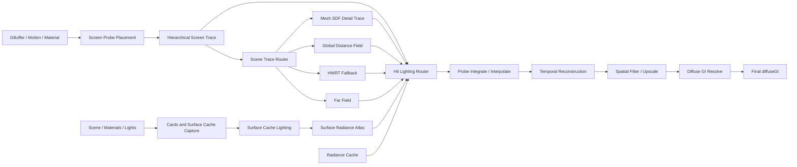

# LumenGI 生产主链闭环与画质修复执行计划

> 状态：2026-08-10 CodeGraph 复核后的当前权威执行入口
> 适用仓库：`F:\project\FalcorRendering`
> 分支：`codex/lumen-gi`
> 长期架构路线：`docs/LumenGI_Technical_Roadmap.md`
> 历史阶段拆解：`task.md`
> 原则：保留已通过的组件测试，但在生产数据流闭环前，不把组件完成称为完整 LumenGI。

## 1. 目标、边界与完成定义

目标不变：在 Falcor 上独立实现一套借鉴 UE5 Lumen 公开架构思想的实时动态漫反射 GI。它不是 Unreal Engine Lumen 源码移植，也不能退化为“每像素 1 spp HWRT + 普通降噪”。

生产主链必须真实形成以下数据依赖：



只有同时满足以下条件，才能称为“生产主链闭环”：

- Surface Cache 的 radiance atlas 被 Screen Probe 的屏幕命中点/场景命中查询，而非只用于独立 debug 或统计。
- Screen Trace miss 能进入明确的 Scene Trace Router，并按配置选择 Mesh SDF/GDF/HWRT/Far Field。
- `Hybrid` 真正融合或回退多个追踪后端，而非“HWRT 输出 + GDF debug”。
- Probe 输出经过 Temporal、Spatial/Upscale，并由 Resolve 写入最终 `diffuseGI`。
- 中间资源由 pass 内部保证分配；不能依赖 RenderGraph `markOutput()` 才让生产链工作。
- 任一模块关闭或失效时存在可测、可解释、无黑帧的回退路径。
- 最终图、间接光参考、动态稳定和性能四类 Gate 同时通过。

## 2. CodeGraph 复核后的真实状态

2026-08-10 已执行 `codegraph sync .`。同步后索引为 1,519 files、67,119 nodes、155,001 edges，状态 up to date。

### 2.1 可保留的已完成组件证据

| 组件 | 可保留结论 | 不可外推的结论 |
|---|---|---|
| S1 HWRT baseline | 单反弹 HWRT、解析/环境/发光响应和数值防护已有证据 | 不代表 Screen Probe 或最终 Lumen 主链完成 |
| S2 Cards/Capture | 卡片、页分配、atlas、capture、coverage/churn 组件可工作 | 不代表 cache radiance 被最终 GI 消费 |
| S3 Cache Lighting | 独立 cache lighting、feedback 和稳定性测试已有证据 | 不代表 Screen Probe hit lighting 已读取 cache |
| S4 Screen Trace/Probe | HZB、screen trace、probe trace/integrate/interpolate 组件可运行 | 当前命中 radiance 仍复用 S1 屏幕结果 |
| S5 Temporal/Spatial | history、cut invalidation、时空滤波组件测试已有证据 | `spatialFiltered` 尚未 Resolve 到最终 `diffuseGI` |
| S6 Mesh SDF/GDF | builder/cache/atlas/compose/sphere trace 组件已打通 | 执行顺序错误，Hybrid 与 fallback 未完成 |
| S7 Radiance Cache | CPU 数据结构和单测存在 | `mUseRadianceCache` 仅解析/序列化/UI，GPU 主链未接 |
| S8 Quality Preset | preset 数据表和单测存在 | 运行时仅 cache-lighting samples/texel 部分受 preset 控制 |

### 2.2 必须先修的已确认问题

1. **Arcade cache-lighting `E_INVALIDARG`**：复杂灯光组合下的绑定/variant 问题阻塞真实场景 Gate。
2. **Arcade 800x450 崩溃**：分辨率相关资源或 dispatch 边界问题。
3. **MeshSDF 黑帧条件**：`traceMode=MeshSDF` 会跳过 HWRT；若 `useGDF=false`，GDF 也不运行。
4. **GDF 顺序错误**：GDF 在 Probe/Temporal/Spatial 之后运行，MeshSDF 结果绕过重建链。
5. **Hybrid 名不副实**：当前只保留 HWRT 主输出，GDF 仅写可选诊断通道。
6. **Surface Cache 未消费**：Screen Probe 的 hit radiance 仍读取 `diffuseRadianceHitDist`。
7. **最终 Resolve 缺失**：`spatialFiltered` 是 incident irradiance 中间层，没有回写最终 modulated diffuse GI。
8. **可选输出误作内部依赖**：未 `markOutput()` 时部分中间纹理不分配，生产阶段变成 no-op。
9. **跨帧方向集不新增样本**：当前对固定 Hammersley 集做索引轮换；全量更新方向时只是排列变化。
10. **质量档语义/接线不完整**：probe tile 表存在“8px 更密却称 Low 最稀疏”的矛盾，且绝大多数参数未生效。

## 3. 状态模型：组件 Gate 与集成 Gate 分离

以后每个阶段必须分别记录两种状态：

- **Component Gate**：本组件独立输入/输出、单测、debug view 和局部稳定性通过。
- **Production Integration Gate**：组件输出被下游生产路径真实消费，并最终影响 `diffuseGI`。

禁止以下证据单独关闭 Production Integration Gate：

- shader 文件存在；
- CPU 数据结构单测通过；
- debug output 非零；
- feature checkbox 可切换；
- 独立 atlas/probe 通道数值稳定；
- 仅通过 Cornell 单视角或单分辨率；
- 通过 `markOutput()` 人工强制分配后才工作。

## 4. 总体执行顺序与依赖

```text
P0 复现与可信基线
  ↓
P1 Trace Router 与执行顺序
  ↓
P2 Surface Cache Hit Lighting
  ↓
P3 Screen Probe 采样与重建输入
  ↓
P4 Temporal / Spatial / Final Resolve
  ↓
P5 Radiance Cache / Far Field
  ↓
P6 Quality Preset / 性能优化
  ↓
P7 全量图像、动态、性能与稳定性发布 Gate
```

P0–P4 统称 **S5.5 Production Chain Closure**。P5 对应原 S7，P6 对应原 S8，P7 对应原 S9。原 S2–S6 的组件证据不删除，但所有受数据流改动影响的 GPU/image Gate 必须重跑。

## 5. P0：复现、诊断与可信画质基线

### P0.1 冻结当前失败

目标：在任何架构改动前保存最小复现和 validation 证据。

任务：

- 固定 `run_diag_env.py` 的 Arcade cache-lighting `E_INVALIDARG` 复现。
- 固定 640x360 正常、800x450 失败的对照。
- 保存 D3D12 Debug Layer、RT Validation、shader define、资源尺寸和绑定清单。
- 给每个失败分配唯一 artifact 目录，禁止覆盖旧日志。

建议产物：

```text
artifacts/lumengi/chain-closure/P0/
├── arcade-cache-lighting-640x360.log
├── arcade-cache-lighting-800x450.log
├── resource-manifest.json
├── shader-defines.json
└── verdict.json
```

Gate：

- [ ] 两个问题都能在固定命令下稳定复现或被证明已不可复现。
- [ ] 日志包含第一个 D3D12/Falcor error，而不是只保存最终崩溃。
- [ ] 不通过降低分辨率、关闭灯光或吞掉 validation error 关闭 Gate。

### P0.2 重写截图/参考协议

当前截图不能用于最终画质判断。新的协议必须同时保存：

- `rawBaselineGI`：S1 HWRT baseline。
- `probeInterpolated`：Probe 重建前输出。
- `temporalFiltered`。
- `spatialFiltered`。
- `resolvedDiffuseGI`：乘材质后的最终间接漫反射。
- `finalColor`：直接光、发光、间接光合成后的展示图。
- `ptDirect`：PT bounce 0。
- `ptIndirect`：PT bounce 1 减 bounce 0，在线性 HDR 中计算。
- `ptFinal`：完整 PT 参考。

固定矩阵：

| 维度 | 最低要求 |
|---|---|
| 场景 | Cornell、Arcade、emissive_glow、black_room、white_furnace |
| 视角 | 每个主要场景 front/left/right 三视角 |
| 分辨率 | 640x360 correctness；800x450 edge case；1920x1080 performance |
| Lumen 帧 | 1、8、32、96；静态尾帧另保存 16 帧序列 |
| PT | 固定 seed；间接参考使用 `bounce1-bounce0`；最终参考单独保存 |
| 曝光 | 固定曝光用于数值比较；展示图可另存自动曝光，但不能参与 Gate |

Gate：

- [ ] 不再比较“纯间接 Lumen”与“完整 PT”。
- [ ] 不再把 incident irradiance 中间层直接称为最终画面。
- [ ] 所有指标从线性 HDR 计算，PNG 只用于人工审查。

### P0.3 Execution log (2026-08-10)

The first runtime pass has now been executed on the single D3D12 GPU. These results update the gates below; they do not close the production chain:

- **C0.1 = PASS_WITH_C1_BLOCKER.** Arcade at 640x360 and 800x450 reproduce the same first-dispatch `E_INVALIDARG` in `LumenGIPass::runCacheLighting`. New telemetry reports valid dimensions (`pages=30`, `threads=(480,16,1)`, `groups=(30,1,1)`, `tg=(16,16,1)`), so the current failure is not a dispatch-size overflow.
- **C0.2 = runtime PASS for the truthful capture protocol.** `tests/lumengi/run_chain_closure_capture.py` produced linear HDR arrays and FrameCapture EXRs for `rawBaselineGI`, `probeInterpolated`, `temporalFiltered`, `spatialFiltered`, and PT direct/one-bounce/final references at Arcade 640x360/front. `resolvedDiffuseGI` and `finalColor` are explicitly recorded as `SKIP` because the pass does not expose those production outputs yet. No intermediate irradiance was relabeled as final color.
- **C1 = partial, safe fallback only.** The eight-case isolation matrix shows that all-off, analytic-only, and emissive-only variants pass; env-only and all-on fail only when the cache-lighting environment importance sampler variant is enabled. With `kUseCacheLightingEnvImportanceSampler=false`, all-on runs successfully and remains finite/non-negative through the cache-lighting pass using the uniform environment fallback. This is a runtime safety fallback, not a solved sampler integration.
- **Required follow-up.** Keep the fallback enabled while closing C2 diagnostics, but do not mark C1 complete or claim final Lumen quality. The next C1 owner must isolate the `EnvMapSampler` descriptor/root-signature/resource-state contract, then re-enable the sampler and rerun the full matrix with D3D12 validation.

Evidence directories (ignored runtime artifacts): `artifacts/lumengi/chain-closure/P0/` and `artifacts/lumengi/chain-closure/C1/`. The exact commands and current source diff remain in the handoff file.

## 6. P1：Trace Router、GDF 顺序与回退语义

### P1.1 冻结追踪模式语义

建议将配置语义明确为：

| 模式 | Screen miss 后端 | 必须回退 |
|---|---|---|
| HardwareRT | HWRT | env/black miss |
| MeshSDF | Detail Mesh SDF → GDF | HWRT 处理薄几何、动态/不支持实例和 SDF miss |
| Hybrid | Screen → Detail SDF/GDF → HWRT | HWRT 永远是最终几何正确性回退 |

`useGDF` 只能表示 GDF capability/feature toggle，不能使合法 trace mode 变成黑帧。若 mode 需要 GDF 但资源不可用，必须明确回退并记录 counter。

### P1.2 重排 `LumenGIPass::execute()`

目标顺序：

```text
scene update / resource validation
→ Surface Cache capture + lighting
→ HZB / Screen Trace
→ Trace Router (GDF/HWRT/Far Field)
→ Hit Lighting Router
→ Probe Integrate / Interpolate
→ Temporal
→ Spatial / Upscale
→ Resolve
→ Debug/export/readback
```

实现约束：

- GDF compose 可在 Probe 前完成；GDF sphere trace 应成为 probe miss 的后端或提供统一 hit record。
- 不允许 GDF 在 Temporal/Spatial 之后直接覆盖最终输出。
- Trace Router 统一输出 hit distance、hit kind、world position/normal、miss reason 和 backend type。
- 所有 backend counter 必须可读：screen hit、detail SDF hit、GDF hit、HWRT fallback hit、far-field hit、miss。
- Debug 输出从统一 hit record 派生，避免每个后端自定义不兼容编码。

主要修改范围：

- `Source/RenderPasses/LumenGI/LumenGI.cpp`
- `Source/RenderPasses/LumenGI/LumenGI.h`
- `Source/RenderPasses/LumenGI/MeshSDF/LumenGDFTrace.cs.slang`
- 新增或重构统一 trace-result shared Slang 数据结构
- `tests/lumengi/run_sdf_trace.py`
- 新增 `tests/lumengi/run_trace_router.py`

Gate：

- [ ] `MeshSDF + useGDF=false` 不黑屏，明确回退 HWRT。
- [ ] `Hybrid` 的 backend counters 同时出现 SDF/GDF 与 HWRT fallback 命中。
- [ ] GDF 结果在 Probe Integrate 前可见。
- [ ] 同方向 HWRT/GDF hit-distance 误差 Gate 通过。
- [ ] 薄几何、开放网格、动态实例走明确 HWRT fallback。

## 7. P2：Surface Cache Hit Lighting 闭环

### P2.1 建立统一 Hit Lighting Router

对追踪命中按以下顺序解析 radiance：

1. 有效 screen-space hit：读取屏幕可见 radiance，但记录 screen-reuse 标志。
2. Surface Cache coverage 有效：读取 radiance atlas。
3. Surface Cache miss/过期：调用现有 hit lighting 或 HWRT material/light fallback。
4. 远距离或预算降级：查询 Radiance Cache。
5. 几何 miss：环境光；无环境则黑。

必须输出：radiance、confidence、hit distance、cache generation/validity、fallback type。

### P2.2 Surface Cache 查询契约

需要冻结：

- world hit → card/page/atlas UV 的查找方法；
- 页 generation 验证；
- material/radiance atlas 坐标和边界；
- 未 capture、evicted、stale、unsupported mesh 的回退；
- 动态光或材质变化后的有效帧延迟；
- cache direct 与 multi-bounce feedback 的能量语义。

主要修改范围：

- `Lighting/LumenGILighting.slang`
- `Lighting/LumenGILightSampling.slang`
- `ScreenProbe/LumenScreenProbeTrace.cs.slang`
- Surface Cache page/card GPU lookup 数据
- `LumenGI.cpp` 的资源绑定和 define 生命周期

Gate：

- [ ] 打开 cache lighting 后，最终 `resolvedDiffuseGI` 发生非零、方向正确的变化。
- [ ] 关闭 Surface Cache 时回退 S1/HWRT，不黑屏。
- [ ] 页 eviction/reallocation 后旧 generation 不被读取。
- [ ] black_room 不自发发光；white_furnace 能量有界；emissive 场景无无限 feedback。
- [ ] Arcade env+analytic+emissive 同开无 `E_INVALIDARG`。

## 8. P3：Screen Probe 采样、积分与插值质量

### P3.1 真正的跨帧采样

当前固定方向集的索引轮换不能在全方向更新时增加样本。改为以下之一，并保持 CPU/Shader 镜像测试：

- Owen-scrambled Sobol；或
- Hammersley + 每帧 Cranley-Patterson rotation；或
- 每 probe 蓝噪声方向集 + frame-dependent hemisphere rotation。

要求：

- 固定 seed 完全可复现；
- frame 1/8/32/96 的有效方向集合持续增长；
- 不引入长期方向偏差；
- trace 与 integrate 使用完全一致的方向重建公式。

### P3.2 Probe 放置与插值

- 初始固定 tile 继续保留作为 fallback。
- 在 depth/normal/material discontinuity 和薄几何附近增加 adaptive probe 或提高更新优先级。
- 插值不能只依赖 2x2 + nearest direct fallback 形成方块；评估置信度驱动 3x3/5x5 gather。
- 保存 moments、variance、history length、miss/fallback composition。
- 低 confidence 区域优先增加 ray budget，而不是只扩大模糊半径。

Gate：

- [ ] 96 帧相对 8 帧的 PT indirect 误差继续下降，而不是只稳定同一偏差。
- [ ] tile 边界平均梯度不超过非边界区域的 1.25 倍。
- [ ] 深度、法线和材质边界不出现明显跨面漏光。
- [ ] screen-off、HWRT-off、cache-off 组合都有明确结果或受支持性报错。

## 9. P4：Temporal、Spatial、Upscale 与 Final Resolve

### P4.1 内部资源生命周期

生产依赖的 `probeInterpolated`、`temporalFiltered`、`temporalConfidence`、`spatialFiltered` 必须由 LumenGI 内部资源或强制 RenderGraph 连接保证存在。`markOutput()` 只能控制导出，不得控制算法是否执行。

Gate：不 mark 任何中间输出时，最终 `diffuseGI` 与开启 debug export 时数值一致。

### P4.2 Temporal/Spatial 修正

- 绑定一阶/二阶 moments 和真实 variance，不再只依靠局部代理。
- 评估启用 history AABB clamp；必须通过动态灯和 disocclusion Gate 后才能默认开启。
- 使用 confidence、backend type、hit distance、normal/material/depth 联合验证历史。
- spatial filter 从单次 radius<=3 与多层 à-trous/多尺度方案做固定 reference 对比。
- half/quarter 模式执行 bilateral upscale，不能简单拉伸。

### P4.3 Final Resolve

新增明确的 Resolve 阶段：

```text
selectedIrradiance = spatial > temporal > probe > raw HWRT fallback
resolvedDiffuseGI = selectedIrradiance * diffuseReflectance / PI
```

如果输入语义已经包含 albedo，必须通过类型/通道名称阻止二次调制。禁止继续让 `diffuseGI` 同时表示“某后端原始结果”和“最终重建结果”。建议内部区分：

- `rawDiffuseRadianceHitDist`
- `reconstructedIrradiance`
- `resolvedDiffuseGI`
- 对外 `diffuseGI = resolvedDiffuseGI`

`finalColor` 展示图再合成 direct lighting、emissive 和其他受支持分量；不要把展示合成与 GI pass 的物理输出混为同一契约。

Gate：

- [ ] `spatialFiltered` 的变化会影响最终 `diffuseGI`。
- [ ] fallback 层级逐项关闭时，最终输出平滑退化而非突然清零。
- [ ] diffuse albedo 只乘一次。
- [ ] 静态尾帧平均变化 <= 1%。
- [ ] camera cut 当帧历史拒绝；移动光/遮挡变化后 <= 4 帧恢复。
- [ ] 最终图具有正确材质颜色，而非黄色/灰白 irradiance debug 外观。

## 10. P5：Radiance Cache 与 Far Field

只有 P1–P4 通过后才接入。

任务：

- 在 `LumenGIPass` 中创建、更新并销毁 Radiance Cache GPU/host 状态。
- 相机移动时滚动 dynamic clipmap；场景/光照变化时按 generation 失效。
- 每帧按预算生成 refresh list、trace/integrate、提交 probe payload。
- Hit Lighting Router 在远距离命中或 Surface Cache miss 时查询。
- query miss/expired 时回退 Surface Cache hit lighting 或 HWRT。
- 提供 resident/dirty/refresh/eviction/query hit/miss 和显存统计。

Gate：

- [ ] `useRadianceCache` 不再是只读 UI 属性。
- [ ] Arcade 固定远景能测得 cache hit，且最终图发生合理变化。
- [ ] 动态灯在冻结帧预算内传播至远场。
- [ ] 超预算时稳定 eviction/降级，无显存持续增长。
- [ ] cache miss 不黑屏。

## 11. P6：Quality Preset 与性能优化

### P6.1 先修正档位语义

probe tile 越小越密。建议冻结为：

| 档位 | GI 分辨率 | Probe tile | Directions | Cache samples | 目标 |
|---|---:|---:|---:|---:|---|
| Low | 0.25 | 16 | 8 | 1 | 最低成本 |
| Medium | 0.5 | 12 | 12 | 2 | 平衡 |
| High | 1.0 | 8 | 16 | 4 | 默认高质量 |
| Reference | 1.0 | 8 或 adaptive | 24/32 | 8 | 图像参考，不承诺实时预算 |

最终数值可在 GPU profile 后调整，但“更高档不能拥有更稀疏 probe”是固定不变量。

### P6.2 一次性应用完整参数

quality change 必须原子应用并按需重建：

- GI resolution/resources；
- probe grid/tile/directions/update budget；
- screen/GDF/HWRT trace distance 和 step budget；
- Surface Cache atlas budget/pages per frame/samples；
- Radiance Cache density/refresh/memory；
- temporal/spatial/upscale 参数；
- feature toggle 与 history reset。

Gate：

- [ ] 四档热切换无 crash、旧资源、错误历史或显存泄漏。
- [ ] High/Reference 的图像指标不低于 Medium/Low。
- [ ] 性能提升来自分辨率、预算、compaction 和资源优化，不来自放宽正确性阈值。

## 12. P7：最终质量、性能与发布矩阵

### 12.1 图像正确性

建议初始门槛，首次完整基线后只能收紧或书面说明调整原因：

- masked indirect SSIM >= 0.80；
- final composite SSIM >= 0.90；
- 间接光中位相对亮度误差 <= 20%；
- tile-boundary gradient ratio <= 1.25；
- black-room 非黑能量低于冻结 epsilon；
- white-furnace 能量有界且无持续增长；
- 所有 HDR 输出 finite、non-negative，无 NaN/Inf。

除汇总指标外，必须人工审查 Cornell/Arcade 三视角和薄几何、接触阴影、屏幕外遮挡区域。指标通过但明显漏光/块状/黑帧仍视为失败。

### 12.2 动态稳定

- static tail mean frame delta <= 1%；
- camera cut 当帧 history accept ~= 0；
- moving light、刚体、遮挡揭露恢复 <= 4 帧；
- resize、scene reload、material/light/env toggle 无旧历史污染；
- 30 分钟动态 soak 和 2 小时 nightly 无持续 VRAM/cache 增长。

### 12.3 性能

GPU 测试只有一块 RTX 2060 SUPER，必须串行。RTX 4070 目标保留为路线目标，但本机同时冻结独立基线，不能混写。

采样规范：

- 预热 >= 120 帧；
- 正式采样 >= 600 帧；
- 独立重复 3 次；
- 报告 GPU pass timing、total frame、P50/P95/P99、VRAM、cache residency；
- 同时保存 culling/trace backend/probe/cache counters。

发布原则：画质 Gate 和帧率 Gate 地位相同；性能不达标时继续 profile/优化，不能降低图像参考或隐藏失败。

## 13. 面向后续 LLM 的小批次提交顺序

后续模型每次只处理一个明确批次；不要以“集成全部 Lumen”作为单次任务。

| 批次 | 建议范围 | 验证后才进入 |
|---|---|---|
| C0 | 只新增 P0 复现 manifest 和可信截图协议 | 两个已知失败可复现 |
| C1 | 修复 Arcade cache-lighting `E_INVALIDARG`（当前为 env sampler fallback） | 重新启用 environment importance sampler 后，Arcade 三种灯光同时开启且 D3D12/RT validation 无新增 error |
| C2 | 修复 800x450/非 8 倍数分辨率 | 640x360、800x450、1280x720 通过 |
| C3 | 修复 MeshSDF 无 GDF 黑帧回退 | mode/toggle 矩阵通过 |
| C4 | 重排 GDF，建立 Trace Router 数据契约 | GDF hit 在 Probe 前可见 |
| C5 | 实现真正 Hybrid 和 backend counters | SDF/GDF/HWRT 同帧有证据 |
| C6 | Surface Cache radiance lookup + generation/fallback | cache 开关影响最终 GI |
| C7 | 修复跨帧 probe direction sampling | 8→32→96 帧误差下降 |
| C8 | 内部化中间资源，移除 `markOutput` 算法依赖 | export on/off 数值一致 |
| C9 | Final Resolve 接入 `diffuseGI` | filtered output 影响最终图 |
| C10 | Radiance Cache GPU 接线 | 远场 query/refresh/预算 Gate |
| C11 | 完整 Quality Preset 热切换 | 四档画质单调、资源安全 |
| C12 | 图像/动态/性能/soak 发布矩阵 | S0–S9 最终 Gate |

每个批次必须交付：

1. 修改文件清单；
2. 调用路径变化；
3. 最小复现或测试；
4. Release 构建和 Mogwai 实机 shader 编译结果；
5. 受影响回归；
6. artifact 路径；
7. 残余风险；
8. 明确说明是否可进入下一批次。

## 14. 构建、GPU 与安全约束

```powershell
# CodeGraph：修改前定位，修改后同步
codegraph explore "<specific LumenGI symbol or call-path question>"
codegraph sync .

# 单 MSBuild，禁止并发仓库构建
tools\.packman\cmake\bin\cmake.exe --build build\windows-vs2022 `
  --config Release --target LumenGI FalcorTest Mogwai --parallel 1

# CPU Lumen 专项
build\windows-vs2022\bin\Release\FalcorTest.exe `
  --test-suite "Lumen" --xml-report artifacts\lumengi\unit.xml

# GPU/Mogwai：单物理 GPU 串行
build\windows-vs2022\bin\Release\Mogwai.exe `
  --device-type d3d12 --headless --precise `
  --script tests\lumengi\<script>.py `
  --logfile artifacts\lumengi\chain-closure\<phase>\<name>.log
```

约束：

- 不运行并发 MSBuild；GPU 测试绝对串行。
- 新/修改 shader 必须经过 Mogwai 运行时编译，不能只检查文件或 CMake 成功。
- 不执行 `git reset --hard`、`git clean` 或覆盖未跟踪文件。
- 不提交 `.codegraph/`、PDB、临时 EXR/日志，除非 artifact 策略明确要求。
- D3D12 Debug Layer/RT Validation error 不得通过吞日志或关闭 validation 解决。
- 大改前先保存基线 artifacts；失败时锁定第一个错误而非追最后一个崩溃。

## 15. 立即停止并回到诊断的条件

出现以下任一情况，不得继续堆叠后续功能：

- 最终 `diffuseGI` 黑帧、NaN/Inf、负能量或尺寸不匹配；
- D3D12 `E_INVALIDARG`、device removed、root signature/resource binding error；
- 新模块只在 `markOutput()` 后才运行；
- feature 开关打开但最终 `diffuseGI` 无任何可测影响；
- Hybrid 没有 fallback counter 证据；
- Surface/Radiance Cache generation 失配仍可被采样；
- 画质指标改善但人工图像出现更严重漏光、块状或拖影；
- 性能通过依赖降低 reference 质量或放宽正确性阈值。

## 16. 可复制给后续 LLM 的启动提示

```text
继续 F:\project\FalcorRendering 的 codex/lumen-gi 分支。

先完整阅读：
1. LUMENGI_HANDOFF.md
2. docs/LumenGI_Production_Chain_Closure_Plan.md
3. task.md 的工程约束、统一 Gate 和总进度看板

先运行 codegraph status；若不是 up to date，运行 codegraph sync .。
任何代码定位先使用 codegraph explore。不要把组件存在或 debug 输出非零当作生产主链完成。

只执行计划中的第一个未完成小批次，不跨批次堆叠。修改前保存最小复现；修改后依次执行：
- 最小测试
- 单目标/单 MSBuild Release 构建（--parallel 1）
- Mogwai 真实 shader 编译与 GPU smoke（单 GPU 串行）
- 受影响回归
- artifact 和 verdict

当前最高优先级顺序：
C0 冻结失败复现与可信截图/参考协议
C1 Arcade cache-lighting E_INVALIDARG
C2 800x450 分辨率崩溃
C3 MeshSDF 无 GDF 黑帧回退
C4 Trace Router 与 GDF 执行顺序
C5 真正 Hybrid
C6 Surface Cache radiance lookup
C7 跨帧 probe 采样
C8 内部资源生命周期
C9 Final Resolve 接入 diffuseGI

C0–C9 全部通过后，才进入 C10 Radiance Cache、C11 Quality Preset 和 C12 发布矩阵。

禁止 reset/clean，保留用户未跟踪文件。不要提交 .codegraph、PDB 或临时输出。
在当前批次 Gate 全部通过前，不开始下一批次，也不把当前原型称为完整 Lumen。
```

## Runtime evidence update (2026-08-10)

This section is the current execution record for the C0-C12 plan. It supersedes
older status prose above when the older prose says that a component is only a
stub or that Final Resolve is absent.

| Batch | Current verdict | Evidence | Remaining gate |
|---|---|---|---|
| C0 | PASS for capture protocol | `tests/lumengi/run_chain_closure_capture.py` records raw/probe/history/temporal/moments/spatial/variance/resolved HDR arrays and FrameCapture outputs. `finalColor` remains explicitly SKIP. | Add a production full-scene composite before calling any image `finalColor`. |
| C1 | PARTIAL, safe fallback only | `artifacts/lumengi/C1/runtime-20260810.json` is 8/8 finite and non-negative with analytic/emissive/environment combinations. The environment importance sampler is deliberately disabled (`envSampler=0`) because the enabled variant still raised D3D12 `E_INVALIDARG`. | Re-enable and validate the importance sampler; do not close C1 on the uniform-environment fallback. |
| C2 | PASS on the resolution matrix | `artifacts/lumengi/C2/full-20260810c/resolution-matrix.json` covers 640x360, 800x450, non-8-multiple sizes, and 1280x720. Resize changes the bound screen-probe resource dimension and reports probe statistics. | Keep the matrix in regression runs. |
| C3 | PASS for HWRT fallback; GDF path blocked | HardwareRT and MeshSDF/Hybrid with `useGDF=false` complete without a black frame and expose HWRT fallback counters. | `useGDF=true` still fails in GDF compose dispatch; C4/C5 must remain open. |
| C4/C5 | BLOCKED | `runGDFCompose` still reports `E_INVALIDARG` after correcting thread-count dispatch semantics and batching a single UAV per level. The older `gdf-r32-verified.log` has stale binary provenance and is not a valid R32 conclusion. The current source now uses R32Float staging views for both `Texture3D<float>` atlas bindings; this needs a fresh build/runtime check. | Run the new E1/E2 no-op descriptor bisect, then re-run production compose with the timestamp-verified R32 build before implementing real Hybrid selection. |
| C6 | PASS | Surface-cache lookup is consumed by probe integration and generation/history plumbing exists. `artifacts/lumengi/C6/surfacecache-effect-20260811` passes lookup on/off, reload invalidation, and low-budget behavior with finite/non-negative outputs. | Keep the on/off, invalidation, and budget matrix in regression runs. |
| C7 | PARTIAL (history only) | `artifacts/lumengi/C7/history-20260810/capture-manifest.json` shows probe-history alpha counts of 16, 112, 496, and 1520 at frames 1/8/32/96 for 16 directions per update. `tests/lumengi/run_probe_direction_union.py` verifies finite/monotonic history but records `directionUnionGate=SKIP` because sample identity is not exposed. | Add per-direction sample ID/valid-mask telemetry and prove union growth plus variance convergence. |
| C8 | PARTIAL | `artifacts/lumengi/C8/runtime-20260810/capture-manifest.json` has finite temporal moments and filtered variance. The 2026-08-11 export matrix passes both filters when `markOutput()` is enabled; when it is disabled the direct `diffuseGI`/`resolvedDiffuseGI` endpoints are unavailable and the cases are correctly reported BLOCKED rather than sampling sentinels. | Expose/validate production endpoints without `markOutput()` and add reset behavior under camera/scene changes. |
| C9 | PARTIAL | Final Resolve is host-wired and `resolvedDiffuseGI` is finite/non-negative in mark-on runs; `finalColor` remains intentionally SKIP because no full-scene composite is claimed. | Complete mark-off endpoint access plus albedo-once/fallback comparison before closing the release gate. |
| C10-C12 | DEFERRED | The plan requires C0-C9 to close first. Radiance Cache is still CPU-only; quality presets and release/soak evidence are not yet valid. | Do not start these batches while C4/C5 or C1 remain open. |

Build/runtime evidence for this update was collected with the Release target
`LumenGI Mogwai --parallel 1`, followed by a single D3D12 GPU run. The usable
visual preview is under
`artifacts/lumengi/screenshots/final-arcade-framed-20260810/`; it is a resolved
indirect-radiance composite preview, not a claim that the full production
Lumen final-color chain is complete.

## Runtime evidence update (2026-08-11)

| Batch | Latest result | Evidence and decision |
|---|---|---|
| C1 | PARTIAL (fallback verified) | `artifacts/lumengi/C1/fallback-verified-20260811.log` passes Arcade all-on with finite/non-negative GI and `envSampler=0`. The enabled environment-importance variant still fails at `dispatchCompute` (`artifacts/lumengi/C1/env-flat2-20260811.log`), so the uniform-sphere fallback remains the only production-safe setting. |
| C4/C5 | BLOCKED (dispatch-size ruled out; R32 recheck pending) | `artifacts/lumengi/C4/E0-20260811.log` still fails with all compose descriptors and a `(1,1,1)` logical dispatch, ruling out the 64x1x4096 dimensions. The source now aligns both atlas resources with `Texture3D<float>` as R32Float and adds `LumenGDFComposeDiag*.cs.slang` for E1/E2; these shaders still require host wiring and a fresh Mogwai compile. |
| C6 | PASS | `artifacts/lumengi/C6/surfacecache-effect-20260811` passes lookup on/off, scene reload invalidation, and 1-page/frame budget. Outputs are finite/non-negative; allocated pages and reset observations change as expected. |
| C8/C9 | PARTIAL (mark-on pass; mark-off blocked) | `artifacts/lumengi/C8/export-equivalence-20260811d/export-equivalence.json` passes both filters for mark-on/export-off and mark-on/export-on. Mark-off cases report `BLOCKED` because direct `diffuseGI`/`resolvedDiffuseGI` endpoints are not available without graph marking; sentinel buffers are retained only as diagnostics and are never treated as GI. `finalColor` remains SKIP. |
| Trace dispatch | HOST FIXED, runtime pending | `runGDFSphereTrace()` now passes logical frame dimensions to `ComputePass::execute`; the reflected 8x8 shader group performs the ceil-divide. Re-run only after C4 compose is unblocked. |

The next C4 diagnostic wave is intentionally bounded: E1 binds only the level UAV
with `LumenGDFComposeDiag.cs.slang`; E2 keeps the same `(1,1,1)` dispatch while
adding the CB, GDF buffers, atlas SRVs and scalars from
`LumenGDFComposeDiagAll.cs.slang`; E3 restores the production body and tests
single-thread, reflected-group, then real dirty-region sizes. Preserve the first
HRESULT and descriptor summary at each boundary before any Hybrid router work.

The single-GPU rule remains in force. C10-C12 are still deferred until C1 and
C4/C5 are closed and C8/C9 mark-off endpoint evidence is complete.

## Runtime evidence update (2026-08-11b)

- C4/C5: a fresh Release build with the source R32Float atlas staging change still
  fails `runGDFCompose` at `E_INVALIDARG` (`artifacts/lumengi/C4/r32-verified-20260811.log`).
  The typed-view mismatch is fixed in source but is not the sole root cause. The
  next experiment remains E1/E2 descriptor bisection using the new diagnostic shaders.
  Both E1/E2 compile under the real Mogwai Slang compiler (`artifacts/lumengi/C4/gdf-diag-compile-20260811d.json`); that standalone compile script still exits with a shutdown-only DXGI_DEVICE_REMOVED after the compile report is written, so it is not a dispatch result.
- C7: `artifacts/lumengi/C7/probe-direction-union-20260811/probe-direction-union.json`
  confirms history alpha 16/112/496/1520 and finite monotonic accumulation at
  1/8/32/96 frames. `directionUnionGate` is explicitly `SKIP` because the runtime
  does not expose a per-direction sample identity or valid mask.
