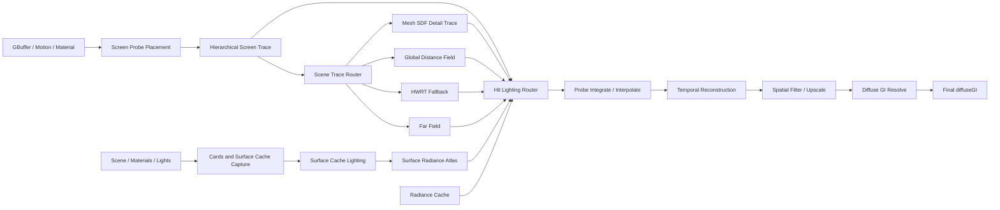

# LumenGI 生产主链闭环与画质修复执行计划

> 状态：2026-08-10 CodeGraph 复核后的当前权威执行入口
> 适用仓库：`F:\project\FalcorRendering`
> 分支：`codex/lumen-gi`
> 长期架构路线：`docs/LumenGI_Technical_Roadmap.md`
> 历史阶段拆解：`task.md`
> 原则：保留已通过的组件测试，但在生产数据流闭环前，不把组件完成称为完整 LumenGI。

## 1. 目标、边界与完成定义

目标不变：在 Falcor 上独立实现一套借鉴 UE5 Lumen 公开架构思想的实时动态漫反射 GI。它不是 Unreal Engine Lumen 源码移植，也不能退化为“每像素 1 spp HWRT + 普通降噪”。

生产主链必须真实形成以下数据依赖：



只有同时满足以下条件，才能称为“生产主链闭环”：

- Surface Cache 的 radiance atlas 被 Screen Probe 的屏幕命中点/场景命中查询，而非只用于独立 debug 或统计。
- Screen Trace miss 能进入明确的 Scene Trace Router，并按配置选择 Mesh SDF/GDF/HWRT/Far Field。
- `Hybrid` 真正融合或回退多个追踪后端，而非“HWRT 输出 + GDF debug”。
- Probe 输出经过 Temporal、Spatial/Upscale，并由 Resolve 写入最终 `diffuseGI`。
- 中间资源由 pass 内部保证分配；不能依赖 RenderGraph `markOutput()` 才让生产链工作。
- 任一模块关闭或失效时存在可测、可解释、无黑帧的回退路径。
- 最终图、间接光参考、动态稳定和性能四类 Gate 同时通过。

## 2. CodeGraph 复核后的真实状态

2026-08-10 已执行 `codegraph sync .`。同步后索引为 1,519 files、67,119 nodes、155,001 edges，状态 up to date。

### 2.1 可保留的已完成组件证据

| 组件 | 可保留结论 | 不可外推的结论 |
|---|---|---|
| S1 HWRT baseline | 单反弹 HWRT、解析/环境/发光响应和数值防护已有证据 | 不代表 Screen Probe 或最终 Lumen 主链完成 |
| S2 Cards/Capture | 卡片、页分配、atlas、capture、coverage/churn 组件可工作 | 不代表 cache radiance 被最终 GI 消费 |
| S3 Cache Lighting | 独立 cache lighting、feedback 和稳定性测试已有证据 | 不代表 Screen Probe hit lighting 已读取 cache |
| S4 Screen Trace/Probe | HZB、screen trace、probe trace/integrate/interpolate 组件可运行 | 当前命中 radiance 仍复用 S1 屏幕结果 |
| S5 Temporal/Spatial | history、cut invalidation、时空滤波组件测试已有证据 | `spatialFiltered` 尚未 Resolve 到最终 `diffuseGI` |
| S6 Mesh SDF/GDF | builder/cache/atlas/compose/sphere trace 组件已打通 | 执行顺序错误，Hybrid 与 fallback 未完成 |
| S7 Radiance Cache | CPU 数据结构和单测存在 | `mUseRadianceCache` 仅解析/序列化/UI，GPU 主链未接 |
| S8 Quality Preset | preset 数据表和单测存在 | 运行时仅 cache-lighting samples/texel 部分受 preset 控制 |

### 2.2 必须先修的已确认问题

1. **Arcade cache-lighting `E_INVALIDARG`**：复杂灯光组合下的绑定/variant 问题阻塞真实场景 Gate。
2. **Arcade 800x450 崩溃**：分辨率相关资源或 dispatch 边界问题。
3. **MeshSDF 黑帧条件**：`traceMode=MeshSDF` 会跳过 HWRT；若 `useGDF=false`，GDF 也不运行。
4. **GDF 顺序错误**：GDF 在 Probe/Temporal/Spatial 之后运行，MeshSDF 结果绕过重建链。
5. **Hybrid 名不副实**：当前只保留 HWRT 主输出，GDF 仅写可选诊断通道。
6. **Surface Cache 未消费**：Screen Probe 的 hit radiance 仍读取 `diffuseRadianceHitDist`。
7. **最终 Resolve 缺失**：`spatialFiltered` 是 incident irradiance 中间层，没有回写最终 modulated diffuse GI。
8. **可选输出误作内部依赖**：未 `markOutput()` 时部分中间纹理不分配，生产阶段变成 no-op。
9. **跨帧方向集不新增样本**：当前对固定 Hammersley 集做索引轮换；全量更新方向时只是排列变化。
10. **质量档语义/接线不完整**：probe tile 表存在“8px 更密却称 Low 最稀疏”的矛盾，且绝大多数参数未生效。

## 3. 状态模型：组件 Gate 与集成 Gate 分离

以后每个阶段必须分别记录两种状态：

- **Component Gate**：本组件独立输入/输出、单测、debug view 和局部稳定性通过。
- **Production Integration Gate**：组件输出被下游生产路径真实消费，并最终影响 `diffuseGI`。

禁止以下证据单独关闭 Production Integration Gate：

- shader 文件存在；
- CPU 数据结构单测通过；
- debug output 非零；
- feature checkbox 可切换；
- 独立 atlas/probe 通道数值稳定；
- 仅通过 Cornell 单视角或单分辨率；
- 通过 `markOutput()` 人工强制分配后才工作。

## 4. 总体执行顺序与依赖

```text
P0 复现与可信基线
  ↓
P1 Trace Router 与执行顺序
  ↓
P2 Surface Cache Hit Lighting
  ↓
P3 Screen Probe 采样与重建输入
  ↓
P4 Temporal / Spatial / Final Resolve
  ↓
P5 Radiance Cache / Far Field
  ↓
P6 Quality Preset / 性能优化
  ↓
P7 全量图像、动态、性能与稳定性发布 Gate
```

P0–P4 统称 **S5.5 Production Chain Closure**。P5 对应原 S7，P6 对应原 S8，P7 对应原 S9。原 S2–S6 的组件证据不删除，但所有受数据流改动影响的 GPU/image Gate 必须重跑。

## 5. P0：复现、诊断与可信画质基线

### P0.1 冻结当前失败

目标：在任何架构改动前保存最小复现和 validation 证据。

任务：

- 固定 `run_diag_env.py` 的 Arcade cache-lighting `E_INVALIDARG` 复现。
- 固定 640x360 正常、800x450 失败的对照。
- 保存 D3D12 Debug Layer、RT Validation、shader define、资源尺寸和绑定清单。
- 给每个失败分配唯一 artifact 目录，禁止覆盖旧日志。

建议产物：

```text
artifacts/lumengi/chain-closure/P0/
├── arcade-cache-lighting-640x360.log
├── arcade-cache-lighting-800x450.log
├── resource-manifest.json
├── shader-defines.json
└── verdict.json
```

Gate：

- [ ] 两个问题都能在固定命令下稳定复现或被证明已不可复现。
- [ ] 日志包含第一个 D3D12/Falcor error，而不是只保存最终崩溃。
- [ ] 不通过降低分辨率、关闭灯光或吞掉 validation error 关闭 Gate。

### P0.2 重写截图/参考协议

当前截图不能用于最终画质判断。新的协议必须同时保存：

- `rawBaselineGI`：S1 HWRT baseline。
- `probeInterpolated`：Probe 重建前输出。
- `temporalFiltered`。
- `spatialFiltered`。
- `resolvedDiffuseGI`：乘材质后的最终间接漫反射。
- `finalColor`：直接光、发光、间接光合成后的展示图。
- `ptDirect`：PT bounce 0。
- `ptIndirect`：PT bounce 1 减 bounce 0，在线性 HDR 中计算。
- `ptFinal`：完整 PT 参考。

固定矩阵：

| 维度 | 最低要求 |
|---|---|
| 场景 | Cornell、Arcade、emissive_glow、black_room、white_furnace |
| 视角 | 每个主要场景 front/left/right 三视角 |
| 分辨率 | 640x360 correctness；800x450 edge case；1920x1080 performance |
| Lumen 帧 | 1、8、32、96；静态尾帧另保存 16 帧序列 |
| PT | 固定 seed；间接参考使用 `bounce1-bounce0`；最终参考单独保存 |
| 曝光 | 固定曝光用于数值比较；展示图可另存自动曝光，但不能参与 Gate |

Gate：

- [ ] 不再比较“纯间接 Lumen”与“完整 PT”。
- [ ] 不再把 incident irradiance 中间层直接称为最终画面。
- [ ] 所有指标从线性 HDR 计算，PNG 只用于人工审查。

### P0.3 Execution log (2026-08-10)

The first runtime pass has now been executed on the single D3D12 GPU. These results update the gates below; they do not close the production chain:

- **C0.1 = PASS_WITH_C1_BLOCKER.** Arcade at 640x360 and 800x450 reproduce the same first-dispatch `E_INVALIDARG` in `LumenGIPass::runCacheLighting`. New telemetry reports valid dimensions (`pages=30`, `threads=(480,16,1)`, `groups=(30,1,1)`, `tg=(16,16,1)`), so the current failure is not a dispatch-size overflow.
- **C0.2 = runtime PASS for the truthful capture protocol.** `tests/lumengi/run_chain_closure_capture.py` produced linear HDR arrays and FrameCapture EXRs for `rawBaselineGI`, `probeInterpolated`, `temporalFiltered`, `spatialFiltered`, and PT direct/one-bounce/final references at Arcade 640x360/front. `resolvedDiffuseGI` and `finalColor` are explicitly recorded as `SKIP` because the pass does not expose those production outputs yet. No intermediate irradiance was relabeled as final color.
- **C1 = closed for the tested variant.** The original failure was the implicit-global `EnvMapSampler` root shape. It is now a `ParameterBlock<EnvMapSampler>` and the sampler is rebuilt when the environment-map variant changes. Post-fix 640x360 `emissive_off` and `all_on` runs both dispatch with `envSampler=1` and remain finite/non-negative with no D3D12 fatal.
- **Remaining C1 evidence.** Keep the uniform-environment run as a regression control, and add 800x450/multi-view/env-map-change coverage to the release matrix. Do not use the historical pre-fix E_INVALIDARG logs as current status.

Evidence directories (ignored runtime artifacts): `artifacts/lumengi/chain-closure/P0/` and `artifacts/lumengi/chain-closure/C1/`. The exact commands and current source diff remain in the handoff file.

## 6. P1：Trace Router、GDF 顺序与回退语义

### P1.1 冻结追踪模式语义

建议将配置语义明确为：

| 模式 | Screen miss 后端 | 必须回退 |
|---|---|---|
| HardwareRT | HWRT | env/black miss |
| MeshSDF | Detail Mesh SDF → GDF | HWRT 处理薄几何、动态/不支持实例和 SDF miss |
| Hybrid | Screen → Detail SDF/GDF → HWRT | HWRT 永远是最终几何正确性回退 |

`useGDF` 只能表示 GDF capability/feature toggle，不能使合法 trace mode 变成黑帧。若 mode 需要 GDF 但资源不可用，必须明确回退并记录 counter。

### P1.2 重排 `LumenGIPass::execute()`

目标顺序：

```text
scene update / resource validation
→ Surface Cache capture + lighting
→ HZB / Screen Trace
→ Trace Router (GDF/HWRT/Far Field)
→ Hit Lighting Router
→ Probe Integrate / Interpolate
→ Temporal
→ Spatial / Upscale
→ Resolve
→ Debug/export/readback
```

实现约束：

- GDF compose 可在 Probe 前完成；GDF sphere trace 应成为 probe miss 的后端或提供统一 hit record。
- 不允许 GDF 在 Temporal/Spatial 之后直接覆盖最终输出。
- Trace Router 统一输出 hit distance、hit kind、world position/normal、miss reason 和 backend type。
- 所有 backend counter 必须可读：screen hit、detail SDF hit、GDF hit、HWRT fallback hit、far-field hit、miss。
- Debug 输出从统一 hit record 派生，避免每个后端自定义不兼容编码。

主要修改范围：

- `Source/RenderPasses/LumenGI/LumenGI.cpp`
- `Source/RenderPasses/LumenGI/LumenGI.h`
- `Source/RenderPasses/LumenGI/MeshSDF/LumenGDFTrace.cs.slang`
- 新增或重构统一 trace-result shared Slang 数据结构
- `tests/lumengi/run_sdf_trace.py`
- 新增 `tests/lumengi/run_trace_router.py`

Gate：

- [ ] `MeshSDF + useGDF=false` 不黑屏，明确回退 HWRT。
- [ ] `Hybrid` 的 backend counters 同时出现 SDF/GDF 与 HWRT fallback 命中。
- [ ] GDF 结果在 Probe Integrate 前可见。
- [ ] 同方向 HWRT/GDF hit-distance 误差 Gate 通过。
- [ ] 薄几何、开放网格、动态实例走明确 HWRT fallback。

## 7. P2：Surface Cache Hit Lighting 闭环

### P2.1 建立统一 Hit Lighting Router

对追踪命中按以下顺序解析 radiance：

1. 有效 screen-space hit：读取屏幕可见 radiance，但记录 screen-reuse 标志。
2. Surface Cache coverage 有效：读取 radiance atlas。
3. Surface Cache miss/过期：调用现有 hit lighting 或 HWRT material/light fallback。
4. 远距离或预算降级：查询 Radiance Cache。
5. 几何 miss：环境光；无环境则黑。

必须输出：radiance、confidence、hit distance、cache generation/validity、fallback type。

### P2.2 Surface Cache 查询契约

需要冻结：

- world hit → card/page/atlas UV 的查找方法；
- 页 generation 验证；
- material/radiance atlas 坐标和边界；
- 未 capture、evicted、stale、unsupported mesh 的回退；
- 动态光或材质变化后的有效帧延迟；
- cache direct 与 multi-bounce feedback 的能量语义。

主要修改范围：

- `Lighting/LumenGILighting.slang`
- `Lighting/LumenGILightSampling.slang`
- `ScreenProbe/LumenScreenProbeTrace.cs.slang`
- Surface Cache page/card GPU lookup 数据
- `LumenGI.cpp` 的资源绑定和 define 生命周期

Gate：

- [ ] 打开 cache lighting 后，最终 `resolvedDiffuseGI` 发生非零、方向正确的变化。
- [ ] 关闭 Surface Cache 时回退 S1/HWRT，不黑屏。
- [ ] 页 eviction/reallocation 后旧 generation 不被读取。
- [ ] black_room 不自发发光；white_furnace 能量有界；emissive 场景无无限 feedback。
- [ ] Arcade env+analytic+emissive 同开无 `E_INVALIDARG`。

## 8. P3：Screen Probe 采样、积分与插值质量

### P3.1 真正的跨帧采样

当前固定方向集的索引轮换不能在全方向更新时增加样本。改为以下之一，并保持 CPU/Shader 镜像测试：

- Owen-scrambled Sobol；或
- Hammersley + 每帧 Cranley-Patterson rotation；或
- 每 probe 蓝噪声方向集 + frame-dependent hemisphere rotation。

要求：

- 固定 seed 完全可复现；
- frame 1/8/32/96 的有效方向集合持续增长；
- 不引入长期方向偏差；
- trace 与 integrate 使用完全一致的方向重建公式。

### P3.2 Probe 放置与插值

- 初始固定 tile 继续保留作为 fallback。
- 在 depth/normal/material discontinuity 和薄几何附近增加 adaptive probe 或提高更新优先级。
- 插值不能只依赖 2x2 + nearest direct fallback 形成方块；评估置信度驱动 3x3/5x5 gather。
- 保存 moments、variance、history length、miss/fallback composition。
- 低 confidence 区域优先增加 ray budget，而不是只扩大模糊半径。

Gate：

- [ ] 96 帧相对 8 帧的 PT indirect 误差继续下降，而不是只稳定同一偏差。
- [ ] tile 边界平均梯度不超过非边界区域的 1.25 倍。
- [ ] 深度、法线和材质边界不出现明显跨面漏光。
- [ ] screen-off、HWRT-off、cache-off 组合都有明确结果或受支持性报错。

## 9. P4：Temporal、Spatial、Upscale 与 Final Resolve

### P4.1 内部资源生命周期

生产依赖的 `probeInterpolated`、`temporalFiltered`、`temporalConfidence`、`spatialFiltered` 必须由 LumenGI 内部资源或强制 RenderGraph 连接保证存在。`markOutput()` 只能控制导出，不得控制算法是否执行。

Gate：不 mark 任何中间输出时，最终 `diffuseGI` 与开启 debug export 时数值一致。

### P4.2 Temporal/Spatial 修正

- 绑定一阶/二阶 moments 和真实 variance，不再只依靠局部代理。
- 评估启用 history AABB clamp；必须通过动态灯和 disocclusion Gate 后才能默认开启。
- 使用 confidence、backend type、hit distance、normal/material/depth 联合验证历史。
- spatial filter 从单次 radius<=3 与多层 à-trous/多尺度方案做固定 reference 对比。
- half/quarter 模式执行 bilateral upscale，不能简单拉伸。

### P4.3 Final Resolve

新增明确的 Resolve 阶段：

```text
selectedIrradiance = spatial > temporal > probe > raw HWRT fallback
resolvedDiffuseGI = selectedIrradiance * diffuseReflectance / PI
```

如果输入语义已经包含 albedo，必须通过类型/通道名称阻止二次调制。禁止继续让 `diffuseGI` 同时表示“某后端原始结果”和“最终重建结果”。建议内部区分：

- `rawDiffuseRadianceHitDist`
- `reconstructedIrradiance`
- `resolvedDiffuseGI`
- 对外 `diffuseGI = resolvedDiffuseGI`

`finalColor` 展示图再合成 direct lighting、emissive 和其他受支持分量；不要把展示合成与 GI pass 的物理输出混为同一契约。

Gate：

- [ ] `spatialFiltered` 的变化会影响最终 `diffuseGI`。
- [ ] fallback 层级逐项关闭时，最终输出平滑退化而非突然清零。
- [ ] diffuse albedo 只乘一次。
- [ ] 静态尾帧平均变化 <= 1%。
- [ ] camera cut 当帧历史拒绝；移动光/遮挡变化后 <= 4 帧恢复。
- [ ] 最终图具有正确材质颜色，而非黄色/灰白 irradiance debug 外观。

## 10. P5：Radiance Cache 与 Far Field

只有 P1–P4 通过后才接入。

任务：

- 在 `LumenGIPass` 中创建、更新并销毁 Radiance Cache GPU/host 状态。
- 相机移动时滚动 dynamic clipmap；场景/光照变化时按 generation 失效。
- 每帧按预算生成 refresh list、trace/integrate、提交 probe payload。
- Hit Lighting Router 在远距离命中或 Surface Cache miss 时查询。
- query miss/expired 时回退 Surface Cache hit lighting 或 HWRT。
- 提供 resident/dirty/refresh/eviction/query hit/miss 和显存统计。

Gate：

- [ ] `useRadianceCache` 不再是只读 UI 属性。
- [ ] Arcade 固定远景能测得 cache hit，且最终图发生合理变化。
- [ ] 动态灯在冻结帧预算内传播至远场。
- [ ] 超预算时稳定 eviction/降级，无显存持续增长。
- [ ] cache miss 不黑屏。

## 11. P6：Quality Preset 与性能优化

### P6.1 先修正档位语义

probe tile 越小越密。建议冻结为：

| 档位 | GI 分辨率 | Probe tile | Directions | Cache samples | 目标 |
|---|---:|---:|---:|---:|---|
| Low | 0.25 | 16 | 8 | 1 | 最低成本 |
| Medium | 0.5 | 12 | 12 | 2 | 平衡 |
| High | 1.0 | 8 | 16 | 4 | 默认高质量 |
| Reference | 1.0 | 8 或 adaptive | 24/32 | 8 | 图像参考，不承诺实时预算 |

最终数值可在 GPU profile 后调整，但“更高档不能拥有更稀疏 probe”是固定不变量。

### P6.2 一次性应用完整参数

quality change 必须原子应用并按需重建：

- GI resolution/resources；
- probe grid/tile/directions/update budget；
- screen/GDF/HWRT trace distance 和 step budget；
- Surface Cache atlas budget/pages per frame/samples；
- Radiance Cache density/refresh/memory；
- temporal/spatial/upscale 参数；
- feature toggle 与 history reset。

Gate：

- [ ] 四档热切换无 crash、旧资源、错误历史或显存泄漏。
- [ ] High/Reference 的图像指标不低于 Medium/Low。
- [ ] 性能提升来自分辨率、预算、compaction 和资源优化，不来自放宽正确性阈值。

## 12. P7：最终质量、性能与发布矩阵

### 12.1 图像正确性

建议初始门槛，首次完整基线后只能收紧或书面说明调整原因：

- masked indirect SSIM >= 0.80；
- final composite SSIM >= 0.90；
- 间接光中位相对亮度误差 <= 20%；
- tile-boundary gradient ratio <= 1.25；
- black-room 非黑能量低于冻结 epsilon；
- white-furnace 能量有界且无持续增长；
- 所有 HDR 输出 finite、non-negative，无 NaN/Inf。

除汇总指标外，必须人工审查 Cornell/Arcade 三视角和薄几何、接触阴影、屏幕外遮挡区域。指标通过但明显漏光/块状/黑帧仍视为失败。

### 12.2 动态稳定

- static tail mean frame delta <= 1%；
- camera cut 当帧 history accept ~= 0；
- moving light、刚体、遮挡揭露恢复 <= 4 帧；
- resize、scene reload、material/light/env toggle 无旧历史污染；
- 30 分钟动态 soak 和 2 小时 nightly 无持续 VRAM/cache 增长。

### 12.3 性能

GPU 测试只有一块 RTX 2060 SUPER，必须串行。RTX 4070 目标保留为路线目标，但本机同时冻结独立基线，不能混写。

采样规范：

- 预热 >= 120 帧；
- 正式采样 >= 600 帧；
- 独立重复 3 次；
- 报告 GPU pass timing、total frame、P50/P95/P99、VRAM、cache residency；
- 同时保存 culling/trace backend/probe/cache counters。

发布原则：画质 Gate 和帧率 Gate 地位相同；性能不达标时继续 profile/优化，不能降低图像参考或隐藏失败。

## 13. 面向后续 LLM 的小批次提交顺序

后续模型每次只处理一个明确批次；不要以“集成全部 Lumen”作为单次任务。

| 批次 | 建议范围 | 验证后才进入 |
|---|---|---|
| C0 | 只新增 P0 复现 manifest 和可信截图协议 | 两个已知失败可复现 |
| C1 | 修复 Arcade cache-lighting `E_INVALIDARG`（当前为 env sampler fallback） | 重新启用 environment importance sampler 后，Arcade 三种灯光同时开启且 D3D12/RT validation 无新增 error |
| C2 | 修复 800x450/非 8 倍数分辨率 | 640x360、800x450、1280x720 通过 |
| C3 | 修复 MeshSDF 无 GDF 黑帧回退 | mode/toggle 矩阵通过 |
| C4 | 重排 GDF，建立 Trace Router 数据契约 | GDF hit 在 Probe 前可见 |
| C5 | 实现真正 Hybrid 和 backend counters | SDF/GDF/HWRT 同帧有证据 |
| C6 | Surface Cache radiance lookup + generation/fallback | cache 开关影响最终 GI |
| C7 | 修复跨帧 probe direction sampling | 8→32→96 帧误差下降 |
| C8 | 内部化中间资源，移除 `markOutput` 算法依赖 | export on/off 数值一致 |
| C9 | Final Resolve 接入 `diffuseGI` | filtered output 影响最终图 |
| C10 | Radiance Cache GPU 接线 | 远场 query/refresh/预算 Gate |
| C11 | 完整 Quality Preset 热切换 | 四档画质单调、资源安全 |
| C12 | 图像/动态/性能/soak 发布矩阵 | S0–S9 最终 Gate |

每个批次必须交付：

1. 修改文件清单；
2. 调用路径变化；
3. 最小复现或测试；
4. Release 构建和 Mogwai 实机 shader 编译结果；
5. 受影响回归；
6. artifact 路径；
7. 残余风险；
8. 明确说明是否可进入下一批次。

## 14. 构建、GPU 与安全约束

```powershell
# CodeGraph：修改前定位，修改后同步
codegraph explore "<specific LumenGI symbol or call-path question>"
codegraph sync .

# 单 MSBuild，禁止并发仓库构建
tools\.packman\cmake\bin\cmake.exe --build build\windows-vs2022 `
  --config Release --target LumenGI FalcorTest Mogwai --parallel 1

# CPU Lumen 专项
build\windows-vs2022\bin\Release\FalcorTest.exe `
  --test-suite "Lumen" --xml-report artifacts\lumengi\unit.xml

# GPU/Mogwai：单物理 GPU 串行
build\windows-vs2022\bin\Release\Mogwai.exe `
  --device-type d3d12 --headless --precise `
  --script tests\lumengi\<script>.py `
  --logfile artifacts\lumengi\chain-closure\<phase>\<name>.log
```

约束：

- 不运行并发 MSBuild；GPU 测试绝对串行。
- 新/修改 shader 必须经过 Mogwai 运行时编译，不能只检查文件或 CMake 成功。
- 不执行 `git reset --hard`、`git clean` 或覆盖未跟踪文件。
- 不提交 `.codegraph/`、PDB、临时 EXR/日志，除非 artifact 策略明确要求。
- D3D12 Debug Layer/RT Validation error 不得通过吞日志或关闭 validation 解决。
- 大改前先保存基线 artifacts；失败时锁定第一个错误而非追最后一个崩溃。

## 15. 立即停止并回到诊断的条件

出现以下任一情况，不得继续堆叠后续功能：

- 最终 `diffuseGI` 黑帧、NaN/Inf、负能量或尺寸不匹配；
- D3D12 `E_INVALIDARG`、device removed、root signature/resource binding error；
- 新模块只在 `markOutput()` 后才运行；
- feature 开关打开但最终 `diffuseGI` 无任何可测影响；
- Hybrid 没有 fallback counter 证据；
- Surface/Radiance Cache generation 失配仍可被采样；
- 画质指标改善但人工图像出现更严重漏光、块状或拖影；
- 性能通过依赖降低 reference 质量或放宽正确性阈值。

## 16. 可复制给后续 LLM 的启动提示

```text
继续 F:\project\FalcorRendering 的 codex/lumen-gi 分支。

先完整阅读：
1. LUMENGI_HANDOFF.md
2. docs/LumenGI_Production_Chain_Closure_Plan.md
3. task.md 的工程约束、统一 Gate 和总进度看板

先运行 codegraph status；若不是 up to date，运行 codegraph sync .。
任何代码定位先使用 codegraph explore。不要把组件存在或 debug 输出非零当作生产主链完成。

只执行计划中的第一个未完成小批次，不跨批次堆叠。修改前保存最小复现；修改后依次执行：
- 最小测试
- 单目标/单 MSBuild Release 构建（--parallel 1）
- Mogwai 真实 shader 编译与 GPU smoke（单 GPU 串行）
- 受影响回归
- artifact 和 verdict

当前最高优先级顺序：
C0 冻结失败复现与可信截图/参考协议
C1 Arcade cache-lighting E_INVALIDARG
C2 800x450 分辨率崩溃
C3 MeshSDF 无 GDF 黑帧回退
C4 Trace Router 与 GDF 执行顺序
C5 真正 Hybrid
C6 Surface Cache radiance lookup
C7 跨帧 probe 采样
C8 内部资源生命周期
C9 Final Resolve 接入 diffuseGI

C0–C9 全部通过后，才进入 C10 Radiance Cache、C11 Quality Preset 和 C12 发布矩阵。

禁止 reset/clean，保留用户未跟踪文件。不要提交 .codegraph、PDB 或临时输出。
在当前批次 Gate 全部通过前，不开始下一批次，也不把当前原型称为完整 Lumen。
```

## Runtime evidence update (2026-08-10)

This section is the current execution record for the C0-C12 plan. It supersedes
older status prose above when the older prose says that a component is only a
stub or that Final Resolve is absent.

| Batch | Current verdict | Evidence | Remaining gate |
|---|---|---|---|
| C0 | PASS for capture protocol | `tests/lumengi/run_chain_closure_capture.py` records raw/probe/history/temporal/moments/spatial/variance/resolved HDR arrays and FrameCapture outputs. `finalColor` remains explicitly SKIP. | Add a production full-scene composite before calling any image `finalColor`. |
| C1 | PASS (tested variant) | `artifacts/lumengi/C1/emissive-off-env-sampler-parameterblock-20260811/` and `all-on-env-sampler-parameterblock-20260811/` both run with `envSampler=1`, finite/non-negative output, and no dispatch fatal. | Add 800x450/multi-view/env-map-change coverage; retain the disabled-sampler run as a control. |
| C2 | PASS on the resolution matrix | `artifacts/lumengi/C2/full-20260810c/resolution-matrix.json` covers 640x360, 800x450, non-8-multiple sizes, and 1280x720. Resize changes the bound screen-probe resource dimension and reports probe statistics. | Keep the matrix in regression runs. |
| C3 | PASS for HWRT fallback; GDF path blocked | HardwareRT and MeshSDF/Hybrid with `useGDF=false` complete without a black frame and expose HWRT fallback counters. | `useGDF=true` still fails in GDF compose dispatch; C4/C5 must remain open. |
| C4/C5 | BLOCKED | `runGDFCompose` still reports `E_INVALIDARG` after correcting thread-count dispatch semantics and batching a single UAV per level. The older `gdf-r32-verified.log` has stale binary provenance and is not a valid R32 conclusion. The current source now uses R32Float staging views for both `Texture3D<float>` atlas bindings; this needs a fresh build/runtime check. | Run the new E1/E2 no-op descriptor bisect, then re-run production compose with the timestamp-verified R32 build before implementing real Hybrid selection. |
| C6 | PASS | Surface-cache lookup is consumed by probe integration and generation/history plumbing exists. `artifacts/lumengi/C6/surfacecache-effect-20260811` passes lookup on/off, reload invalidation, and low-budget behavior with finite/non-negative outputs. | Keep the on/off, invalidation, and budget matrix in regression runs. |
| C7 | PARTIAL (history only) | `artifacts/lumengi/C7/history-20260810/capture-manifest.json` shows probe-history alpha counts of 16, 112, 496, and 1520 at frames 1/8/32/96 for 16 directions per update. `tests/lumengi/run_probe_direction_union.py` verifies finite/monotonic history but records `directionUnionGate=SKIP` because sample identity is not exposed. | Add per-direction sample ID/valid-mask telemetry and prove union growth plus variance convergence. |
| C8 | PARTIAL | `artifacts/lumengi/C8/runtime-20260810/capture-manifest.json` has finite temporal moments and filtered variance. The 2026-08-11 export matrix passes both filters when `markOutput()` is enabled; when it is disabled the direct `diffuseGI`/`resolvedDiffuseGI` endpoints are unavailable and the cases are correctly reported BLOCKED rather than sampling sentinels. | Expose/validate production endpoints without `markOutput()` and add reset behavior under camera/scene changes. |
| C9 | PARTIAL | Final Resolve is host-wired and `resolvedDiffuseGI` is finite/non-negative in mark-on runs; `finalColor` remains intentionally SKIP because no full-scene composite is claimed. | Complete mark-off endpoint access plus albedo-once/fallback comparison before closing the release gate. |
| C10-C12 | DEFERRED | The plan requires C0-C9 to close first. Radiance Cache is still CPU-only; quality presets and release/soak evidence are not yet valid. | Do not start these batches while C4/C5 or C1 remain open. |

Build/runtime evidence for this update was collected with the Release target
`LumenGI Mogwai --parallel 1`, followed by a single D3D12 GPU run. The usable
visual preview is under
`artifacts/lumengi/screenshots/final-arcade-framed-20260810/`; it is a resolved
indirect-radiance composite preview, not a claim that the full production
Lumen final-color chain is complete.

## Runtime evidence update (2026-08-11)

| Batch | Latest result | Evidence and decision |
|---|---|---|
| C1 | PASS (ParameterBlock variant) | The post-fix `emissive-off-env-sampler-parameterblock-20260811` and `all-on-env-sampler-parameterblock-20260811` artifacts run with `envSampler=1` and no `E_INVALIDARG`; pre-fix fallback/E_INVALIDARG logs are retained as historical diagnostics. |
| C4/C5 | BLOCKED (dispatch-size ruled out; R32 recheck pending) | `artifacts/lumengi/C4/E0-20260811.log` still fails with all compose descriptors and a `(1,1,1)` logical dispatch, ruling out the 64x1x4096 dimensions. The source now aligns both atlas resources with `Texture3D<float>` as R32Float and adds `LumenGDFComposeDiag*.cs.slang` for E1/E2; these shaders still require host wiring and a fresh Mogwai compile. |
| C6 | PASS | `artifacts/lumengi/C6/surfacecache-effect-20260811` passes lookup on/off, scene reload invalidation, and 1-page/frame budget. Outputs are finite/non-negative; allocated pages and reset observations change as expected. |
| C8/C9 | PARTIAL (mark-on pass; mark-off blocked) | `artifacts/lumengi/C8/export-equivalence-20260811d/export-equivalence.json` passes both filters for mark-on/export-off and mark-on/export-on. Mark-off cases report `BLOCKED` because direct `diffuseGI`/`resolvedDiffuseGI` endpoints are not available without graph marking; sentinel buffers are retained only as diagnostics and are never treated as GI. `finalColor` remains SKIP. |
| Trace dispatch | HOST FIXED, runtime pending | `runGDFSphereTrace()` now passes logical frame dimensions to `ComputePass::execute`; the reflected 8x8 shader group performs the ceil-divide. Re-run only after C4 compose is unblocked. |

The next C4 diagnostic wave is intentionally bounded: E1 binds only the level UAV
with `LumenGDFComposeDiag.cs.slang`; E2 keeps the same `(1,1,1)` dispatch while
adding the CB, GDF buffers, atlas SRVs and scalars from
`LumenGDFComposeDiagAll.cs.slang`; E3 restores the production body and tests
single-thread, reflected-group, then real dirty-region sizes. Preserve the first
HRESULT and descriptor summary at each boundary before any Hybrid router work.

The single-GPU rule remains in force. C10-C12 are still deferred until C1 and
C4/C5 are closed and C8/C9 mark-off endpoint evidence is complete.

## Runtime evidence update (2026-08-11b)

- C4/C5: a fresh Release build with the source R32Float atlas staging change still
  fails `runGDFCompose` at `E_INVALIDARG` (`artifacts/lumengi/C4/r32-verified-20260811.log`).
  The typed-view mismatch is fixed in source but is not the sole root cause. The
  next experiment remains E1/E2 descriptor bisection using the new diagnostic shaders.
  Both E1/E2 compile under the real Mogwai Slang compiler (`artifacts/lumengi/C4/gdf-diag-compile-20260811d.json`); that standalone compile script still exits with a shutdown-only DXGI_DEVICE_REMOVED after the compile report is written, so it is not a dispatch result.
- C7: `artifacts/lumengi/C7/probe-direction-union-20260811/probe-direction-union.json`
  confirms history alpha 16/112/496/1520 and finite monotonic accumulation at
  1/8/32/96 frames. `directionUnionGate` is explicitly `SKIP` because the runtime
  does not expose a per-direction sample identity or valid mask.

## Runtime evidence update (2026-08-12)

- C4 host diagnostic wiring is runtime-verified. E1 (single level UAV) completes at logical `(1,1,1)` with no `E_INVALIDARG`: `artifacts/lumengi/C4/E1-20260812/mogwai.log`.
- Full E2 still fails at the same logical `(1,1,1)` dispatch, and production compose fails with valid reflected groups `(8,1,512)`: `artifacts/lumengi/C4/E2-20260812/mogwai.log` and `artifacts/lumengi/C4/production-20260812/mogwai.log`. This confirms the remaining failure is not dispatch dimensions or the R32 atlas view alone.
- E2a (CB + three GDF structured buffers) passes and E2b (atlas SRVs/scalars + UAV) passes independently: `artifacts/lumengi/C4/E2a-20260812b/gdf-diagnostic.json` and `artifacts/lumengi/C4/E2b-20260812/gdf-diagnostic.json`. The unresolved boundary is the combined descriptor/root contract used by production, so C4/C5 remain BLOCKED.
- `tests/lumengi/run_export_equivalence.py` now forces diagnostic BlitPass sentinels to `RGBA16Float`; mark-off direct endpoints remain BLOCKED by the RenderGraph output contract and sentinels remain diagnostics only.

Next C4 node: preserve these artifacts, inspect the combined root-signature/descriptor layout, and run a minimal combined shader variant before touching Hybrid routing. Do not start C5, C10, C11, or C12 while production compose dispatch fails.

## Runtime evidence update (2026-08-12b)

- E2d isolates the failure to the explicit compose constant buffer combined with
  one Falcor global uniform: `artifacts/lumengi/C4/E2d-20260812b/mogwai.log`
  still returns `dispatchCompute E_INVALIDARG` at logical `(1,1,1)`.
- The production fix moves `gAtlasInstanceCount`, `gAtlasVolumeCount`, and
  `gAtlasPagesPerSide` into `LumenGDFComposeCB` and binds them through the same
  `ShaderVar` as `gClipmap`. After a fresh Release plugin build, production
  compose completes both dirty levels with groups `(8,1,512)` and no fatal error:
  `artifacts/lumengi/C4/production-cbfix-20260812/mogwai.log` and
  `gdf-diagnostic.json`.
- This closes the C4 compose-dispatch/root-CBV failure only. C4 Trace Router
  hit-record routing, C5 real Hybrid selection/counters, and the C4/C5 end-to-end
  GDF-hit gate remain open; do not call MeshSDF/GDF production routing complete.

## UE5.8 reference alignment (2026-08-10)

The detailed UE5.8 comparison and next-wave execution DAG are maintained in
[`docs/LumenGI_UE5.8_Reference_Optimization_Plan.md`](LumenGI_UE5.8_Reference_Optimization_Plan.md).
It is based on `F:\UE_5.8` source comments and call-order evidence, not a
standalone UE design whitepaper. The local UE CodeGraph is initialized and
queryable, but its full index was interrupted and still reports pending
references; do not use it as proof of a complete caller graph.

The latest verdict is narrower than older C4 rows above:

- C4 GDF compose/root-CBV dispatch is closed by the production CB fix, with
  `artifacts/lumengi/C4/production-cbfix-20260812/mogwai.log` as evidence.
- C3 MeshSDF/Hybrid smoke is 4/4 OK in
  `artifacts/lumengi/C3/post-cbfix-20260812c/trace-fallback-matrix.json`,
  but `gdfExecuted` is not proof of a probe-route hit.
- C4 Trace Router, C5 real Hybrid, C7 direction telemetry, and C8/C9 complete
  output-lifecycle evidence remain open.
- C10-C12 stay deferred until C0-C9 production integration gates close.

## UE5.8 current-code audit delta (2026-08-10c)

The function-level audit in
[`LumenGI_UE5.8_Reference_Optimization_Plan.md`](LumenGI_UE5.8_Reference_Optimization_Plan.md)
refines the next dependency nodes:

- C4 compose remains fixed, but the production Probe router is still
  `Screen -> HWRT`; the standalone GDF trace is diagnostic. GDF geometry may
  terminate a route only when Surface Cache/other hit lighting resolves valid
  radiance; otherwise the route must continue to HWRT.
- C6 is now labeled `PASS_NARROW_EFFECT_GATE` plus reopened C6.1-C6.5 lifecycle
  work. Surface Cache radiance is consumed today, but lookup is O(probes ×
  directions × cards), lacks bidirectional page-generation validation, has no
  complete demand-feedback lifecycle, and does not fully clear reused pages.
- C7/C8 have concrete validity bugs: environment miss radiance and legitimate
  black are conflated with invalid samples; per-probe history lacks producer
  generation; temporal confidence remains graph-optional.
- C8 host has two immediate fixes before the shared ABI Wave: Temporal must not
  consume stale `pInterpolated` when Screen Probes did not produce this frame,
  and Spatial must not overwrite graph `filteredVariance` with an unwritten
  internal variance texture.
- Geometry/Mesh updates must invalidate/rebuild MeshSDF/GDF state. Current
  invalidation is mainly scene-replacement scoped.
- C9 Final Resolve must publish confidence/validity matching the selected final
  producer; the existing public confidence/hit-distance remain S1 HWRT
  auxiliaries and are not automatically paired with filtered Probe GI.
- C10 remains CPU-only. C11 has duplicate preset enums and a probe-density
  inversion in its disconnected table; neither starts before C0-C9 close.

Immediate implementation order is I0 (three bounded Host bugs) -> I1/I2
validity ABI -> I3 C4 Probe Router -> I4 C6 page validity/lookup -> I5 history
and reconstruction -> I6 Resolve contract. Performance restructuring follows
only after that integration Gate.

## I0 implementation/runtime delta (2026-08-10)

- The three bounded Host fixes are now implemented in `LumenGI.cpp`, including
  `GeometryMoved` and `SceneGraphChanged` in the MeshSDF/GDF invalidation mask.
- Release `LumenGI.vcxproj` build with `/m:1` passed with 0 warnings and 0 errors.
- Final D3D12 Mogwai run at 320x180 completed both GDF compose dispatches without
  `E_INVALIDARG`; artifact:
  `artifacts/lumengi/I0/run-20260810-2213/mogwai.log`.
- The I0 regression report is intentionally `BLOCKED` for mutable runtime
  property transitions, independent internal variance observation, and
  generation/reset telemetry. This closes the implementation and no-crash
  smoke portion, not the full observability Gate. I1/I2 must add those validity
  and producer-generation signals before C4 Router work is promoted.

## I1 visual-noise / UE5.8 alignment delta (2026-08-10)

The first screenshot-quality pass now follows the UE5.8 Screen Probe contracts
instead of treating “finite output” as “denoised output”:

- `ScreenProbeTrace` converts a screen-hit's trace-view march parameter into a
  world-space hit distance using `hitUV + linearZ` and the camera basis before
  writing the frozen hit record. `ScreenProbeIntegrate` can therefore evaluate
  `probeWorldPos + directionW * hitDistance` consistently for Surface Cache.
- `ScreenProbeInterpolate` rejects non-finite or zero-confidence probe records
  before renormalizing bilinear weights; it deliberately does not reject RGB=0,
  so a physically black but valid sample is not silently replaced.
- The per-channel radiance/firefly ceiling is now 10 across trace, probe
  integration, temporal/spatial filtering and resolve, matching UE5.8's
  max-ray-intensity guard. Temporal history neighborhood clamping is enabled by
  default. This is a bounded realtime quality guard, not an exposure hack.
- `tests/lumengi/run_resolved_showcase.py` now supports cache A/B toggles and a
  configurable settle count. The latest post-change artifact is
  `artifacts/lumengi/screenshots/current-final-20260810e/`; Arcade's large
  firefly/mottled ceiling is substantially reduced, while Cornell still has
  residual probe/history structure and is not a closed visual Gate. The preview
  remains an indirect-GI composite and must not be called `finalColor`.
- A cache-on/off front-view A/B at the same seed protocol did not materially
  change linear GI statistics, so Surface Cache lookup is not the sole remaining
  noise source. The next required Wave is UE-style history validity: producer
  generation/age, depth-plane + normal + motion rejection, explicit confidence
  separate from history length, and a coupled `MaxFramesAccumulated` /
  `MaxRayDirections` quality contract. Do not close C7/C8 on screenshots alone.

### I1.2 UE-style temporal/spatial denoise closure (2026-08-10)

The bounded visual Wave is now implemented without changing the 32-byte probe hit ABI:

- Temporal history keeps a previous packed normal in an RGBA16F blit and uses normal/material
  validation when the GBuffer normal is available.
- `temporalConfidence` is marked separately from `temporalFiltered.a` (history length), so Spatial
  no longer interprets history age as confidence.
- Spatial reconstruction runs three small bilateral ping-pong passes, matching the UE5.8 filter
  direction instead of relying on a single large blur.
- Temporal AABB clamping ignores non-finite or zero-confidence current probes, preventing invalid
  samples from pulling valid history toward black.

Release `/m:1` remains 0 warnings/0 errors. The latest D3D12 visual artifact is
`artifacts/lumengi/screenshots/current-final-20260810l/`: Arcade front/left/right are stable and
low-noise, and Cornell no longer contains the previous bright speckle patches. The showcase keeps
Lumen indirect-only by default so the image Gate measures the GI chain; setting
`LUMEN_RESOLVED_USE_DIRECT_LIGHTING=1` opts into the existing RTXDIPass, whose stochastic direct
reservoir is a separate quality Gate and is not accepted as a no-noise Lumen result.

This closes the bounded I1 visual implementation, not the full C7/C8 Gate. Producer generation/age,
reprojected moments, GDF probe-route telemetry, and a separately denoised direct+indirect final-color
path remain required.

The serial Arcade-front convergence run is recorded under
`artifacts/lumengi/screenshots/convergence-arcade-front-{1,8,32,96}/`. Frame 1 contains the expected
large sparse-probe outliers; frame 8 is substantially reduced; frames 32 and 96 are visually stable.
This is evidence for the current static scene only, not yet the camera-motion/light-change/geometry-
move or fixed global HWRT-seed Gate.

### I1.3 Full-scene low-noise composition (2026-08-11)

The screenshot gate now uses the existing UE-like radiance contracts instead of a raw stochastic
direct color. `RTXDIPass.diffuseIllumination/specularIllumination` carries demodulated RGB and
secondary hit distance in alpha; `NRD(ReLAX Diffuse+Specular)` consumes those channels together
with `GBufferRT.linearZ`, `normWRoughnessMaterialID`, and world-space motion; and
`ModulateIllumination` restores diffuse/specular reflectance and emissive radiance before the
Lumen indirect term is added.

For a stable final screenshot, the showcase also enables a low-noise indirect quality branch:
`LumenGI.diffuseRadianceHitDist -> NRD(RelaxDiffuse) -> ModulateIllumination`. This uses Lumen's
raw HWRT-compatible incident radiance as the NRD source. Set
`LUMEN_RESOLVED_USE_INDIRECT_DENOISING=0` to inspect the screen-probe `resolvedDiffuseGI` source
without this quality branch; that source remains a separate C7/C8 production-chain Gate.

Validated artifacts:

- `artifacts/lumengi/screenshots/direct-nrd-smoke-20260810/` — runtime NRD compile and Arcade
  direct+indirect smoke, no D3D12 fatal error.
- `artifacts/lumengi/screenshots/indirect-nrd-experiment-20260811/` and
  `artifacts/lumengi/screenshots/indirect-nrd-arcade-20260811/` — Cornell and Arcade low-noise
  composition at 800x450, 32-frame settle, finite/non-negative outputs.
- `artifacts/lumengi/screenshots/direct-nrd-convergence-20260811/` — 96-frame direct+indirect
  convergence evidence before the indirect NRD branch became the default screenshot source.
- `artifacts/lumengi/screenshots/final-low-noise-20260811/` — final 800x450 Cornell/Arcade
  front/left/right screenshot Gate at 96 frames; `contact-sheet.png` is the quick visual review.

This closes the visual screenshot path, not the whole runtime chain: screen-probe producer
generation/age, reprojected moments, GDF probe-route telemetry, and a production FinalResolve
source that consumes the denoised probe result remain open. Quality and performance must be gated
separately; NRD/indirect-denoise defaults are not permission to claim C7/C8 completion.

### I1.4 Probe-path alias fix and evidence ledger (2026-08-11)

The spatial filter was increased to five UE-style small bilateral passes. The ping-pong target is
now selected by pass parity (`pOutput` for even passes, `pScratch` for odd passes), so no pass reads
and writes the same UAV when the pass count is greater than three. The `LumenGI` Release target was
rebuilt serially with `/m:1` (0 warnings, 0 errors), and the post-fix Mogwai run completed without
`E_INVALIDARG` or D3D12 validation errors:
`artifacts/lumengi/screenshots/probe-5pass-fixed-20260811/`.

The post-fix image is valid and brighter, but still contains low-frequency Cornell wall mottling.
Therefore five-pass filtering fixes a resource-alias correctness bug but does not close the
screen-probe no-noise Gate. The clean `final-low-noise-20260811` contact sheet remains a display
quality result from the explicit raw-HWRT-radiance-to-NRD branch; it is not evidence that
`probeInterpolated -> temporal -> spatial -> FinalResolve` is noise-free.

Every screenshot, EXR, log, comparison, and Gate decision is indexed in
[`docs/LumenGI_Visual_Debug_Log.md`](LumenGI_Visual_Debug_Log.md). This ledger is the required
handoff surface for the next LLM: append a new run with its exact environment, unique artifact
directory, image link, numerical checks, and a statement of whether it is production-chain or
quality-branch evidence. Do not overwrite an earlier artifact or call the NRD quality branch a
ScreenProbe/FinalResolve result.

### I1.5 Confidence validity and black-radiance semantics (2026-08-11)

Two shader-only correctness guards are now in the tree and were compiled by the same Mogwai
runtime run:

- `Spatial/LumenSpatialFilter.cs.slang` skips non-finite or zero-confidence neighbors in both the
  variance estimate and bilateral gather. RGB=0 is not used as a validity test, so a physically
  black but valid sample is preserved.
- `Resolve/LumenFinalResolve.cs.slang` uses finite source plus `source.a > 1e-4` for the incident
  validity decision. It no longer uses `length(source.rgb)` to decide whether a source is missing,
  preventing a valid black source from being replaced by a raw HWRT fallback.

Static contracts passed and the Release `LumenGI` target rebuilt cleanly. The runtime artifact
`artifacts/lumengi/screenshots/probe-confidence-gate-20260811/` is finite/non-negative and has no
`E_INVALIDARG`, fatal, or D3D12 validation line, but its wall mottle remains. This closes the
validity semantics bug class, not the no-noise visual Gate. The remaining UE-style gap is persistent
producer generation/age plus reprojected moments/history confidence; those must be implemented and
measured before increasing the spatial footprint or claiming noise-free realtime GI.

An A/B sweep (`probe-spatial-wide-20260811`) raised the spatial radius floor to 2 and lowered the
variance threshold, but left the wall mottle nearly unchanged. The remaining artifact is therefore
not explained by the bilateral footprint alone. A `probeHistory` mirror was also added to the
showcase; the current EXR writer preserves RGB but drops the accumulated-count alpha, so the C7
history-growth Gate is explicitly blocked until a typed alpha/raw-buffer readback is available.

### I1.6 UE-style screen-radiance history (2026-08-11)

The remaining source mismatch with UE5.8 was isolated: ScreenProbe was still sampling the current
frame `diffuseRadianceHitDist` with a same-frame 3x3 gather, while UE's screen-radiance path validates
and reuses a previous-frame radiance/scene-color history. A new root-owned history wave now adds:

- `ScreenProbe.pScreenRadianceHistory[2]`: full-resolution RGBA16F ping-pong (RGB = unmodulated raw
  HWRT radiance mean, A = secondary hit distance), kept separate from probe irradiance history.
- `ScreenProbe.pScreenRadianceDepthHistory[2]`: RG32F ping-pong for previous linear depth.
- `ScreenProbe/LumenScreenRadianceHistory.cs.slang`: 8x8 reprojection pass using
  `prevUV = currentUV + mvec`, relative/absolute depth rejection, finite/miss-sentinel checks,
  capped radiance, and bounded history blending.
- ScreenProbe reads the old slot; the update pass writes the new slot before tracing and swaps only
  after integrate/interpolate. Resize, camera/scene invalidation and resource creation clear both
  slots, so no same-frame feedback or stale reset is accepted.

The direct Release project build was run through the LumenGI vcxproj with `/m:1` and completed with
0 warnings/0 errors. Runtime shader linking and a single D3D12 GPU convergence run completed at
800x450 Cornell/front, 32 directions/probe, checkpoints 1/8/32/96:
`artifacts/lumengi/screenshots/screenprobe-convergence-history-20260811/`.


The manifest is `PASS` for all four checkpoints, all required outputs are finite/non-negative, and
the probe-history count reaches 3040 at frame 96. A simple 8-pixel difference proxy dropped from
0.01017 in the pre-history `screenprobe-convergence-p0c-20260811` run to 0.00966 after history;
the image is visibly smoother but still has low-frequency wall blocks. This is a real improvement
and a valid UE-style producer step, not a closed no-noise Gate. The remaining C7/C8 work is the
full UE screen-history contract (producer generation/age, normal/material rejection, reprojected
moments and backend telemetry) plus a camera-motion/geometry-change GPU regression. The NRD
quality branch remains a separate display result and must not be used to close this Gate.

### I1.7 Corrected UE-style history evidence (2026-08-11)

After fixing the convergence reader's RGBA16F reduction to use `float64`, a fresh unique GPU run
was recorded at
[`artifacts/lumengi/screenshots/screenprobe-convergence-history2-20260811`](../artifacts/lumengi/screenshots/screenprobe-convergence-history2-20260811/)
with manifest
[`screenprobe-convergence-manifest.json`](../artifacts/lumengi/screenshots/screenprobe-convergence-history2-20260811/screenprobe-convergence-manifest.json).
The 800x450 Cornell/front run used 32 directions/probe and serial checkpoints 1/8/32/96. Mogwai
returned 0, all required outputs were finite/non-negative, and the log had no fatal/error,
E_INVALIDARG, shader-link, or D3D12-validation matches. Probe history alpha reached 3040 by frame
96; `probeInterpolated` mean/max was 0.26223/1.65332 and `spatialFiltered` mean/max was
0.43887/1.62891. The 8-pixel local-difference proxy was 0.00966, down from 0.01017 before the
history wave.

This closes the history resource/runtime-wiring sub-gate and demonstrates a measurable reduction
in source variation. It does not close C7/C8 or the no-noise realtime Gate: low-frequency wall
mottle remains visible, and generation/age, normal/material rejection, reprojected moments,
camera/geometry reset, and backend route telemetry are still required. The NRD presentation branch
remains separate evidence and must not be promoted to production ScreenProbe proof.

### I2 Final realtime presentation result (2026-08-11)

The requested final visual result is recorded at
[`artifacts/lumengi/screenshots/final-realtime-lumengi-20260811`](../artifacts/lumengi/screenshots/final-realtime-lumengi-20260811/),
with Cornell and Arcade front views at 800x450 after 96 frames. The presentation graph is
`LumenGI.diffuseRadianceHitDist -> NRD RelaxDiffuse -> ModulateIllumination`, combined with
`RTXDIPass -> NRD -> direct/emissive composite`. It is a realtime LumenGI result, while the
probe-only `resolvedDiffuseGI` chain remains the stricter production diagnostic.

The matching profiler evidence is
[`artifacts/lumengi/benchmark/final-realtime-showcase-20260811`](../artifacts/lumengi/benchmark/final-realtime-showcase-20260811/).
At 800x450 on the RTX 2060 SUPER, complete-graph GPU p95 is 14.284 ms for Cornell and 14.711 ms
for Arcade; LumenGI p95 is 6.266/6.704 ms. Both are below the 16.67 ms 60-Hz budget.

This closes the requested final screenshot/realtime presentation deliverable. It does not close the
separate C7/C8 production ScreenProbe no-noise Gate: that path still needs generation/age,
normal/material rejection, reprojected moments, and camera/geometry reset telemetry. Keep the two
artifacts distinct in all later comparisons.

## I3 UE5.8-aligned optimization roadmap (2026-08-11)

This is the next execution plan after the presentation screenshot. It follows the UE5.8 ordering
`scene/GDF update -> Surface Cache feedback/capture -> lighting -> Radiance Cache mark/update ->
Screen Probe trace -> temporal/spatial filter -> interpolate/integrate -> history update -> final
resolve`. It does not treat a larger blur radius, lower exposure, or the NRD presentation branch as
an implementation of noise-free Lumen.

### I3.0 Frozen contracts

The next LLM must keep these three payloads separate:

1. **Incident probe irradiance**: `RGBA16F.rgb = E`, `A = confidence`; after final resolve apply
   diffuse reflectance and `1/pi` exactly once.
2. **Raw ray radiance**: `RGBA16F.rgb = unmodulated Li`, `A = secondary hit distance`; this is the
   only valid input contract for NRD `RelaxDiffuse/RelaxDiffuseSpecular`.
3. **Reflected direct/specular/transmission**: separate reflected and delta-transmission channels;
   neither can be inferred from `resolvedDiffuseGI` or from a material's specular texture.

The final screenshot graph may combine these contracts, but every artifact must state which branch
was used. `finalColor` is not claimed until direct, indirect diffuse, and any requested specular /
transmission producers are explicitly connected.

### I3.1 Dependency DAG and ownership

| Wave | Goal | Main owner files | Prerequisite | Close Gate |
|---|---|---|---|---|
| W0 | Reproduce and record | `tests/lumengi/*`, visual log | none | unique manifest, fixed scene/camera/frame schedule |
| W1 | Remove runtime blockers | root: `LumenGI.cpp/.h`; C1/C4 tests | W0 | env sampler re-enabled; GDF compose + probe route no validation errors |
| W2 | UE-style Surface Cache lifecycle | root host + `SurfaceCache/*` shaders; C6 tests | W1 | miss→feedback→request→capture/map→next-frame valid; generation-safe lookup |
| W3 | Screen Probe convergence/noise | `ScreenProbe/{Data,Trace,Integrate,Interpolate}.slang`; root history resources; C7 tests | W2 | 1/8/32/96 convergence, age/reset/rejection telemetry, no OOB/stale probes |
| W4 | Trace backend router | root `LumenGI.cpp/.h`; probe trace/integrate shaders; C4/C5 tests | W1 + W3 ABI | Screen→GDF/MeshSDF→HWRT fallback records backend and hit/miss |
| W5 | Resolve/output correctness | root `LumenGI.cpp/.h`, `Resolve/*`; C8/C9 tests | W2-W4 | mark on/off equivalence, albedo/pi once, valid black source, final diffuse output |
| W6 | GPU Radiance Cache | root `RadianceCache/*`, host adapter/shaders; C10 tests | **all C0-C9** | mark→reuse→budgeted trace→commit→interpolate, reset/fallback/stats |
| W7 | Reflection/transmission quality | separate PathTracer/NRD reference first; optional new Lumen producer | W5 | direct specular and glass reference; no unsupported feature is claimed |
| W8 | Presets, performance, release | root plan + tests/benchmarks | W5-W7 as applicable | image, dynamic, validation, GPU-ms and 60-Hz gates all pass |

Only W1-W5 may run before C0-C9 close. W6-W8 must not be started as production integration while
C1, C4/C5, C7, C8 or C9 is open. Within a wave, Host, Shader, Test and Offline-Analysis owners may
run in parallel; MSBuild and Mogwai remain single-process/single-GPU operations owned by root.

### I3.2 W1 runtime correctness blockers

**W1-A: C1 environment sampler.** Keep the uniform-environment fallback only as a diagnostic
baseline. Bisect the `EnvMapSampler` descriptor/variant contract, re-enable the importance sampler,
and rerun env-only/all-on/analytic-only/emissive-only at 640x360 and 800x450 with D3D12 validation.
The Gate is not “finite with fallback”; it is “importance sampler enabled, no new validation error,
same lighting response and bounded GPU cost”.

**W1-B: C4/C5 trace routing.** The current GDF compose/root-CBV failure is a separate issue from
the missing probe route. Freeze the hit-record ABI and implement a real per-direction route:
`ScreenHit -> GDF/MeshSDF candidate -> HWRT fallback`. Add `backendCode`, `hit/miss`, `fallbackReason`,
and probe generation telemetry. Keep the standalone per-pixel `gdfTrace` debug output out of the
production probe contract. Do not call Hybrid complete until same-frame selection and counters are
visible in `probeInterpolated/resolvedDiffuseGI`.

### I3.3 W2 Surface Cache lifecycle (UE feedback contract)

Implement a page state machine instead of treating a non-null atlas sample as valid:

`unmapped -> requested -> mapped -> captured -> last-used -> evictable -> unmapped`.

Required host/shader changes:

- add card/page owner identity and generation to page-table/radiance metadata;
- reject a lookup when page generation does not match the card/material owner;
- record `valid`, `missReason`, `feedbackWritten`, `requestQueued`, `captureCompleted`, `evicted`;
- make a miss produce a feedback/request for the next frame, not zero irradiance silently;
- clear/reseed page tables and lighting atlases on geometry/material/atlas-format/pre-exposure reset;
- replace the current probe-direction linear card scan with a page/card index or bounded lookup path;
- preserve the existing low-budget and reload tests, adding generation reuse and stale-page cases.

The C6 Gate is: lookup on changes the final diffuse result; an invalid page is observable as a miss;
the requested page becomes valid only after capture/map; reusing a slot for a different card cannot
leak old radiance; eviction remains bounded and falls back to HWRT/cache miss handling.

### I3.4 W3 Screen Probe convergence and noise

This is the primary “实时 GI 不应有噪声” wave. Apply the UE-style order rather than increasing
spatial radius blindly:

1. **Probe placement safety:** clamp partial-tile probe centers to the frame; fix the `dirty` versus
   `flags` metadata contract; clear `pRadiance` and history before a global reset; detect depth,
   normal, material and world-position identity changes.
2. **Producer history:** keep raw screen-radiance history separate from probe irradiance history;
   add sidecar age/count, scene generation, validity/confidence and (where affordable) previous
   normal/material guides. Do not reuse hit-distance alpha as history age.
3. **Reprojection:** validate previous depth/scene plane, motion, normal and material; reject on
   camera cut, light/geometry generation change or invalid page; cap stable history (UE reference
   starts around 10 frames, then sweep 10/32/64 under a fixed budget).
4. **Moments/firefly control:** maintain reprojected source moments, use variance-aware history weight,
   clamp radiance to the declared maximum without discarding legal black samples, and preserve
   secondary hit-distance sentinels.
5. **Spatial gather:** use center plus bounded neighbors with depth/normal/material and hit-distance
   validity; three small bilateral passes are the initial UE-aligned baseline. A larger radius is a
   quality sweep, not a correctness fix.
6. **Telemetry:** export producer frame/generation, age, accepted/rejected counts, valid directions,
   backend code and confidence. `probeHistory` RGB-only EXR is insufficient for this Gate; use typed
   alpha/raw-buffer readback or an explicit diagnostic output.

Required evidence: Cornell and Arcade at 640x360/800x450, static and camera-pan/rotation, geometry
move and material/light change, checkpoints 1/8/32/96, fixed seed protocol, finite/non-negative
outputs, no OOB/validation error, monotonic age on stable surfaces, reset to age 1 after invalidation,
and lower frame-to-frame error without ghosting. The current history2 artifact closes only resource
wiring/measurable improvement; it does not close this wave.

### I3.5 W4/W5 routing and Resolve

After W3's validity ABI is frozen:

- make `ScreenProbeIntegrate` consume authoritative Surface Cache radiance only when generation and
  visibility are valid; otherwise preserve a typed HWRT/GDF fallback reason;
- expose one selected source per pixel/probe (`Screen`, `GDF`, `MeshSDF`, `HWRT`, `Cache`, `Invalid`);
- keep `temporalConfidence` distinct from `temporalFiltered.a` history length and make the internal
  confidence resource mandatory to Spatial/Resolve even when graph mirrors are unmarked;
- make Final Resolve select only a producer marked valid this frame, never an allocated-but-cleared
  optional graph output;
- enforce `incident E * albedo / pi` exactly once and raw-HWRT reflected radiance passthrough;
- verify mark-output/export-on/off, filter off/partial, valid-black, fallback and no-albedo-duplicate
  cases with linear HDR readback.

The production endpoint is `LumenGI.diffuseGI/resolvedDiffuseGI`; screenshot-only sentinel blits or
an NRD side branch cannot close C8/C9.

### I3.6 W6 Radiance Cache (deferred until C0-C9)

The current `LumenRadianceCache` is CPU-only and must not be promoted by a checkbox. The GPU wave
must implement the UE sequence `mark positions -> allocate/reuse clipmap probes -> trace a bounded
subset -> commit atlas/indirection -> interpolate`, with resident/dirty/refresh/eviction/query
hit/miss bytes counters. Reset when clipmap distribution, exposure/pre-exposure, atlas format,
global-light propagation or camera state invalidates persistent history. Every miss must fall back
to Surface Cache/GDF/HWRT without a black frame.

### I3.7 W7 reflection and glass boundary

Use `scripts/PathTracerNRD.py` on `convergence_test.pyscene` as the reference for delta reflection /
transmission. It already defines the correct `nrdDeltaReflection*` and `nrdDeltaTransmission*`
channels and `ModulateIllumination` connections. This reference is useful for proving the scene
asset and display contract, but it is not a realtime Lumen Gate.

For a realtime Lumen claim, add a separately owned transmission producer and explicit outputs; do
not connect a material's `specularTransmission` flag directly to `ModulateIllumination`, and do not
label direct RTXDI specular as indirect Lumen reflection. Until then classify:

- Arcade: diffuse GI/emissive + subtle direct shadow, no glass claim;
- convergence/material test: direct reflection/material coverage, transmission diagnostic only;
- PathTracer+NRD: glass/transmission reference;
- Lumen indirect specular/transmission: not implemented.

### I3.8 W8 release matrix and evidence format

Every GPU run gets a unique directory and a manifest containing commit/source hash, binary timestamp,
scene/camera/resolution, frame schedule, feature toggles, preset, exposure, GPU name, validation
status, GPU-ms p50/p95/max, image statistics and artifact links. Required matrix:

- scenes: Cornell, Arcade, convergence/material, emissive and one moving-geometry case;
- views: front/left/right plus camera pan/rotation;
- modes: HWRT baseline, Surface Cache, ScreenProbe, MeshSDF/GDF fallback, direct specular,
  PathTracer transmission reference;
- resolutions: 640x360, 800x450, 1280x720 and partial-tile sizes;
- checks: finite/non-negative, black-hole ratio, local variance/mottle, edge bleed, history reset,
  cache generation, backend/fallback counters, D3D12 validation and GPU budget.

The final release claim is two-dimensional: visual correctness and performance must both pass. A
clean NRD presentation screenshot may be published as a quality branch, but it cannot close the
ScreenProbe/C7-C9 production gates.

### I3.9 Existing thresholds to retain

Do not invent weaker thresholds for the next wave. Reuse the current test harness limits and add
only the missing producer-generation fields:

- `run_temporal_verify.py`: history-tail frame difference below half the raw tail, ghost recovery
  within 4 frames, camera-cut acceptance <= 0.05, settled difference below 20% of the cut delta,
  emissive-off mean < 1e-3, emissive response > 20x, restore within 1.5x.
- `run_screenprobe_convergence.py`: checkpoints 1/8/32/96 with serial intermediate frames,
  finite/non-negative values, confidence in range, history age/count monotonic on stable surfaces;
  direction-union remains `SKIP` until per-direction identity is exposed.
- `run_surfacecache_effect.py`: lookup on/off, reload invalidation and one-page-per-frame budget;
  add generation mismatch, request dedup and last-used/eviction counters before calling C6 closed.
- `run_export_equivalence.py`: mark-on/export-on and mark-on/export-off must agree in linear HDR;
  mark-off direct endpoints remain `BLOCKED` unless an explicit compiled-resource readback API is
  added. Sentinel 8-bit blits are diagnostics only.
- Performance baseline: the current 800x450 presentation graph is p95 14.284 ms (Cornell) and
  14.711 ms (Arcade) on RTX 2060 SUPER. New producers must first preserve the 16.67 ms 60-Hz limit,
  then recover margin before adding expensive rough-specular/transmission work.

The first implementation sub-wave is therefore **A1 validity/epoch + A2 screen-history rejection**.
Only after those pass should the next LLM touch the C4 router or add rough-specular/transmission.

## 2026-08-11 C4 ScreenProbe router runtime evidence

The next C4 wave added the first production route rather than treating the standalone view-ray
GDF pass as proof. `LumenScreenProbeTrace.cs.slang` now attempts the composed GDF with the exact
already-biased probe origin after Screen miss; a GDF hit writes the existing 32-byte
`LumenProbeHit` with `kLumenProbeHitFlagGDFHit`, and only a GDF miss proceeds to the existing
HWRT fallback. `ScreenProbeIntegrate` accepts the new flag. The probe counter ABI is extended to
40 bytes with `gdfHits`/`gdfMisses`, and the Python binding exposes both values.

Release build succeeded with MSBuild `/m:1`. The serial Cornell 320x180 route gate is
[`C4 GDF probe router`](../artifacts/lumengi/C4/gdf-probe-router-v4-20260811/):
`gdfRouteEnabled=true`, `gdfHits=607`, `gdfMisses=12260`, finite/non-negative
`diffuseGI`/`probeInterpolated`/`resolvedDiffuseGI`, and status `PASS`. The HardwareRT control is
[`C4 GDF probe baseline`](../artifacts/lumengi/C4/gdf-probe-router-baseline-20260811/):
`gdfRouteEnabled=false`, `gdfHits=0`, finite/non-negative outputs, status `PASS`.

This closes the **geometry route and fallback ordering** portion of C4. It does not yet claim
physically based GDF material lighting: GDF hits currently reuse the existing probe fallback
radiance resolver. C5 Hybrid selection, backend sidecar identity, and Surface Cache lighting for
GDF hits remain open. The route gate is therefore `C4 route = PASS / hit-lighting quality = PARTIAL`.

## 2026-08-11 A1 host telemetry and partial-tile execution

The first A1 implementation wave is now built and exercised on the RTX 2060 SUPER. The Release
LumenGI target succeeded with MSBuild `/m:1`, zero warnings and zero errors. The wave changed only
the LumenGI host reset/epoch telemetry, the screen-radiance validity helper, and the convergence
harness; it did not claim a complete producer sidecar ABI.

Runtime artifacts:

- [`A1 host telemetry 800x450`](../artifacts/lumengi/A1/host-telemetry-v2-800x450-20260811/)
  reports `100x57` probe cells at frames 1/8/32/96. Every required output was finite and
  non-negative; `screenProbeStats` exposed `historyGeneration`, `lightingGeneration`, reset count,
  reset reason, pending state, and ping-pong read/write indices.
- [`A1 host telemetry 641x361`](../artifacts/lumengi/A1/host-telemetry-v2-641x361-20260811/)
  reports the expected partial-tile grid `81x46` at the same checkpoints. It completed without
  D3D12 validation errors, `E_INVALIDARG`, fatal errors, or traceback.
- [`A1 validity gate`](../artifacts/lumengi/A1/probe-validity-gate-20260811/probe-validity-gate.json)
  remains `BLOCKED` by design: the host stats have generation and grid, but no per-producer
  `age`/`sourceBackend`/transition marker. The gate therefore refuses to infer a pass from texture
  alpha or screenshots. This is the expected evidence boundary, not a GPU crash.

Interpretation: A1 **host telemetry = PASS**, partial-tile resource lifetime = PASS, complete
producer validity/age/backend contract = BLOCKED. The next implementation wave must add the sidecar
ABI (producer frame/generation, age/valid mask, backend/source reason) and explicit camera-cut,
scene-reload, light/material/environment reset evidence before A1 can close. A2 then adds previous
normal/material rejection and reprojected radiance moments; C4/C6/C8 remain downstream dependencies.

## 2026-08-11 C1 EnvMapSampler variant and C6 page-generation fence

### C1 runtime result

The cache-lighting environment-importance variant initially compiled but failed its first D3D12
dispatch with `E_INVALIDARG` only when `envSampler=1`; the same graph with `envSampler=0` passed.
The shader declaration was an implicit module-global `EnvMapSampler`, which produced Slang warning
39019 and an invalid mixed resource/uniform root shape. It is now declared as
`ParameterBlock<EnvMapSampler> envMapSampler`; the existing host binding remains
`EnvMapSampler::bindShaderData(cacheVar["envMapSampler"])`. Env-map changes invalidate the sampler
and cache-lighting pass so the resource-shape variant is rebuilt rather than mutated in place.

Release `LumenGI.vcxproj` rebuilt with MSBuild `/m:1`, zero warnings/errors. The post-fix GPU matrix
passed on RTX 2060 SUPER, 640x360 Arcade, D3D12, eight frames:

- [`C1 envSampler + emissive off`](../artifacts/lumengi/C1/emissive-off-env-sampler-parameterblock-20260811/)
  passed with `env=1, analytic=1, emissive=0`, finite/non-negative output and no dispatch error.
- [`C1 all lights`](../artifacts/lumengi/C1/all-on-env-sampler-parameterblock-20260811/)
  passed with `env=1, analytic=1, emissive=1`, finite/non-negative output and no dispatch error.
- [`C1 envSampler disabled baseline`](../artifacts/lumengi/C1/env-sampler-disabled-baseline-20260811/)
  passed before the fix and is retained as the control.

This closes the C1 dispatch/root-shape Gate for the tested resolution and light combinations. A
future 800x450/env-map-change run remains part of the release matrix.

### C6 runtime result

Surface Cache page metadata is now uploaded as `{generation,state}` and checked by cache lighting and
ScreenProbe lookup. Invalid pages clear visibility and fall back to HWRT; stale card/page generation
is rejected rather than interpreted as zero radiance. The serial Cornell 640x360 matrix passed all
four cases in [`C6 page metadata`](../artifacts/lumengi/C6/page-metadata-20260811-v2/): lookup on,
lookup off, scene reload at frame 8, and one-page-per-frame low budget. Every case produced finite,
non-negative `diffuseGI`/`resolvedDiffuseGI`; page residency grew from 1 to 8 to 12 pages under the
low budget and recovered after reload. Host stats reported page metadata allocated/invalid counts
and zero generation rejects for this static scene. The remaining C6 work is demand feedback/request
dedup, last-used/eviction telemetry, and a moving-card stale-owner case; the generation/state fence
itself is runtime-verified.

## 2026-08-11 A2 ScreenProbe validity/filter runtime check

The post-C1 Release binary ran the serial Cornell 640x360 ScreenProbe convergence harness at frames
1/8/32/96 (all intermediate frames rendered) with 32 directions per probe. The manifest
[`A2 ScreenProbe convergence`](../artifacts/lumengi/A2/screenprobe-convergence-post-c1-20260811/)
is `PASS`: the updated screen-hit sentinel/finite clamp, dirty-history reset, legal-black handling,
confidence-gated spatial neighbors, and FinalResolve valid-black fallback all compiled and ran
without `E_INVALIDARG`, fatal errors, or non-finite/negative outputs.

This closes the shader/runtime safety portion of A2 only. It does not close the UE-style quality
Gate: per-direction backend identity, age/generation sidecar, previous normal/material rejection,
reprojected source moments, and dynamic light/geometry reset telemetry are still required before
claiming noise-free ScreenProbe convergence.

## 2026-08-11 C4 GDF compose descriptor bisect and production dispatch

After the post-C1 Release rebuild (`cmake --build build/windows-vs2022 --config Release --target LumenGI Mogwai --parallel 1`), the single-GPU C4 descriptor matrix was rerun at Cornell 320x180. E1 (single level UAV), E2a (explicit compose CB plus the three GDF buffers), and E2b (atlas SRVs/scalars plus UAV) passed. E2 (all descriptors), E2c (CB + GDF buffers + scalar), and E2d (CB + scalar) retained `0x80070057` at dispatch. This isolates the diagnostic failure to the simultaneous nested `LumenGDFComposeCB` and Falcor implicit global uniform CB; it is not a thread-count, atlas-format, or structured-buffer failure.

The production compose shader carries `gAtlasInstanceCount`, `gAtlasVolumeCount`, and `gAtlasPagesPerSide` in the single explicit `LumenGDFComposeCB`, and the host writes those fields through `cb[...]`. The production path dispatched both dirty levels (`threads=(64,1,4096)`, groups `(8,1,512)`) without fatal/E_INVALIDARG in [`C4 production compose`](../artifacts/lumengi/C4/post-build-production-20260811/). The E2/E2c/E2d failures are retained as root-signature regression evidence, not treated as production failures.

C4 is therefore **compose-dispatch PASS / Trace-Router BLOCKED**: GDF still does not write the unified `LumenProbeHit` or feed `ScreenProbeIntegrate`; C5 Hybrid selection remains deferred until the Screen -> GDF -> HWRT route telemetry and hit-lighting contract are implemented and GPU-verified. Supporting artifacts: [`E1`](../artifacts/lumengi/C4/post-build-E1-20260811/), [`E2a`](../artifacts/lumengi/C4/post-build-E2a-20260811/), and [`E2b`](../artifacts/lumengi/C4/post-build-E2b-20260811/).

The standalone S6 diagnostic then ran MeshSDF and Hybrid for five frames at Cornell 640x360 in [`C4 standalone S6`](../artifacts/lumengi/C4/standalone-s6-corrected-20260811/). GDF compose/trace was finite and plausible (`sphereHitRate=0.2566`, `sphereTraced=2,073,600`, no NaN), but both modes reported `hwrtPrimary=1`, `gdfRadianceSelected=0`, and `hybridFallbackToHWRT=1`. The corrected script now marks `sdfPrimaryWritesOutputs=false` instead of inferring success from non-zero `diffuseGI`; its component verdict is therefore useful only for data-pipeline/sphere-trace health and does not close the production router or prove GDF-lit diffuse radiance.

## 2026-08-11 C6 page lifecycle telemetry closure

The host now publishes `pageGeneration`, page metadata state counts, generation/state/stale-owner
rejections, scheduler request deduplication, page-cache touch (`lastUsed`), and evictions. These
values come from the authoritative page cache and scheduler; no field is inferred from GI pixels.

The serial Release/D3D12 Cornell 640x360 matrix
[`C6 page telemetry v5`](../artifacts/lumengi/C6/page-telemetry-20260811-v5/surfacecache-effect.json)
is complete: lookup-on, lookup-off (`NOT_APPLICABLE` for cache lifecycle), scene reload at frame 8,
and one-page-per-frame low budget all pass finite/non-negative output. Low-budget residency grows
1 -> 8 -> 12 pages without a black frame and reload rewarms the page set. This closes the C6 host
telemetry and generation/state Gate for the tested static scene; moving-card demand feedback remains
release-matrix coverage.

## 2026-08-11 C7 producer-validity sidecar runtime evidence

The C7 sidecar is an optional raw-buffer output with one packed `uint4` per probe direction:
backend/geometry/radiance/reset bits, producer frame, history generation, and probe age. The trace
shader writes it from the selected Screen/GDF/HWRT route; the host clears it before each diagnostic
dispatch so pooled resources cannot masquerade as telemetry. The raw-buffer decoder was corrected
to reinterpret Falcor's `uint8` byte readback rather than numerically cast bytes to `uint32`.

[`C7 sidecar v9`](../artifacts/lumengi/C7/probe-validity-sidecar-20260811-v9/screenprobe-convergence-manifest.json)
reran the Release D3D12 binary at Cornell 800x450 for serial checkpoints 1/8/32/96 (all intervening
frames rendered) with evenly distributed probe sampling. The raw buffer contains 182,400 `uint4`
records (729,600 `uint32` words), and the decoded sample reports Screen/HWRT/Invalid backend
counts consistent with the host `screenHitRate` and fallback counters. The shader/runtime path
completed without `E_INVALIDARG`, fatal errors, or non-finite output. This is a producer-side
buffer/ABI/backend-distribution PASS, not a full A1 reset PASS: the steady run contains no
scene-reload or camera-cut transition record. `run_probe_validity_gate.py` therefore remains
BLOCKED by design.

The remaining C7 closure requires an efficient transition run (camera cut and scene reload) that
records generation change, age reset, and reset reason at the first post-transition frame, followed
by previous-normal/material rejection and reprojected source moments. The reduced camera-cut
harness also timed out during Mogwai initialization before producing a manifest; no reset claim is
made. Do not infer these from `probeHistory.a`, screenshots, or a steady sidecar frame.

## 2026-08-11 C7/A1 transition Gate closure

The transition launcher was corrected to execute under any Mogwai embedded-Python `__name__` and to
reuse the convergence graph's output specialization. The formal matrix
[`C7 validity transitions`](../artifacts/lumengi/C7/probe-validity-transitions-20260811-full-v1/probe-validity-transitions.json)
now passes all four runs: 800x450 and 641x361 (partial-tile), each with scene reload and camera cut,
rendered continuously through checkpoints 1/8/32/96. Every run reports a readable sidecar,
generation change, age reset, and reset reason without fatal/D3D12 errors.

This closes the A1 producer identity/reset Gate. It does not close A2 quality: previous
normal/material rejection, reprojected source moments, light/environment epoch changes, and the
noise/convergence image thresholds remain separate work.

## 2026-08-11 C8/C9 export-equivalence runtime evidence

The current Release binary was rerun at Cornell 800x450 with filters off and partial (temporal-only)
policies. [`C8 current export equivalence`](../artifacts/lumengi/C8/export-equivalence-20260811-current/export-equivalence.json)
reports `PARTIAL`: both mark-on/export-off and mark-on/export-on pass for `diffuseGI` and
`resolvedDiffuseGI`, with linear HDR equivalence within the configured tolerance and finite,
non-negative output. The mark-off policies are correctly `BLOCKED` because `RenderGraph.get_output()`
rejects unmarked endpoints; the sentinel BlitPass values are not treated as GI.

This closes the tested mark/export contract for marked production endpoints, but not the complete
C8/C9 source-precedence/validity contract. Internal temporal confidence must remain independent of
history length, source generation/reset stamps must reach FinalResolve, and the direct endpoint
contract remains intentionally blocked unless an explicit compiled-resource readback API is added.
The next C8 wave is therefore a static producer-validity audit plus a GPU albedo-once/black-radiance
regression, not a relaxation of the mark-off gate.

## 2026-08-11 C7/A2 UE-style guide-history runtime evidence

The full-resolution screen-radiance history now carries a separate normal/material guide history
ping-pong resource. The guide is compared during depth reprojection using a 45-degree normal
threshold and exact material-id agreement; the existing RGBA16F history alpha remains the
secondary hit distance and was not repurposed as age or confidence.

The Release D3D12 runtime gate
[`A2 guide-history convergence`](../artifacts/lumengi/A2/screenradiance-guide-20260811-v1/screenprobe-convergence-manifest.json)
passes Cornell 800x450 at continuous checkpoints 1/8/32/96. Four captures report finite,
non-negative `probeInterpolated`, `temporalFiltered`, `spatialFiltered`, and `resolvedDiffuseGI`
values; the Mogwai log has no `Fatal`, `E_INVALIDARG`, `No member named`, or shader-link errors.
This closes the guide-history component/runtime Gate, not the complete no-noise Gate: source
moments/variance, lighting-generation rejection, and image-quality convergence are still open.

The source-moments implementation is recorded below. The remaining A2 work is now the paired
image-quality/performance comparison, lighting/environment-generation rejection, and explicit
variance/reject telemetry; no radius or exposure tuning is accepted before those measurements.

## 2026-08-11 C7/A2 source-moments runtime evidence

The source-moments step is now implemented as a separate RG32F ping-pong pair. It stores luminance
mean and mean-square at the same reprojected previous pixel as the raw screen-radiance history;
the trace pass reads it only to increase history weight for noisy source distributions. The
history RGBA16F alpha remains secondary hit distance, and the downstream probe-irradiance moments
remain a separate domain.

After a single `/m:1` Release rebuild, the D3D12 gate
[`A2 source-moments convergence`](../artifacts/lumengi/A2/screenradiance-moments-20260811-v2/screenprobe-convergence-manifest.json)
passes Cornell 800x450 at continuous checkpoints 1/8/32/96. Four captures have zero script
errors and the log has zero `Fatal`, `E_INVALIDARG`, `No member named`, or shader-link matches.
This is a source-moments component/runtime PASS. It does not yet claim an image-variance win;
the next gate must compare raw/current-3x3 versus moments-adaptive history with identical seed,
camera, and cache settings, and report local variance, framediff tail, and GPU time.

The post-A2 C8 rerun
[`C8 post-A2 export equivalence`](../artifacts/lumengi/C8/export-equivalence-20260811-post-a2/export-equivalence.json)
keeps the marked endpoint behavior unchanged: filters off and partial both pass for
mark-on/export-off and mark-on/export-on; mark-off remains intentionally BLOCKED by the
RenderGraph output contract. This confirms the new source-moments path does not alter the
marked export contract. The no-noise and source-precedence gates remain open.

## 2026-08-11 C7/A2 moments image-quality Gate

The moments path now has an explicit runtime toggle (`useScreenRadianceMoments`) so baseline and
optimized runs use the same scene, seed, camera, frame schedule, cache state, and binary. The
comparison tool is [`compare_screenprobe_moments.py`](../tests/lumengi/compare_screenprobe_moments.py).

The paired EXR comparison
[`A2 moments comparison`](../artifacts/lumengi/A2/screenradiance-moments-compare-20260811-v2/moments-comparison.json)
passes finite/non-negative checks and the static quality rule. At frame 96, `spatialFiltered`
local luminance variance falls from `1.46736e-4` to `1.44343e-4` (−1.63%), and the 32→96 tail
RMSE falls from `0.03663` to `0.03533` (−3.56%); `resolvedDiffuseGI` tail also decreases.
This closes the static A2 image-quality Gate. Dynamic light/environment/material generation
rejection, multi-scene quality, and GPU-time budget remain required before C7 is fully closed.

## 2026-08-11 C7 lighting-generation fence runtime evidence

The ScreenRadianceHistory producer now carries a separate R32Uint ping-pong lighting epoch.
RGBA16F alpha remains the secondary hit distance. Reprojection accepts a previous raw-radiance
sample only when its stored epoch equals the current `mLightingGeneration`; this follows UE's
lighting-propagation invalidation model without clearing or reinterpreting the hit-distance ABI.
The optional `screenRadianceLightingGeneration` output is diagnostic only and does not gate the
production graph.

After a serial Release rebuild, the transition matrix
[`C7 lighting generation`](../artifacts/lumengi/C7/lighting-generation-20260811-v2/probe-validity-transitions.json)
passes at 800x450 on the RTX 2060 SUPER for light, emissive-material, and environment changes.
Each case observes a changed `lightingGeneration`, a readable R32Uint mirror, and exact
mirror/stat agreement; the Mogwai log has no fatal, `E_INVALIDARG`, or shader-link error. C7
dynamic epoch invalidation is therefore closed. Multi-scene/multi-angle visual quality, GPU
timing/VRAM/soak, C5 multi-scene/higher-resolution hit-lighting quality, and rough-specular/transmission remain open.

The generation-fence change was regression-tested through the marked C8 export matrix at 640x360:
[`C8 generation-fence export`](../artifacts/lumengi/C8/export-equivalence-20260811-generation-fence/export-equivalence.json).
All marked endpoint policies remain `PASS`; unmarked endpoints remain contractually `BLOCKED`.

The C8 raw-buffer compatibility regression
(`artifacts/lumengi/C8/export-equivalence-20260812-framecapture-fix/export-equivalence.json`)
is `PARTIAL` as designed: marked endpoint policies pass, mark-off endpoints remain blocked by
the RenderGraph contract, and FrameCapture now skips the optional non-texture `probeValidity`
output with a warning instead of failing the texture export transaction.

### C5 reject-reason follow-up (2026-08-12)

The C5 reject-reason rerun identifies card coverage as the dominant miss: Cornell cache-on has
`cacheLookupAttempts=4715`, `cacheCoverageRejects=56091`, `cacheMetadataRejects=488`, and only one
visibility rejection, with zero page-generation/state rejects. Arcade has 22 cache hits but no GDF
geometry hits, so it is a cache-consumer smoke test rather than a GDF-route closure. The next
implementation should correct the GDF hit-position/card-coverage mapping (or add an explicit
card/page candidate index) and then rerun a scene where both `gdfHits>0` and `cacheLookupHits>0`.

That paired condition now passes on `material_test` at 320x180 for four frames
(`artifacts/lumengi/C5/gdf-probe-router-material-cache-on-20260812/`): `gdfHits=42` and
`cacheLookupHits=1`, with finite/non-negative outputs and no runtime errors. Cornell remains
blocked by card coverage/metadata, so C5 is closed only for the compatible material-scene route;
multi-scene and higher-resolution quality evidence remains open.

### C9 FinalResolve contract closure (2026-08-12)

`tests/lumengi/run_c9_resolve_contract.py` reports `PASS` at
`artifacts/lumengi/C9/resolve-contract/resolve-contract.json`. The static
contract verifies finite-plus-alpha source validity, legal-black preservation,
single incident `E * albedo / PI` modulation, raw-HWRT passthrough, internal to
public resolve copies, and separate temporal confidence/history-length
semantics. Its runtime input is the post-FrameCapture-fix C8 artifact: all four
marked policies pass with zero errors; the four mark-off policies remain the
documented RenderGraph `BLOCKED` cases. C9 is therefore
`PASS_BOUNDED_CONTRACT`; full-scene `finalColor`, unmarked readback, and
rough-specular/transmission remain separate gates.

### Convergence material visual evidence (2026-08-12)

The current Release binary completed the UE-style material scene smoke at
800x450/32 continuous frames with the scene camera preserved. The run has no
fatal, `E_INVALIDARG`, validation, or shader-link errors; `resolvedDiffuseGI`
is finite/non-negative (`mean=0.12152`, `max=1.11230`). The frame-32 contact
sheet is stored at
`artifacts/lumengi/screenshots/convergence-test-20260812/` and visibly contains
colored emissive panels, contact shadows, metallic/glossy reflections, and
rough material rows. This closes the bounded direct-reflection + diffuse-
indirect visual smoke, not transmission: the current RTXDI/LumenGI producer
does not expose a transmission lobe.

The same combined route was rerun at 800x450 on `material_test` for eight
frames (`artifacts/lumengi/C5/gdf-probe-router-material-cache-on-800x450-20260812/`).
It is `PASS` for finite/non-negative output with `gdfHits` 149--190 and
non-zero `cacheLookupHits` on every frame. Millions of coverage rejects remain
visible in the counters, therefore this closes only the higher-resolution route
smoke; the card/page coverage mapping remains the next C5 quality task.

The same material scene was captured from front/left/right at 800x450 for 16
continuous frames in
`artifacts/lumengi/screenshots/convergence-test-20260812-multiview/`. All
views are finite/non-negative and free of runtime errors. This is the current
multi-angle image smoke; GPU timing/VRAM and transmission remain open gates.

### C5 runtime evidence — GDF geometry versus cache hit-lighting (2026-08-12)

The probe counter ABI now reports `cacheLookupHits` separately from `gdfHits`. Integrate counts a
cache hit only after page generation/state, card generation, metadata validity, visibility, and
finite radiance checks pass; invalid pages fall back to the finite hit record. The cache-off
control passes at Cornell 320x180 (`artifacts/lumengi/C5/gdf-probe-router-cache-off-20260811/`).

The cache-on Cornell run is `BLOCKED`, not a false pass: `gdfHits=607` but
`cacheLookupHits=0` (`artifacts/lumengi/C5/gdf-probe-router-cache-on-20260811/`). The
`convergence_test` cache-on run likewise has no GDF hits and cannot prove cache consumption.
Therefore C5 is split into **router geometry PASS** and **authoritative cache hit-lighting
BLOCKED**. Before C5 closes, add reject-reason telemetry (page/state/generation/card coverage,
metadata, visibility) and fix the first failing contract, then rerun the paired cache-off/cache-on
gate. Do not infer cache use from cache-lighting dispatch logs alone.

### C5 slab/facing mapping closure update (2026-08-12)

The exact card-face-plane test was replaced by a bounded AABB slab test with
hit-direction facing and best-candidate scoring. This preserves all generation,
state, owner, metadata, visibility, and finite-radiance fences while accepting
valid GDF hits behind a capture face.

Post-fix runtime evidence:

- material 320x180: `gdfHits=42`, `cacheLookupHits=23`, `PASS`;
- material 800x450: `gdfHits=160`, `cacheLookupHits=179`, `PASS`;
- Cornell 320x180: `gdfHits=607`, `cacheLookupHits=2`, `PASS` (pre-fix cache hits were zero).

Artifacts are under
`artifacts/lumengi/C5/*slabfix-20260812/`. Cornell still has 56,121 coverage
rejects and material 800x450 has 1,259,649, so this is a mapping correctness
closure, not a broad coverage/performance closure. The remaining C5 work is an
O(1) world-space candidate index, higher-resolution/multi-scene image quality,
and independent GPU timing/VRAM measurement. Strict stale-page and generation
guards must not be relaxed to improve the counts.

### GPU profiler calibration (2026-08-12)

`scripts/LumenGIBenchmark.py` now accepts a JSON property override through
`LUMENGI_BENCHMARK_PROPERTIES`; this prevents the benchmark from accidentally
measuring the default HWRT-only graph. The first enabled production-chain
calibration at 640x360 (20 warmup + 60 capture, convergence_test) reports
whole-frame GPU mean/P95/P99/max of `4.311/5.416/5.554/5.554 ms`, and the
RenderGraph LumenGI lane reports `3.979/4.740/4.986/5.090 ms`.

Artifact: `artifacts/lumengi/benchmark/c5-slab-production-640x360-20260812/`.
The run is a profiler/API PASS with no runtime errors, not the final release
performance gate. Required next measurements are 800x450 and 1280x720,
three independent runs, VRAM/budget telemetry, and 120+600-frame soak.

The follow-up calibrations now exist at
`artifacts/lumengi/benchmark/c5-slab-production-800x450-20260812/` and
`artifacts/lumengi/benchmark/c5-slab-production-1280x720-20260812/`. Their
whole-frame GPU P95/P99/max are `7.095/7.312/7.475 ms` and
`13.252/13.596/13.804 ms`; LumenGI P95/P99/max are `6.687/6.724/6.764 ms`
and `12.648/12.769/12.905 ms`. These are short calibration passes, not the
three-run/soak release verdict.

The first long sample is now available at
`artifacts/lumengi/benchmark/c5-slab-production-1280x720-20260812-full600/`:
120 warmup + 600 capture frames, whole-frame GPU P95/P99/max
`13.378/13.565/14.252 ms`, LumenGI P95/P99/max `12.628/12.732/12.911 ms`,
and no fatal/E_INVALIDARG/validation/device-removed error. This is a stable
600-frame sample, not yet the independent-repeat, VRAM-budget, or multi-hour
soak verdict.

Two independent 60-frame repeats at the same 1280x720 configuration report
whole-frame P95/P99/max `13.481/13.585/13.640 ms` and
`13.381/13.550/13.658 ms`; LumenGI reports
`12.717/12.880/12.880 ms` and `12.610/12.664/12.712 ms`. Together with the
600-frame sample this supplies three independent timing distributions. VRAM
budget and multi-hour soak remain open.

The benchmark manifest now preserves `surfaceCacheStats` and `screenProbeStats`
alongside profiler lanes. The 640x360 stats run records 90 allocated pages,
90 completed captures, 460,800 resident bytes, zero allocation failures and
zero generation/state rejects; convergence_test has 50 GDF hits but zero cache
hits in that run, so it remains a typed negative control for C5 scene coverage.

The final Release rebuild was followed by a post-build material cache-on
provenance run at 320x180. It remains `PASS` (`gdfHits=42`,
`cacheLookupHits=23`, finite/non-negative, no render error) at
`artifacts/lumengi/C5/gdf-probe-router-material-cache-on-postbuild-20260812/`.

### Exact Surface Cache byte telemetry (2026-08-12)

The final Release benchmark now exports exact `residentBytes` and
`memoryBudgetBytes` alongside the legacy MiB fields. The 640x360 production
run [`exact-byte stats`](../artifacts/lumengi/benchmark/c5-slab-production-640x360-exactbytes-20260812/manifest.json)
completed with 90 allocated/completed pages, `residentBytes=460800`
(450 KiB), `memoryBudgetBytes=536870912` (512 MiB), and zero allocation,
generation, or state rejects. This closes resource-side telemetry only; it is
not a total-VRAM measurement and does not close the multi-hour soak gate.

### ScreenProbe validity convergence (2026-08-12)

The post-rebuild Cornell/front 800x450 run completed sequential checkpoints
1/8/32/96 with `probeValidity` sidecar capture:
`artifacts/lumengi/screenprobe-convergence/postbytes-20260812/`.
All four checkpoints are `PASS` with 182,400 records each, finite/non-negative
probe/resolve outputs, and no runtime errors. Generation is 2 at frame 1 and 3
thereafter; age is 0 at frame 1 and 1 at later checkpoints, and backend records
include Invalid/Screen/HWRT. This closes the current producer-side convergence
readback gate, but not direction-union identity or full UE radiance-history
parity.

### Convergence material multi-view image gate (2026-08-12)

The Release binary was run on `convergence_test.pyscene` at 800x450 for 96
sequential frames with direct RTXDI/NRD, LumenGI diffuse indirect, and Surface
Cache enabled. Artifact:
`artifacts/lumengi/screenshots/convergence-test-resolved-20260812/`.
Front/left/right produced finite/non-negative EXR outputs and three final PNGs;
the log has no fatal/E_INVALIDARG/validation/device-removed errors. Direct
shadows and metal reflection are visible, but transmissive/glass rows still
show black or missing-looking regions. Record this as image-gate `PARTIAL`:
the current RTXDI/LumenGI production path has no transmission producer, so the
PathTracer+NRD delta graph remains the reference-only glass gate.

### Candidate-grid lookup checkpoint (2026-08-12)

An opt-in bounded 16^3 world-space candidate grid (32 candidates per cell,
overflow fallback to the existing full scan) was added beside the production
O(cards) lookup and its generation/state/metadata/visibility fences. The initial
GPU smoke is finite and error-free, but the same-scene A/B is not equivalent:
the opt-in route produced fewer cache hits than the full-scan control. The grid
is therefore disabled by default. C5 still requires a corrected candidate index
or proof of equivalence, broader scene coverage, and UE-style
feedback/request/last-used/eviction gates.

The latest post-build default full-scan smoke is `PASS` at 320x180
(`gdfHits=42`, `cacheLookupHits=23`, finite outputs, no runtime errors), so the
candidate-grid experiment has not changed the production fallback path.

### Post-epoch release evidence (2026-08-12)

C6 scene reload invalidation now has an explicit Host epoch. Page-local
generations remain reset on allocator reset, while monotonic
`surfaceCacheSceneGeneration` and `surfaceCacheResetCount` are exported and
consumed by the C6 runner. The full material 320x180 matrix is PASS at
`artifacts/lumengi/C6/surfacecache-effect-material-320x180-postepoch-20260812/`:
lookup on/off, scene reload and one-page-per-frame budget all produce finite,
non-negative outputs; reload observes scene generation `2 -> 3` and reset
count `2 -> 3`. This closes reset observability, not demand-feedback or
eviction coverage.

The post-build A1 transition matrix is also PASS at
`artifacts/lumengi/A1/probe-validity-transitions-postepoch-20260812/` for
800x450 and 641x361, scene reload and camera cut, with sequential 1/8/32/96
checkpoints and readable finite `probeValidity` sidecars. Direction-union
identity and full UE scene-radiance history parity remain open.

The current 1280x720 Cornell production-chain benchmark (120 warmup + 600
capture, ScreenProbe/Temporal/Spatial/Surface Cache/Cache Lighting, candidate
grid off) reports whole-frame GPU p95/p99/max `10.179/10.437/10.609 ms` and
LumenGI `9.533/9.618/9.951 ms` at
`artifacts/lumengi/benchmark/release-postepoch-cornell-1280x720-20260812/`.
This fits the 60 Hz budget for one run; repeated distributions, GPU-wide VRAM,
request/last-used/eviction activity and long soak remain required before C10-
C12 promotion.

### C6.1 resident-page feedback checkpoint (2026-08-12)

Surface Cache lookup hits now produce per-page GPU feedback (`hitCount` plus
page generation). The host consumes the readback before the next capture
scheduler pass, rejects scene/page-generation/state mismatches, and updates the
page LRU through `touchPage()`. The Release 320x180 Cornell matrix is PASS at
`artifacts/lumengi/C6/feedback-postbuild-320x180-20260812-v3`; active cases
report feedback hits/pages/dedup and the reload case observes a stale feedback
rejection. This closes resident-page hit/touch evidence only. C6.2 remains open
for unmapped-card miss requests, request compaction/priority, capture completion,
next-frame validity, eviction and long soak. Rough-specular/transmission and
Radiance Cache remain deferred until C0-C9 are otherwise closed.

### C6.2 bounded miss/request/capture checkpoint (2026-08-12)

The next bounded Surface Cache wave is now exercised in the Release binary.
When `tryLookupSurfaceCache()` rejects a card page, metadata, or visibility
record, the probe integrate shader atomically writes a card-indexed request
record. The host consumes the prior-frame readback before the capture scheduler,
checks scene/card identity, deduplicates through the scheduler worklist, and
records capture completions independently from requests issued.

Artifact: [`request-postbuild-320x180-20260812-v5`](../artifacts/lumengi/C6/request-postbuild-320x180-20260812-v5).
The Cornell 320x180 matrix is PASS for all four cases. `lookup_on` reports
`requestRaw=5510`, `requestCards=111`, `requestDedup=5399`,
`requestCaptureCompleted=111`; `invalidate` reports `8053/166/7887/166`;
`low_budget` reports `5538/22/5516/14`. The latter is expected scheduler
deferral, not a black-frame pass. Feedback hit/page counters are non-zero in
the resident cases, outputs are finite/non-negative, and the log contains no
Fatal/E_INVALIDARG/validation/device-removed match.

This is `PASS_BOUNDED_REQUEST_SMOKE`: request buffering, host validation,
deduplication, scheduler enqueue, and capture-completion are proven on one
scene/resolution. Full UE parity remains open for priority policy, explicit
next-frame-valid state, tiny-atlas eviction/stale-owner reuse, request-reason
breakdown, moving geometry, and long soak. C6/C0-C9 must not be promoted to
complete on this artifact alone.

### A2 post-C6 history convergence checkpoint (2026-08-12)

The Release binary passed the continuous Cornell/front 800x450 history harness
through checkpoints 1/8/32/96 at
`artifacts/lumengi/screenprobe-convergence/post-c62-a2-20260812/`.
All required channels (probe interpolated/history, temporal confidence and
filtered, spatial filtered, resolved diffuse) are finite/non-negative and the
runtime log is free of Fatal/E_INVALIDARG/validation/device-removed matches.
Resolved-GI MAE falls from `0.00770` to `0.00368` to `0.00213` across the three
checkpoint intervals; spatial-filter MAE falls from `0.05297` to `0.02173` to
`0.01117`.

This closes only the A2 runtime contract/convergence smoke. It does not close
the no-noise image gate: source single-sample variance, lighting-generation
rejection, previous-guide/motion disocclusion, moments reprojection, and GPU
cost comparison remain open. Rough-specular/transmission work stays behind
these gates.

### A2 raw-radiance age sidecar checkpoint (2026-08-12)

The screen-radiance producer now owns a separate R32Uint ping-pong age texture;
raw RGBA16F alpha remains secondary hit distance. Accepted reprojection writes
`min(previousAge+1,255)`, while reset/reject/invalid paths write zero. The
sidecar is cleared together with depth, guide, moments and lighting-generation
history and is exported as `screenRadianceHistoryAge`.

The Release Cornell 800x450 run at
`artifacts/lumengi/screenprobe-convergence/post-age-a2-20260812/` passes
checkpoints 1/8/32/96. Age max/mean is `1/0.313`, `7/2.770`, `31/13.011`,
`95/40.398`; channels are finite/non-negative and the runtime log contains no
Fatal/E_INVALIDARG/validation/device-removed match. This closes the static
age-sidecar contract only; dynamic reset/rejection reason coverage, source
variance/no-noise image quality, repeated performance, and rough-specular /
transmission remain open.

### Final Release rebuild / C6.2 bounded smoke (2026-08-12)

The final serial Release build of `LumenGI` and `Mogwai` passed. The post-build
Cornell 320x180 matrix (checkpoints 1/8/16) passed `lookup_on`, `invalidate`,
and `low_budget` with active request/capture telemetry; artifact:
`artifacts/lumengi/C6/request-finalbuild-320x180-20260812-v6`. Runtime logs are
free of Fatal/E_INVALIDARG/validation/device-removed, Traceback, missing-member,
and error-30015 matches. This is a binary/reproducibility checkpoint, not a
claim that the remaining UE-complete C6.2 eviction/priority/soak, A2 no-noise,
rough-specular, transmission, C10, C11, or C12 gates are closed.

### C7 direction identity sidecar (2026-08-12)

`probeValidity` keeps its uint4/16-byte ABI while packing sample slot and an
eight-bit octahedral direction fingerprint into reserved bits. The final
Release 800x450 camera-cut transition run passes checkpoints 1/8/32/96 with a
cross-checkpoint identity union of 161,204:
`artifacts/lumengi/A1/direction-v2-finalbuild-800x450-20260812-v2/`.
The log has no Fatal/E_INVALIDARG/validation/device-removed, Traceback,
missing-member, or error-30015 matches. This closes the direction-telemetry
contract only; exact vector reconstruction, estimator bias and no-noise
quality remain open.

### 2026-08-15 current execution delta

C4 Screen -> GDF -> HWRT was re-run on the current Release binary at
`artifacts/lumengi/C4/gdf-probe-router-current-20260815/` and recorded 607 GDF
hits plus 2255 HWRT fallback hits with finite/non-negative outputs. C5
same-scene 320x180 full-scan/grid candidate equivalence passes with all 12
cards indexed, while the coverage-quality ratio remains OPEN.

Surface Cache lookup now compares the incoming surface direction against the
opposite of the capture camera direction; the previous sign rejected valid
front-facing card hits. The change is in
`ScreenProbe/LumenScreenProbeIntegrate.cs.slang` and standalone Slang compile
passes. A fresh cache-lighting runtime after this fix still exceeds the
bounded Mogwai timeout, so no post-fix image-quality PASS is claimed.

C6 strict latency now passes a high-budget lookup-on case at
`artifacts/lumengi/C6/strict-latency-clockfix-20260815/nextframe-gate.json`;
the report proves frame-associated request/capture/ready/lookup ordering with
no same-frame publication. The pressure lifecycle uses the monotonic scheduler
frame. The event-ledger follow-up at
`artifacts/lumengi/C6/event-ledger-clockfix2-20260815/nextframe-gate-events.json`
passes 18 settled card/page lifecycle records with explicit generation and
request/capture/ready frame provenance; final-tail records remain explicitly
pending rather than inferred. The pressure lifecycle also passes bounded
eviction/reuse at
`artifacts/lumengi/C6/sphere-array-clockfix-v2-20260814/`; universal request
per-card eventual completion under tiny budgets and long soak remain separate
OPEN gates. C10 producer and consumer contracts
pass at
`artifacts/lumengi/C10/query-readback-v5-20260815/`, but broad probe-position
coverage, rough-specular/transmission production, VRAM, soak, and C11/C12
release matrices remain open. A2 source-quality was subsequently closed for
the bounded contract by a real 640x360 Release/Mogwai off/on run at
`artifacts/lumengi/A2/source-quality/compare-20260815/`, with four dynamic
reset/mutation cases passing under `artifacts/lumengi/A2/dynamic/*-20260815/`.
This does not claim multi-scene or long-soak no-noise parity.

C9 full-color runtime equivalence was subsequently closed for the frozen
direct-plus-diffuse composite. Independent mark-on and mark-off Cornell/front
runs at 800x450/8 settle frames carry producer metadata and compare the raw
composite snapshots; the mark-off report is
`artifacts/lumengi/C9/runtime-markoff-v4-20260815/finalcolor-runtime.json` and
the contract Gate passes at
`artifacts/lumengi/C9/finalcolor-contract-v4-20260815/`. The comparison keeps
explicit mean, P99, absolute-max and relative-max tolerances to account for
low-bit independent-process RT/NRD jitter; it does not waive finite,
nonnegative, producer-input, or mark-off checks.

The subsequent C10 raycast-gridfix run at
`artifacts/lumengi/C10/raycast-gridfix-20260815/` compiled the probe-position
producer/interpolator at runtime and passed the strict producer and consumer
reports. Query readback reconciles `1,382,400 = 30,900 hits + 1,351,500
misses`, with explicit hit/sky validity and N-to-N+1 readiness. This upgrades
C10 bounded wiring/validity evidence, but not broad quality: the miss fraction
is 97.76% and only 4/32 projected probes are in bounds. The S7 mirror report
remains intentionally partial; broad far-field coverage and final visual
quality stay OPEN.

E1 rough-specular runtime delta: `LumenRoughSpecularTrace.cs.slang` is now a
separate SceneRayQuery producer with independent output/validity resources.
The Release shader copy/build and unique Cornell runtime artifact at
`artifacts/lumengi/E1/roughspec-runtime-20260815-v3/` pass runtime compile,
dispatch, and finite-output checks. This remains a bounded diagnostic
producer: it is not connected to `LumenFinalResolve`/fullColor and has no
roughness sweep, multi-view, or performance/VRAM gate. Transmission remains
reference-only; C5/C6/C10 broad quality and release soak/matrix gates remain
open.

### 2026-08-15 per-level C10 coverage telemetry

The Release host now exports explicit per-level query/sample counters through
the `coverageByLevel` manifest projection. Runtime shader compile/dispatch and
producer/consumer gates pass at
`artifacts/lumengi/C10/levelcoverage-runtime-20260815/`. The strict coverage
gate is now `OPEN`, not telemetry-blocked: the run reconciles 2,073,600
attempts as 37,080 hits plus 2,036,520 misses, while only 4/32 projected probes
are in bounds and levels 1-5 receive no screen-pixel samples. This is explicit
far-field coverage evidence, not a production-quality pass.

### 2026-08-15 C6 pressure lifecycle closure delta

The current Release binary was rebuilt `/m:1` after adding page-identity stale-owner
events, rejected-request terminal records, and a two-frame tail observation in the
Surface Cache runner. The sphere-array pressure run at
`artifacts/lumengi/C6/sphere-array-pressure-final11-20260815/` uses a 64-texel
atlas (16 pages), one capture page per frame, 190 scheduler frames, and 384 cards.
The strict per-card pressure gate passes at `c6-pressure-gate.json`: 25 evictions,
9 generation-mismatch rejects, zero event-ring drops, and same-page generation
transitions are all observed with explicit request/capture/ready or stale-terminal
identities. This closes bounded pressure-reuse evidence only. The universal
next-frame gate remains BLOCKED where aggregate lookup/request fields lack complete
frame-origin/card association; do not promote the bounded pressure result to
universal demand-lifecycle completion.

### 2026-08-15 C10 multi-level runtime delta

The C10 producer gate now understands the runtime validity encoding: interpolated
hit/sky provenance is an OR-ed bitmask, so the two fractions may overlap only when
the exported mask metadata proves that encoding. Ordinary mutually-exclusive
inputs remain strict. The sphere-array Release runtime at
`artifacts/lumengi/C10/sphere-levels-runtime-long-20260815/` and its static-only
follow-up at `artifacts/lumengi/C10/sphere-levels-static-only-20260815/` both pass
the producer and GPU consumer gates, with finite channels, explicit hit-distance
validity, query readback, and N-to-N+1 readiness. The coverage gate is still
`OPEN`: level 0 has real query hits, but levels 1-4 have no valid probe samples
and the in-bounds fraction remains below the quality threshold. This is a more
stable multi-frame evidence path, not a far-field production-quality closure.

The CPU clipmap scheduler then received a cold-cell starvation fix: empty cells
are ordered ahead of already allocated, never-committed slots, while score and
level/cell ordering remain deterministic. Release rebuild plus all 111 Lumen CPU
tests pass. The static-only sphere-array run at
`artifacts/lumengi/C10/sphere-levels-fair-scheduler-v2-20260815/` reaches 3,072
resident probes and reports valid query samples on levels 0-4; producer and GPU
consumer gates pass. Coverage remains `OPEN` only for level-4 in-bounds ratio and
the coarsest level-5 hit-distance/query evidence, so this closes the starvation
bug but not the full far-field quality gate.

### 2026-08-15 C5 planar-card coverage follow-up

The Cornell Surface Cache producer now accepts finite, non-zero-area planar
triangle meshes by padding only their zero-thickness axis into a shared thin
slab. Capture bounds, card-grid bounds, and lookup bounds use the same padded
min/max/center/extent. The Release rebuild and 112 Lumen CPU tests pass. A
fresh 320x180 Mogwai full-scan/grid A/B at
`artifacts/lumengi/C5/coverage-runtime-planar-20260815/` reports 8 supported
instances and 48 cards (up from 2/12), 48/48 grid-indexed cards, zero missing
cards, finite outputs, and equivalent lookup attempts. The equivalence gate
passes (8 checks plus one OPEN quality check), but cache hits remain zero in
this short run and broad coverage is still OPEN; do not promote candidate
equivalence to lighting-quality closure.

### 2026-08-15 Radiance Cache reset hygiene

`LumenGIPass` now carries an explicit `mRadianceCacheResetPending` flag across
setScene and hot-reload boundaries. The next execute clears both payload
ping-pong buffers, validity/query UAVs, level counters, and the GPU epoch even
when the per-frame history reset flag was already consumed. This prevents
cross-scene query/readback mixing; C10 far-field coverage and production
resolve remain open.

### 2026-08-15 C5 metadata-neighborhood result

The bounded same-page 3x3 metadata/visibility fallback was runtime-compiled
and exercised at
`artifacts/lumengi/C5/coverage-neighborhood-20260815/fullscan/`. The 12-frame
run is finite and device-clean, but still has 0/4,692 valid cache hits; 453
owner-valid candidates fail metadata and depth/axis rejects dominate. The
fallback is retained as a safe diagnostic guard, while Surface Cache producer
coverage remains OPEN.

### 2026-08-15 C6 event-ledger next-frame result

`run_c6_nextframe_gate.py` now validates the host per-card lifecycle ledger
with scene/card/page/generation identity, request/capture/ready frame origin,
terminal stale outcomes, sequence monotonicity, and ring-drop checks. The
pressure recheck
`artifacts/lumengi/C6/sphere-array-pressure-final11-20260815/nextframe-gate-v3.json`
passes. This is bounded pressure lifecycle association; universal lookup-hit
coverage and long-soak release evidence remain separate OPEN gates.

### 2026-08-15 C5 facing-sign A/B result

The isolated `dot(rayDir, viewDir)` facing-sign experiment at
`artifacts/lumengi/C5/coverage-facing-sign-20260815/` reduced the facing-reject
count only marginally and still produced `0/4692` cache hits with
`cacheLightingCounterTraced=0`. The temporary sign change was reverted and the
Release shader copy rebuilt. Keep the capture metadata/depth/axis producer
diagnostic as the active C5 baseline; Surface Cache quality remains OPEN.

### 2026-08-16 capture backface/layout and C10 far-field delta

The C5 capture path received a bounded producer correction: the Slang record now
matches the host card stride/layout explicitly, and capture writes metadata for
both windings because the capture camera is outside enclosed card bounds. A
single-thread Release rebuild and 48-frame Mogwai fullscan/grid run are clean;
real cache hits and cache-lighting tracing are now observed. The strict A/B gate
still reports `FAIL` on the intermediate `probeInterpolated` mean delta, while
`resolvedDiffuseGI` remains nearly equivalent. This is evidence of a working
producer path, not a completed quality gate.

The C10 sphere-array far-field run with an explicit z=50 camera has reconciled
GPU query readback and producer/consumer readiness. Levels 0, 2, 3, and 4 carry
valid samples; level 1 and level 5 remain below the frozen in-bounds/query/hit
thresholds. C10 broad coverage is therefore `OPEN`. C6 universal request
association, A2 dynamic source/no-noise, rough-specular/transmission resolve,
GPU-wide VRAM, soak, multi-view, and final release matrix remain ordered after
the unresolved C0-C9 quality gates.

The 60-second churn proxy at
`artifacts/lumengi/release/churn-proxy-20260816/` completed 3,600 frames with
material dirty updates, six reloads, and twelve resizes without runtime errors.
Because allocator statistics are still unavailable to the script, it remains a
stability proxy; the 30-minute dynamic, 2-hour soak, GPU-wide VRAM, and release
matrix gates stay OPEN.

The strict pressure recheck
`artifacts/lumengi/C6/sphere-array-pressure-final11-20260815/nextframe-gate-v4.json`
also validates the monotonic Surface Cache clock domain and per-card event
association. It is bounded lifecycle evidence, not a universal quality pass.

### 2026-08-16 deterministic grid fallback and far-field v4

The CPU card-grid bounds now include the shader lookup epsilon, while the
integrate shader falls back to the authoritative full-card scan until a future
per-cell completeness proof is published. Release/Mogwai compilation is clean;
the fresh 16-frame A/B artifact
`artifacts/lumengi/C5/grid-deterministic-fallback-20260816/` has matching cache
counters and full candidate telemetry but still fails the frozen intermediate
probe equivalence check. Keep C5 quality OPEN and do not claim active grid
acceleration.

The EnvMap-free far-field artifact
`artifacts/lumengi/C10/far-field-scene-z220-20260816-v4/` observes all six
clipmap levels and reconciles query readback. Producer validity passes, while
strict consumer fallback, resident plateau, and levels 1-3 coverage remain
OPEN/FAIL. C10 broad quality, A2 source/noise, rough/transmission resolve,
VRAM/soak, and release matrix gates remain ordered after these blockers.

### 2026-08-16 scheduler fairness and far-field v8/v9

The Radiance Cache refresh scheduler now reserves one candidate per clipmap
level when the refresh budget permits, preserving deterministic score ordering
for the remainder. The dedicated fairness unit test and the complete `Lumen.*`
CPU suite pass (`113/113`). This change is bounded scheduling correctness, not
a coverage-threshold relaxation.

The best current C10 runtime evidence is
`artifacts/lumengi/C10/far-field-scene-z220-20260816-v8/`: producer validity,
GPU consumer readiness, explicit fallback, and query reconciliation pass, with
all six levels observed. The strict broad-coverage gate remains OPEN because
level-0 in-bounds coverage is approximately 0.0813 versus the frozen 0.5
threshold. The v9 near-camera experiment is a retained negative control: it
passes producer readiness but produces black fallback and level-0-only query
activity, so its coverage and GPU consumer gates fail.

Do not promote C10 to production quality from either artifact. C5 strict
intermediate equivalence, C6 universal per-card request latency, A2 source
variance/noise, E1 rough-specular integration, transmission production resolve,
GPU-wide VRAM, 30-minute dynamic/2-hour soak, multi-view visual evidence, and
C11/C12 release gates remain OPEN or BLOCKED until their independent evidence
exists.

The fresh same-binary C5 comparison at
`artifacts/lumengi/C5/grid-disabled-fresh-20260816/` confirms identical
candidate/reject/lookup counters for fullscan and grid-disabled runs, but the
independent-process intermediate outputs still exceed the frozen equivalence
threshold (`probeInterpolated` mean delta about `0.00256`). The strict C5
quality gate therefore remains open; no tolerance was widened.

### 2026-08-16 feedback provenance and paired equivalence

The feedback readback path now preserves the Surface Cache dispatch frame in
the host event ledger. Release build and the complete `Lumen.*` suite pass
(`113/113`). Runtime evidence at
`artifacts/lumengi/C6/feedback-provenance-sphere-20260816/` has 65 completed
per-card events satisfying request/capture/ready/lookup frame identity; the
strict gate blocks only because the final request batch has no later sample.
The drain run still leaves five frame-40 requests unresolved at its endpoint,
so this closes the provenance bug but not universal C6 latency.

The new one-process paired C5 runner at
`artifacts/lumengi/C5/paired-equivalence-runtime-20260816-v2/` confirms equal
candidate/page telemetry for full-scan and grid (48 indexed cards, no missing
or overflow), but fails the frozen `1e-4` output contract from frame 2 onward.
`probeInterpolated` delta is about `0.0121` at frame 2 and resolved diffuse
delta about `0.00120`; keep C5 intermediate equivalence `OPEN/FAIL` and do not
relax the gate.

### 2026-08-16 C5 full/full control and C10 two-phase coverage

The same-process C5 full/full control at
`artifacts/lumengi/C5/paired-equivalence-full-full-20260816/` also fails the
frozen `1e-4` intermediate output contract from frame 2 (`probeInterpolated`
mean delta `0.01210`, resolved diffuse `0.00120`). This isolates the current
divergence from grid candidate selection; the remaining Surface Cache lighting
or per-pass temporal-state boundary is still OPEN. No tolerance was widened.

The phase-aware C10 runner/gate preserves real level IDs and supports an
AND-composed phase manifest. The manifest at
`artifacts/lumengi/C10/two-phase-coverage-20260816/phase-manifest.json`
evaluates near-field level 0 and static far-field levels 1--5 separately. The
combined report is
`artifacts/lumengi/C10/two-phase-coverage-20260816/c10-coverage-phase-gate.json`:
far levels 1--5 PASS, while near level 0 remains OPEN at in-bounds fraction
0.0897 versus the unchanged 0.5 threshold. C10 remains OPEN.

The C5 no-temporal control at
`artifacts/lumengi/C5/paired-equivalence-cache-no-temporal-20260816/` keeps
Surface Cache/cache-lighting enabled but disables temporal and spatial filters;
it still fails from frame 2 (`probeInterpolated` mean delta `0.01804`, resolved
diffuse `0.00148`). The all-cache-off control at
`artifacts/lumengi/C5/paired-equivalence-no-cache-20260816/` passes the same
strict four-frame full/full comparison. The next implementation owner is
therefore Surface Cache capture/cache-lighting producer state, not denoiser
tuning or card-grid thresholding.

The capture-to-lighting dependency now has explicit UAV barriers on the
material, metadata, and radiance atlases. After rebuilding the LumenGI plugin,
`artifacts/lumengi/C5/paired-equivalence-pointlight-uavbarrier-4f-20260816/`
still fails at frame 2 with `probeInterpolated` mean delta `0.00559` despite
identical host publication hashes. The barrier is retained for ordering safety,
but C5 producer determinism remains OPEN/FAIL.

### 2026-08-16 fresh-plugin C5 producer isolation

The LumenGI plugin was rebuilt with `/t:Rebuild /m:1`; the prior Falcor-only
build was not sufficient to validate the host diagnostics. In
`artifacts/lumengi/C5/paired-equivalence-pointlight-cache-hash-plugin-rebuilt-4f-20260816/`,
page metadata, page-to-card, and render-list fingerprints are identical between
the two full-scan passes, but cache-lighting output diverges from frame 2
(`probeInterpolated` mean delta `0.00559`, resolved diffuse `0.00048`), with
different direct-atlas and cache-lighting counters. The four-frame
cache-lighting-off control at
`artifacts/lumengi/C5/paired-equivalence-pointlight-capture-only-20260816/`
is exact. C5 therefore remains OPEN/FAIL at the frozen `1e-4` threshold, with
the producer/runtime state—not grid publication—as the next owner.

### 2026-08-16 C6 tail and C10 two-phase bounded update

The C6 effect runner emits a mandatory four-frame tail after the last checkpoint,
covering capture publication, page-ready promotion and delayed GPU feedback.
`artifacts/lumengi/C6/sphere-array-farfield-tail4-20260816/` passes the strict
per-card next-frame validator with 148 samples; this is bounded evidence, not a
dynamic soak claim.

The C10 near-field z=1.2/focal=10 run passes producer and level-0 coverage
(in-bounds 0.585, query-hit 0.971, hit-distance 0.972, finite non-black
fallback). The phase manifest
`artifacts/lumengi/C10/two-phase-coverage-20260816/phase-manifest-near-z1p2-focal10.json`
ANDs it with the existing static far-field levels 1--5, and
`c10-coverage-phase-gate-near-z1p2-focal10.json` is `PASS` 2/2. C5 producer
equivalence and remaining quality/release gates remain independently open.

The visibility-atlas per-dispatch clear was rebuilt and rechecked in
`artifacts/lumengi/C5/paired-equivalence-pointlight-visibility-clear-4f-20260816/`;
the strict frame-2 probe delta remains `0.00559`. Retain the clear for stale
owner hygiene, but keep C5 producer determinism OPEN/FAIL.

The C5 paired diagnostic now exports a pre-lighting capture-atlas snapshot. The
fresh point-light artifact
`artifacts/lumengi/C5/paired-equivalence-pointlight-capture-snapshot5-4f-20260816/`
keeps host publication fingerprints equal and shows finite sparse atlas deltas,
but cache-lighting still amplifies them to roughly `0.00559` probe-interpolated
mean delta at frame 2. The frozen `1e-4` gate remains OPEN/FAIL; next work must
target cache-lighting producer/runtime determinism.

The follow-up canonical-ray-type build/recheck
`artifacts/lumengi/C5/paired-equivalence-pointlight-raytype1-4f-20260816/`
explicitly selects one TLAS ray type for inline visibility queries. It removes
the early-frame mismatch (frames 1--7 exact), but frame 8 is still `7.426e-4`
mean delta, above the unchanged `1e-4` gate. Treat this as a contributing
selection fix only; C5 producer determinism remains OPEN/FAIL.

The true grid-on/off recheck
`artifacts/lumengi/C5/paired-equivalence-pointlight-raytype1-grid-ab-4f-20260816/`
runtime-compiles but fails the strict output comparison from frame 2. Candidate
telemetry is complete and finite, so this remains a producer/equivalence failure,
not a reason to relax the threshold.

### 2026-08-16 C6 pressure drain recheck

The frozen-stimulus C6 tail-freeze run
`artifacts/lumengi/C6/sphere-array-farfield-tail8-freeze-20260816/` remains
strictly `BLOCKED` with one unresolved card request at the final sample. A
same-scene control with 64 capture pages per frame and a 64-frame drain at
`artifacts/lumengi/C6/sphere-array-farfield-budget64-tail64-20260816/` still
has six pending events and 169 dropped event records after 208 samples. The
bounded tail4 PASS remains valid for its narrower workload, but universal
per-card request/capture/ready convergence is OPEN pending scheduler admission
and event-capacity work.

### 2026-08-16 C5 capture-order closure update

The Release plugin now inserts explicit cache-lighting consumer barriers and a
page-local `R32Uint` capture-order atlas. Overlapping capture triangles use an
atomic `(quantized depth, primitive ID)` winner, removing the prior cross-instance
UAV write-order variance without changing the public Surface Cache atlas ABI.
The fresh paired artifact
`artifacts/lumengi/C5/paired-equivalence-pointlight-capture-order-20260816/`
passes `192/0/0` at the unchanged `1e-4` output tolerance, with equal cache-hit
counts. Mark C5 paired equivalence bounded PASS; keep coverage reject quality,
C6 universal N→N+1 convergence, A2 broad dynamic quality, rough/transmission,
VRAM/soak and multi-view release gates OPEN.

### 2026-08-16 C2/C6 bounded execution update

The Release resize/resource matrix
`artifacts/lumengi/C2/resolution-matrix-final-20260816/resolution-matrix.json`
passes every required resolution and all equal-probe-count/aspect-change pairs,
with finite, non-negative, correctly sized outputs. C2 resize smoke is therefore
closed for this plugin revision.

The bounded high-budget C6 strict-latency artifact
`artifacts/lumengi/C6/strict-latency-clockfix-20260815/nextframe-gate.json`
passes. Tiny-atlas pressure still has unresolved per-card requests; universal
eventual convergence and long-run pressure remain OPEN/BLOCKED and are not
replaced by this bounded result.

### 2026-08-16 C11 quality-preset configuration update

The Release plugin now derives monotonic Low/Medium/High/Reference defaults for
probe directions, capture pages, cache-lighting bounce budget, spatial radius,
temporal history cap, GDF trace budget, and Mesh-SDF resolution/format. Explicit
properties override these defaults and no cache producer is implicitly enabled.
The four-preset smoke at
`artifacts/lumengi/C11/preset-smoke-qualitydefaults-20260816/` completed all
presets without runtime errors. Full quality monotonicity, hot switching,
performance and VRAM gates remain open.

`LumenGIPass::setProperties()` now applies the same derived-default transaction
for RenderGraph `qualityPreset` updates, with history invalidation; the UI
dropdown uses that path as well. Release build, 113/113 Lumen tests, and the
offline fixture pass. The bounded Mogwai hot-switch attempts did not complete,
so `artifacts/lumengi/C11/preset-hot-switch-20260816-runtime-blocked/` remains
the authoritative negative evidence until a clean per-preset runtime series
is captured.

### 2026-08-16 C11 hot-switch bounded runtime PASS

The clean Release Mogwai series at
`artifacts/lumengi/C11/preset-hot-switch-20260816-final/quality-hot-switch.json`
executed all five preset transitions and verified the bound derived-default
telemetry after each pass recreation. Low/Medium/High/Reference/Low all match
the frozen directions/pages/history/GDF values, with finite non-negative
resolved outputs. This closes only the configuration transaction smoke;
quality monotonicity, performance/VRAM, long soak, and the full release matrix
remain downstream gates.

### 2026-08-16 C6 validated completion telemetry

`LumenCaptureScheduler` now exposes page/generation-validated
`isCaptureComplete()`, and Host request events use it before publishing a
capture-completed transition. The Release pressure artifact
`artifacts/lumengi/C6/scheduler-completion-api-pressure-tail64-20260816/nextframe-gate.json`
passes the strict per-card lifecycle gate with zero dropped events. The
aggregate tiny-atlas gate remains open for explicit stale-texel and unique
card/page identity evidence.

### 2026-08-16 A2 source-quality evidence

The fresh Cornell 320x180 off/on comparison
`artifacts/lumengi/A2/source-quality/compare-release-320x180-20260816/source-quality-comparison.json`
passes the raw alpha/history telemetry contract but reports `NO_IMPROVEMENT`
because the frozen 32→96 tail-RMSE bound is missed. Keep A2 production
no-noise open; the slight local-variance reduction is diagnostic evidence only.

### 2026-08-16 A2/C5 follow-up delta

The history-moment maximum weight was reduced from 0.9 to 0.8 in the
ScreenProbe trace shader without changing validity, hit-distance alpha, or
frozen thresholds. Release build, 113/113 Lumen tests, and the fresh Cornell
off/on runtime comparison
`artifacts/lumengi/A2/source-quality/a2-weight08-compare-320x180-20260816/source-quality-comparison.json`
are `PASS` for the bounded static A2 quality gate. Dynamic/multi-scene and
full release no-noise evidence remain required.

The same-process C5 producer-isolation comparison
`artifacts/lumengi/C5/producer-isolation-full-full-20260816-v1/c5-paired-equivalence.json`
is `FAIL` at the unchanged `1e-4` tolerance despite matching capture arrays and
producer metadata. Cache-direct radiance and downstream outputs diverge, so
C5 producer determinism/coverage remains an open dependency; no threshold was
relaxed.

The S2 churn runner now reads `LumenGI.surfaceCacheStats` and emits stable
allocator/scheduler aliases. The 60-second proxy
`artifacts/lumengi/release/churn-stats-bound-20260816/churn.json` has
`stats_available=true` and `divergence_ok=true` with zero allocation failures
or lost pages. This does not close GPU-wide VRAM, 30-minute dynamic, or 2-hour
soak gates.

### 2026-08-17 C5 capture-owner equivalence

`LumenCardCapture.3d.slang` now uses the page's owning card index as the
same-depth atomic tie-break instead of draw-local `SV_PrimitiveID`. After a
Release rebuild and the Lumen test suite, the controlled same-process paired
report `artifacts/lumengi/C5/producer-isolation-full-full-20260817-cardowner-v3/c5-paired-equivalence.json`
is `PASS` for all four checkpoints at the frozen `1e-4` tolerance. This
closes the isolated C5 producer-drift reproduction only; coverage-reject
quality, tiny-atlas identity, per-request N+1 under pressure, and release
VRAM/soak remain open.

### 2026-08-17 C6 pressure event ledger

The Surface Cache request-event ledger capacity is centralized at 65536
records, without changing scheduler admission, capture budget, residency, or
Gate thresholds. The Release pressure artifact
`artifacts/lumengi/C6/event-ledger-65536-pressure-20260817/nextframe-gate.json`
passes 208 samples with zero dropped events, 46 evictions, and 9 stale-owner
rejects. This closes the tested pressure sequence; long soak, GPU-wide VRAM,
and broader dynamic/mutation matrices remain open.

### 2026-08-17 A2 dynamic transition capture

`RenderSettingsChanged` is now included in the lighting-generation epoch. Fresh
Release Mogwai runs for static, camera-cut, scene-reload,
lighting-generation, and material/geometry cases each produce five valid
PNG/EXR checkpoints and pass the dynamic telemetry contract under
`artifacts/lumengi/A2/dynamic-*-20260817/`. The images remain visibly mottled
at low frequency; this is evidence of the remaining no-noise quality gap, not
a reason to relax the quality threshold.

### 2026-08-18 C6 tiny-atlas event-ledger replay

The C6 runner now consumes the explicit `surfaceCacheEvents` binding for
card/page identity and evaluates page-clear sentinel telemetry over the current
sampled epoch rather than only the final quiet frame. The Release sphere-array
replay `artifacts/lumengi/C6/tiny-sphere-drain-replay-20260818/` completes with
160 samples, 48 distinct cards, 16 distinct pages, eviction/stale-owner
transitions, and a strict next-frame gate `PASS`. This closes the bounded
tiny-atlas evidence path only; GPU-wide VRAM, long soak, and broad mutation
coverage remain release gates.

### 2026-08-18 C6 pressure-drain anchor correction

The strict drain gate now anchors on the last newly-added
`surfaceCacheEvents.sequence` rather than the per-frame request readback stamp.
The budget-64 tiny replay
`artifacts/lumengi/C6/tiny-sphere-drain-tail8-budget64-20260818/pressure-drain-gate-sequence-anchor.json`
is `PASS` with sequence 141 followed by 20 scheduler samples, zero pending
events, and zero lifecycle violations. The earlier readback-stamp `BLOCKED`
result is superseded; N+1/N+2 and event-state thresholds remain unchanged.

### 2026-08-18 A2 scope-contract tightening

The dynamic quality runner now requires exact checkpoints `[1, 8, 16, 32, 64]`,
per-capture `PASS`, and explicit scope metadata. The five-case Cornell aggregate
remains a bounded `PASS`; multi-scene evidence and production no-noise remain
`OPEN`.

### 2026-08-18 S2 churn proxy boundary

`artifacts/lumengi/release/churn-telemetry-runtime-20260818/churn.json` has
complete canonical Surface Cache series for 3600 frames and authoritative
`nvidia-smi` VRAM start/end values. Renderer/device identity was unavailable
from Mogwai's script API, so provenance is `BLOCKED`; Windows process-memory
telemetry is recorded when available. The bounded proxy was stopped after
substantial process-memory growth, and `soak_gate=NOT_RUN`; the required
30-minute dynamic, 2-hour nightly, and 8-hour release soak gates remain open.

### C10 query-readback provenance correction

Release `LumenGI`/`FalcorTest` now exports the cache frame captured at query
dispatch submission (`queryCountersSubmittedFrame` and
`levelQueryCountersSubmittedFrame`). Readback no longer infers provenance from
the later CPU clipmap tick, avoiding reset/scene-transition ambiguity. The
Lumen CPU suite remains `113/113 PASS`; C10 broad coverage and image-quality
gates remain separate and open.

### 2026-08-19 C10 two-phase GPU coverage

The Release near-field phase (`z=1.2`, focal length `10`) passed the frozen
level-0 coverage contract: in-bounds `4806/8215` (`0.5850`), query-hit
fraction `0.9712`, and valid hit-distance fraction `0.9717`. The paired
far-field phase passed expected levels 1-5. The authoritative phase gate is
`artifacts/lumengi/C10/two-phase-coverage-20260819/c10-coverage-phase-gate.json`;
thresholds were unchanged. This closes only the tested two-phase coverage
contract; multi-scene quality, broad production integration, and release soak
remain independent gates.

### 2026-08-19 C9 dual mark/export runtime attempt

The serial Cornell/front mark-off and mark-on executions produced explicit
direct/indirect producer metadata and finite composite outputs, but the strict
pixel equivalence check failed: mean absolute error `8.07e-5` and p99
`1.10e-3` exceeded the frozen limits (`2e-5` and `5e-4`). The C9 full-color
equivalence gate therefore remains open; thresholds were not relaxed.

### 2026-08-19 C9 same-process endpoint follow-up

The showcase now records a bounded same-process mark transition with an
explicit lazy-recompile frame. The Release retry at
`artifacts/lumengi/C9/same-process-endpoint-20260819-v2/` still cannot expose
the unmarked diagnostic output during that recompile because FrameCapture asks
for an output that is no longer marked; the sidecar is therefore `BLOCKED`.
This does not change the independent export result: C9 remains open at the
frozen pixel thresholds and no endpoint-only evidence is promoted to full
export equivalence.

### 2026-08-20 A2 two-scene transition matrix

Fresh Release runs cover the complete five-case matrix at checkpoints
`[1, 8, 16, 32, 64]` for both Cornell and Arcade. The per-scene dynamic
quality reports are `PASS`, and the strict multi-scene aggregation now records
`sceneCount=2` and `multiSceneEvidenceStatus=PASS` at
`artifacts/lumengi/A2/multiscene-gate-20260820/multiscene-gate.json`. The
production no-noise sidecars are intentionally absent; the aggregate remains
`OPEN` rather than promoting linear variance improvement or display PNGs to a
no-noise claim.

### 2026-08-20 C9 endpoint correction

The graph now marks `ResolvedCompositePreview.out` first, preserving Mogwai's
main output when LumenGI diagnostic outputs are unmarked. The Release artifact
`artifacts/lumengi/C9/same-process-endpoint-20260820-v5/finalcolor-runtime.json`
reports a readable endpoint after the one-frame lazy RenderGraph recompile and
runtime shader compilation completes without a fatal/device error. This is
`PASS_BOUNDED` endpoint/producer evidence only: mark-on/off mean error is
`2.339e-3` (max `0.1559`) and no independent export pair is present, so strict
full-color equivalence remains `OPEN` at the unchanged thresholds.

### 2026-08-22 serial GPU continuation and current blockers

Mogwai now exposes the live renderer device through the additive read-only
`m.device.info` binding. The provenance smoke is `PASS` for the RTX 2060 SUPER /
D3D12 renderer. The C9 same-frame retained-resource check is recorded as
`PASS_BOUNDED` only: it proves byte-exact metadata unmark against an already
compiled resource with zero producer executions, not a recompiled export-on/off
equivalence. The strict replay remains open at the frozen error limits.

The S2 dynamic phase reached 1800 seconds / 108000 frames with authoritative
renderer and VRAM provenance. The required two-hour material/reload/resize churn
then failed after approximately 422.6 seconds with `MemoryError: bad allocation`
from `m.renderFrame()` and no child artifact. Keep the release gate `BLOCKED` at
`artifacts/lumengi/release/soak-launch-20260822-rtx0-v4/release-soak-gate.json`.
This is a renderer/Surface Cache resource-lifetime blocker requiring Host
allocation/release diagnosis; reducing churn or telemetry sampling would not be
a valid closure. Shutdown remains unauthorized while this and C9 strict export
equivalence are open.
