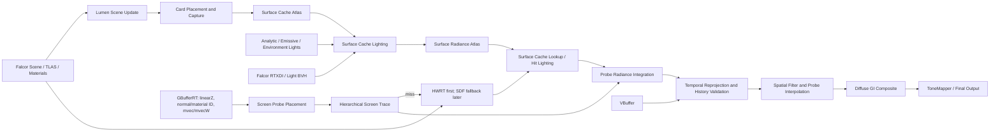

# Falcor Lumen 风格实时全局光照技术路线

> 状态：技术路线草案 0.1  
> 分支：`codex/lumen-gi`  
> 基线：NVIDIA Falcor `master`，commit `eb540f67`  
> 目标平台：Windows 10/11、D3D12、Shader Model 6.5+，优先支持 DXR 1.1

## 1. 项目定位

本项目将在 NVIDIA Falcor 原始代码基线上实现一套 **Lumen 风格** 的动态全局光照系统。这里的“Lumen 风格”指借鉴 Epic 公开资料中的系统设计思想：

- 屏幕空间追踪优先，场景追踪作为可靠回退；
- 使用 Surface Cache 缓存场景材质与光照；
- 使用 Screen Probe Gather 低成本重建漫反射间接光；
- 支持硬件光线追踪，并规划软件 SDF 追踪回退；
- 通过时域重用、空间滤波、分辨率缩放和分帧更新满足实时预算。

本项目不是 Unreal Engine Lumen 的移植，也不复制 Unreal Engine 源码、私有数据结构或 Shader。实现仅依据 Epic 公开技术资料，并建立在仓库已有的 NVIDIA Falcor、RTXDI、NRD/SVGF 等源码之上。文档中的 `LumenGI` 是项目内部工作名，不表示与 Epic Games 的兼容或授权关系。

## 2. 范围与非目标

### 2.1 第一阶段范围

- 完全动态的漫反射间接光照；
- 解析光源、环境光和发光三角形的间接贡献；
- 静态场景、动态相机、动态光源；
- 有限支持刚体动态物体，并正确失效历史与 Surface Cache；
- 硬件光追路径；
- 半分辨率或更低采样率 GI，时空重建到输出分辨率；
- 可视化 Surface Cache、Screen Probe、追踪命中和历史有效性。

### 2.2 后续范围

- 软件光追：Mesh Distance Field + Global Distance Field clipmap；
- 大场景 Far Field / Radiance Cache；
- 粗糙反射与漫反射 GI 共用场景缓存；
- 骨骼动画、毛发、透明材质和体积介质的高级支持；
- 异步计算与多队列调度。

### 2.3 明确的非目标

- 不从 `feature/pbrt-offline-renderer` 继承 Filament 预览、IBL 强度模拟或 PBRT 专用 UI；
- 不把“每像素 1 spp 路径追踪 + 普通降噪”直接称为 Lumen；
- 第一版不追求 UE5 的完整功能、开放世界规模或逐项画质一致；
- 第一版不依赖 DLSS，避免授权包成为构建和运行前置条件。

## 3. Falcor 原始基线评估

### 3.1 可直接复用的模块

| Falcor 模块 | 位置 | 在本项目中的用途 |
|---|---|---|
| RenderGraph / RenderPass | `Source/Falcor/RenderGraph/` | 管线编排、资源生命周期、调试输出 |
| VBufferRT / GBufferRT | `Source/RenderPasses/GBuffer/` | 深度、可见性、法线、粗糙度、材质 ID、运动矢量 |
| Scene DXR | `Source/Falcor/Scene/` | BLAS/TLAS、场景更新、材质和几何绑定 |
| PathTracer | `Source/RenderPasses/PathTracer/` | 正确性参考、BSDF/灯光采样代码、NRD 数据约定 |
| RTXDI | `Source/Falcor/Rendering/RTXDI/`、`Source/RenderPasses/RTXDIPass/` | 多光源直接光采样与 reservoir 复用 |
| NRD / SVGF / TAA | `Source/RenderPasses/` | 低样本降噪、时域重建与抗锯齿参考 |
| 发光几何采样 | `Source/Falcor/Rendering/Lights/` | Emissive sampler、Light BVH |
| SDF Grid | `Source/Falcor/Scene/SDFs/` | 软件追踪的数据结构与 Shader 基础 |
| FLIP / ImageCompare | `Source/RenderPasses/FLIPPass/`、`Source/Tools/ImageCompare/` | 与路径追踪参考图对比 |

### 3.2 必须新建的能力

Falcor 已有 SDF Grid 主要面向显式 SDF primitive 或预先提供的体素距离值，不能直接等价为 Lumen 所需的“任意三角网格 Mesh Distance Field + 相机中心 Global Distance Field”。以下部分需要独立实现：

- 三角网格到 Mesh Distance Field 的离线/缓存构建；
- Mesh Distance Field atlas、流送和实例变换；
- Global Distance Field clipmap 合成及脏区域更新；
- Card 自动放置、Card Capture 和 Surface Cache atlas；
- Surface Cache 页分配、驻留、失效和分帧更新；
- Screen Probe 放置、追踪、积分、插值和时空历史；
- 屏幕追踪与场景追踪的统一命中协议；
- Lumen Scene Lighting 更新调度；
- 面向 GI 的专用泄漏抑制、历史验证和置信度传播。

## 4. 总体架构



### 4.1 设计原则

1. **先正确、后缓存。** 先建立硬件 RT 的正确性基线，再用 Surface Cache 替代昂贵的 hit lighting。
2. **先硬件 RT、后软件 SDF。** Falcor 的 DXR 场景已经成熟，而任意网格的 Global Distance Field 尚不存在。
3. **Surface Cache 和 Screen Probe 是核心。** 若只实现路径追踪和降噪，不算完成本路线。
4. **所有历史均可验证、可失效。** 相机切换、分辨率变化、材质/几何/光源变化不得沿用错误历史。
5. **每阶段均有参考图和 GPU 时间门槛。** 不以主观截图作为唯一验收标准。

## 5. RenderGraph 数据契约

### 5.1 输入

- `vbuffer`：Falcor 可见性缓存；
- `depth` / `linearZ`：屏幕追踪和重投影；
- `mvec` / `mvecW`：时域重投影；
- `viewW`：世界空间观察方向；
- `normWRoughnessMaterialID`：几何边界、材质边界和滤波；
- `directLighting`：可选，用于最终合成；
- `Scene`：TLAS、材质、灯光、环境光和更新标志。

### 5.2 输出

- `diffuseGI`：线性 HDR 漫反射间接光，建议 `RGBA16Float`；
- `diffuseGIConfidence`：历史/追踪置信度；
- `bentNormal`：可选，用于天空遮蔽和材质合成；
- `debugOutput`：Cards、Surface Cache、Probe、命中距离、历史长度等；
- 后续增加 `roughSpecularGI`，但不阻塞漫反射 GI MVP。

### 5.3 持久资源

- Surface Cache material atlas：base color、normal、roughness、emissive、opacity、depth；
- Surface Cache radiance atlas：direct、indirect、history、validity；
- Card metadata 和 mesh/instance 到 card 的映射；
- Screen Probe radiance、depth range、normal cone、history length；
- Temporal moments、variance、hit distance、previous depth/normal/material ID；
- 后续的 Mesh SDF atlas 和 Global Distance Field clipmaps。

## 6. 分阶段实施路线

### Phase 0：基线、测试场景和空管线

目标：建立可持续开发与测量环境，不实现伪 GI。

任务：

- 新建 `LumenGI` RenderPass 插件和 `scripts/LumenGI.py`；
- 以 `GBufferRT` 作为主输入，验证 `linearZ`、`normWRoughnessMaterialID`、`mvec/mvecW`、`viewW`；`VBufferRT` 仅作需要内部解码材质数据的可选路径；
- 建立 Cornell Box、Sponza、Bistro 三档场景；
- 使用原生 `PathTracer` 输出 256 spp 参考图；
- 增加 GPU marker、逐 Pass 时间、显存统计和自动截图；
- 增加 `NoGI`、`ReferencePT`、`LumenGI` 三路对比；
- 固定随机种子和相机轨迹，保证性能回归可重复。

验收：

- RenderGraph 可加载、热重载和调整分辨率；
- 所有 G-buffer 数据与场景运动一致；
- 自动化脚本能产出参考图、测试图和误差报告。

### Phase 1：硬件 RT 单反弹正确性基线

目标：获得物理意义正确、但尚未缓存的动态漫反射 GI。

任务：

- 在半分辨率或 Screen Probe 上发射一条漫反射反弹射线；
- 使用 Falcor Material System/BSDF，而不是仅乘 base color；
- 支持解析光、环境光和发光三角形；
- 使用 MIS 或复用 PathTracer 的灯光/BSDF 采样；
- 输出 radiance、hit distance、normal、material ID 和 moments；
- 接入 NRD；若 NRD 不可用，则接入 SVGF；
- 相机移动、动态灯光和材质更新时正确失效历史。

验收：

- 静态画面收敛方向与 PathTracer 参考一致；
- 动态相机下没有无限历史拖影；
- 该阶段标记为 `HWRT GI Baseline`，不宣称 Surface Cache 已完成。

### Phase 2：Surface Cache 与 Cards

目标：建立 Lumen 风格场景光照缓存，避免每条 GI 射线在命中点完整求材质和阴影。

任务：

- 初版每个静态 mesh 使用六轴 AABB Cards；
- 后续基于面积、法线分布和遮挡覆盖率自适应增加 Cards；
- Card Capture 输出 base color、normal、roughness、emissive、opacity 和 depth；
- 实现固定大小分页 atlas，初版不依赖完整虚拟纹理系统；
- 实现 free-list/LRU 页分配、mesh-instance 映射和可见性优先级；
- 根据 `IScene::UpdateFlags` 失效几何、材质和实例对应页；
- 每帧限制 Card Capture 数量，防止相机快速移动产生卡顿；
- 提供 Card placement、coverage、resident page、invalid page 调试视图。

初版限制：

- 动态网格可先使用硬件 RT hit lighting，不进入 Surface Cache；
- 薄片、双面和透明材质先走显式 fallback；
- atlas 满时允许降低低优先级 Card 分辨率。

验收：

- 静态场景主要可见表面 Coverage 达到约定阈值；
- 缓存材质与直接材质求值的误差可量化；
- 动态材质/实例更新仅失效相关页，不全量重建。

### Phase 3：Surface Cache Lighting

目标：把直接光与多次反弹的低频辐射度写入 Surface Cache。

任务：

- 初版使用 PathTracer 现有的 Light BVH、Emissive 和 EnvMap sampler 为 texel 选择候选光源；RTXDI 适配是后续独立任务，必须拥有专用 SurfaceData writer、frame dimensions 和 reservoir/history，不得复用屏幕 RTXDI 实例；
- 发光三角形使用 Falcor Emissive Light Sampler；
- 环境光使用 importance sampling；
- 对更新页执行阴影可见性查询；
- 直接光、发光和间接反馈分层存储，方便失效；
- 使用上一帧 radiance atlas 进行受控的多反弹反馈；
- 对反馈增加能量 clamp、history confidence 和变化检测，避免发散。

验收：

- 动态灯光在限定帧数内传播到间接光；
- 发光材质能照亮附近表面；
- 多反弹反馈不会持续增亮或振荡。

### Phase 4：Screen Probe Gather

目标：用稀疏屏幕探针代替逐像素大量 GI 射线。

任务：

- 按固定 tile 放置探针，初始建议每 `8x8` 像素一个探针；
- 根据深度不连续、法线差异和薄几何增加自适应探针；
- 每个探针使用低差异/蓝噪声方向集，跨帧旋转采样；
- 先做 hierarchical screen-space trace；
- 屏幕追踪 miss 再走硬件 RT；
- 命中后优先读取 Surface Cache radiance，Coverage 不足时回退 hit lighting；
- 在 probe 内完成方向积分，并基于深度/法线/材质边界插值回像素；
- 输出 confidence、miss reason 和 fallback type。

验收：

- 屏幕内近距离接触反弹稳定；
- 屏幕外遮挡物由硬件 RT fallback 正确补充；
- 探针插值不跨越明显几何和材质边界。

### Phase 5：时域稳定与空间滤波

目标：在低射线预算下获得动态稳定输出。

任务：

- 使用 motion vector 重投影 probe 与像素历史；
- 使用 depth、normal、material ID、hit distance 验证历史；
- 保存一阶/二阶矩、history length 和 variance；
- 对高方差区域提高射线数或空间滤波半径；
- 对 disocclusion、相机切换和快速动态光立即降权；
- 在半分辨率 GI 模式下执行 bilateral upsample；
- 早期可继续使用 NRD，最终逐步替换为 probe-aware temporal filter。

验收：

- 相机平移、旋转和物体运动时没有长期残影；
- 细小遮挡和接触阴影不会被过度抹除；
- 历史失效原因可通过 debug view 检查。

### Phase 6：软件光追与 Global Distance Field

目标：提供无 DXR 或超多实例场景的可扩展回退，并形成完整的混合追踪。

任务：

- 增加静态三角网格 Mesh Distance Field 离线构建器；
- 支持 mesh SDF 量化、mip、压缩、磁盘缓存和版本校验；
- 实现 Mesh SDF atlas 与实例数据；
- 实现以相机为中心的多级 Global Distance Field clipmap；
- 区分静态与动态 clipmap，局部更新脏区域；
- 使用 sphere tracing，并输出步数、最小距离和 miss 原因；
- 近距离可选 Detail Trace，远距离使用 Global Distance Field；
- 保留硬件 RT 作为高质量路径，并允许运行时切换。

注意：Falcor 现有 `Scene/SDFs` 可复用稀疏体素/brick/octree 表示与 Shader 结构，但三角网格生成、atlas 和 Global Distance Field 仍属于新功能。

验收：

- Cornell/Sponza 静态网格能生成、缓存和加载 Mesh SDF；
- clipmap 随相机滚动时仅更新新增区域；
- 软件与硬件追踪的命中距离/遮挡误差在约定范围内；
- 薄几何和开放网格的问题有明确 fallback。

### Phase 7：Radiance Cache、Far Field 与大场景

目标：降低远距离查询成本并支持更大场景。

任务：

- 建立相机中心的世界空间 Radiance Cache clipmap；
- 对 Screen Probe miss 或远距离命中查询 Radiance Cache；
- 依据可见性、相机距离和光照变化分帧刷新；
- 对远场使用更低频 Surface Cache、简化几何或独立 TLAS；
- 添加追踪距离、cache density 和更新预算的质量档位。

### Phase 8：性能、异步计算和质量档位

任务：

- GPU wave compaction：压缩 screen miss、HWRT fallback 和更新页列表；
- Surface Cache、Screen Probe、Temporal/Spatial 尽可能使用 compute；
- 评估 async compute 与 raster/direct lighting 重叠；
- 支持 `Low / Medium / High / Reference` 四档；
- 质量旋钮包括 probe spacing、ray count、trace distance、atlas size、update pages/frame、GI resolution；
- 增加逐 Pass GPU 时间、射线数、cache hit rate、page churn、history rejection rate；
- 在目标硬件上固定回归轨迹并输出 CSV/JSON。

## 7. 推荐代码组织

MVP 阶段建议使用一个 RenderPass 插件持有内部子阶段，避免多个 RenderPass 之间传递复杂 C++ 缓存对象。数据契约稳定后，再拆分高成本阶段以获得更好的 RenderGraph 调度。

```text
Source/RenderPasses/LumenGI/
├── CMakeLists.txt
├── LumenGI.cpp
├── LumenGI.h
├── LumenGIData.slang
├── LumenSceneUpdate.cs.slang
├── LumenCardCapture.3d.slang
├── LumenSurfaceCacheLighting.cs.slang
├── LumenScreenTrace.cs.slang
├── LumenHardwareTrace.rt.slang
├── LumenScreenProbeGather.cs.slang
├── LumenTemporalFilter.cs.slang
├── LumenSpatialFilter.cs.slang
└── LumenComposite.cs.slang

scripts/
└── LumenGI.py

tests/image_tests/renderpasses/
├── test_LumenGI.py
└── graphs/LumenGI.py

Source/Tools/
└── MeshSDFBuilder/                 # Phase 6
```

当 Surface Cache、Mesh SDF 或 Radiance Cache 被两个以上 Pass/工具复用时，再把稳定的数据结构迁移至 `Source/Falcor/Rendering/LumenGI/`。

## 8. 建议的关键数据结构

```cpp
struct LumenCardData
{
    float4x4 worldToCard;
    float4 bounds;
    uint meshID;
    uint instanceID;
    uint materialPage;
    uint radiancePage;
    uint flags;
};

struct LumenSurfacePageData
{
    uint physicalPage;
    uint lastUsedFrame;
    uint lastUpdatedFrame;
    uint dirtyFlags;
};

struct LumenScreenProbeData
{
    float3 positionW;
    float depth;
    float3 normalW;
    float historyLength;
    uint2 screenTile;
    uint validityMask;
};
```

实际布局必须在 Slang/C++ 两侧共享定义，并通过静态断言或反射测试验证尺寸与对齐。

## 9. 更新与失效策略

| 变化 | 必须执行的动作 |
|---|---|
| 相机轻微移动 | 重投影 Screen Probe；滚动 Radiance/GDF clipmap |
| Camera cut / FOV 大变 | 清空屏幕历史，保留有效场景缓存 |
| 分辨率变化 | 重建屏幕资源和 probe 网格；保留 Surface Cache |
| 光源变化 | 标记受影响的 Surface Cache lighting pages；降低历史权重 |
| 材质变化 | 重新 Capture 对应 Cards，并失效 radiance pages |
| 静态实例变换 | 失效旧/新包围盒覆盖页与相关 SDF/GDF 区域 |
| 动态网格变形 | MVP 使用 HWRT hit lighting；后续使用动态专用缓存 |
| 几何拓扑变化 | 更新 BLAS/TLAS，重建对应 Cards/Mesh SDF，清理相关历史 |

## 10. 质量和性能目标

以下数字是项目目标，需在 Phase 0 确认参考 GPU 后冻结，不代表当前已达到。

| 指标 | MVP | 目标版本 |
|---|---:|---:|
| 输出分辨率 | 1280x720 | 1920x1080 |
| GI 内部分辨率 | 1/2 | 1/2，可动态缩放 |
| 漫反射反弹 | 1 | Surface Cache 多反弹反馈 |
| 场景追踪 | HWRT | Screen + HWRT + SDF fallback |
| GI GPU 预算 | ≤ 12 ms | ≤ 8 ms |
| 总帧预算 | 33.3 ms | 16.6 ms |
| Surface Cache 显存 | ≤ 512 MB | 可配置 256–1024 MB |
| 动态光响应 | ≤ 4 帧 | ≤ 2 帧 |

建议参考 GPU：RTX 4070 12 GB；同时记录一张较低档 RTX GPU，避免只对高端硬件优化。最终基准硬件由项目负责人确认。

## 11. 验证计划

### 11.1 场景矩阵

- Cornell Box：能量、颜色传播、漏光；
- Sponza：遮挡、薄几何、室内外过渡；
- Bistro：复杂材质、海量实例和大尺度；
- Emissive Test：小型高亮发光面；
- Dynamic Light Test：移动点光/区域光；
- Dynamic Object Test：移动刚体和 disocclusion；
- Camera Cut Test：历史清理；
- Thin Geometry Test：SDF 与 HWRT 差异。

### 11.2 正确性与稳定性

- 使用 Falcor PathTracer 256 spp/1024 spp 作为参考；
- 输出 FLIP、MSE/相对误差和曝光锁定截图；
- 分别比较 direct、first-bounce、multi-bounce、emissive 和 environment 分量；
- 检查能量是否随帧数无界增长；
- 固定随机种子执行自动化图像测试；
- 固定相机轨迹记录 ghosting、flicker 和 disocclusion；
- 强制切换分辨率、场景、材质和 GI quality；
- 运行 30 分钟检测显存增长、atlas 泄漏和历史越界；
- 开启 D3D12 debug layer 和 GPU validation 执行短测试。

### 11.3 性能

- 每个阶段单独 GPU marker；
- 记录 trace rays、screen hit rate、Surface Cache hit rate；
- 记录 pages captured/lit/evicted、GDF dirty voxels；
- 记录 history accept/reject 和 probe refinement 数量；
- 输出平均值、P95、P99，而非仅显示瞬时 FPS。

## 12. 风险与应对

| 风险 | 影响 | 应对 |
|---|---|---|
| Surface Cache coverage 不足 | 漏光、黑块、视角相关错误 | Card debug view、fallback hit lighting、自适应 Cards |
| 动态物体缓存昂贵 | 更新尖峰 | 动态物体先走 HWRT hit lighting，限制更新预算 |
| 时域重用产生拖影 | 动态场景不可用 | 深度/法线/材质/命中距离联合验证，快速失效 |
| 小型 emissive 高方差 | 火花噪点 | RTXDI/Light BVH、能量 clamp、重要性采样 |
| SDF 薄几何漏光 | 软件路径画质差 | 双面/厚度规则、分辨率提示、HWRT fallback |
| Atlas 抖动 | 画面 popping | 优先级、滞回、LRU、固定最小驻留时间 |
| 大场景 TLAS 更新昂贵 | HWRT 帧时间过高 | 实例裁剪、更新节流、Far Field、SDF fallback |
| 多系统一次性开发 | 难以验证 | 每 Phase 保留独立输出与参考路径，不跨阶段隐藏问题 |

## 13. 首批提交建议

### Commit 1：工程骨架与基准

- 新增 `LumenGI` 空 RenderPass；
- 新增 `scripts/LumenGI.py`；
- 接入 GBufferRT 主输入和 debug output，VBufferRT 仅保留为可选可见性输入；
- 新增固定相机/固定曝光回归脚本。

### Commit 2：HWRT GI Baseline

- 单反弹漫反射；
- 正确 BSDF、环境光、解析光与 emissive；
- 输出 radiance/hit distance/moments；
- 接入 NRD 或 SVGF。

### Commit 3：Surface Cache MVP

- 六轴 Cards；
- Material atlas + Radiance atlas；
- 固定页分配与调试视图；
- HWRT 命中查询 Surface Cache。

### Commit 4：Screen Probe Gather

- 固定 probe 网格；
- Screen Trace + HWRT fallback；
- probe 积分、插值和时域历史。

完成上述四个提交后，系统才具备第一版“Lumen 风格 GI”的核心形态。软件 SDF、Radiance Cache、Far Field 和反射在此基础上继续迭代。

## 14. 公开技术参考

- Epic Games, *Lumen Technical Details*: https://dev.epicgames.com/documentation/en-us/unreal-engine/lumen-technical-details-in-unreal-engine
- Epic Games, *Lumen Performance Guide*: https://dev.epicgames.com/documentation/en-us/unreal-engine/lumen-performance-guide-for-unreal-engine
- Epic Games, *Hardware Ray Tracing*: https://dev.epicgames.com/documentation/en-us/unreal-engine/hardware-ray-tracing-in-unreal-engine
- Epic Games, *Mesh Distance Fields*: https://dev.epicgames.com/documentation/en-us/unreal-engine/mesh-distance-fields-in-unreal-engine
- Epic Games, *Lumen in the Land of Nanite, SIGGRAPH 2022*: https://advances.realtimerendering.com/s2022/SIGGRAPH2022-Advances-Lumen-Wright%20et%20al.pdf
