# LumenGI UE5.8 参考对齐与生产链优化计划

> 版本：2026-08-10（UE5.8 源码对齐版）  
> 适用仓库：`F:\project\FalcorRendering`  
> 参考源码：`F:\UE_5.8`  
> 执行者：后续由 LLM 5.6 Luna 按本文件接手；Root 负责共享接口、唯一构建和唯一 GPU 集成。

## 0. 结论先行

当前目标仍然是“Falcor 中的实时动态 GI，借鉴 UE5 Lumen 的生产链思想”，不改成离线 path tracing，也不把 Unreal Engine 源码直接移植进 Falcor。UE5.8 的价值是提供成熟的阶段划分、资源生命周期、回退语义、历史失效条件和 QA 矩阵。

当前应采用以下判断：

1. **C4 compose 已修复，但 C4 Trace Router 仍未闭环。** GDF compose 的 `E_INVALIDARG` 已定位到显式 nested constant buffer 与 Falcor 默认 global uniform buffer 同时存在的 descriptor 合并边界；把 atlas scalar 合入 `LumenGDFComposeCB` 后，生产 compose 两级 dispatch 已通过。该证据只能关闭 compose dispatch，不代表 GDF 结果已经进入 Screen Probe Integrate。
2. **C3 是 smoke 通过，不是路由通过。** `artifacts/lumengi/C3/post-cbfix-20260812c/trace-fallback-matrix.json` 的 4/4 case 为 OK、无黑帧/NaN/Inf；但 `gdfExecuted=1`、`sphereHit=0` 不能证明 probe direction 真的选中了 GDF。
3. **Falcor 的生产顺序必须重写为“标记/反馈 → 缓存更新 → 追踪 → 命中光照 → 过滤/积分 → 历史 → Resolve”，而不是只验证单个 dispatch。** 这与 UE5.8 `LumenScreenProbeGather.cpp` 的真实顺序一致。
4. **C0–C9 闭环之前不接 C10 Radiance Cache、C11 Quality Preset、C12 发布矩阵。** CPU-only cache、checkbox、debug output 和文件存在均不能提前关闭生产 Gate。
5. **所有中间资源都必须带 validity、generation、producer frame 和 reset reason。** “资源非空”或“被 markOutput”不能代表本帧真的生产了有效数据。

## 1. 证据边界与 CodeGraph 状态

### 1.1 UE5.8 没有独立的 Lumen 设计白皮书

本次在 `F:\UE_5.8\Engine\Documentation` 中未发现 Lumen/Surface Cache/Screen Probe/Radiance Cache 的独立 Markdown、PDF 或设计正文。UE5.8 的可引用设计契约主要分布在：

- `Engine/Source/Runtime/Renderer/Private/Lumen/*.cpp`
- `Engine/Source/Runtime/Renderer/Private/Lumen/*.h`
- `Engine/Shaders/Private/Lumen/**/*.ush`
- `Engine/Shaders/Private/Lumen/**/*.usf`
- `Engine/Source/Programs/AutomationTool/Gauntlet/SelfTest/TestData/LogParser/*.txt`

因此本计划引用的是源码注释、CVar 语义、资源状态机和调用顺序；不能声称存在一份“UE Lumen 技术文档”可直接移植。

### 1.2 UE CodeGraph 初始化结果

已执行：

```powershell
codegraph init F:\UE_5.8
codegraph status F:\UE_5.8
```

当前 `.codegraph` 已建立，状态为“中断后的可查询索引”：

| 项目 | 当前值 | 解释 |
|---|---:|---|
| Files | 102,244 | 已进入索引的文件数 |
| Nodes | 2,184,277 | 类型/函数/方法/导入等节点 |
| Edges | 2,122,556 | 已解析的部分关系 |
| Pending references | 8,488,441 | 仍有大量调用/引用待解析 |
| Pending added files | 24,573 | 仍需 sync/index |
| 状态 | truncated | 全量 index 未完成，调用图可能缺边 |

已通过 CodeGraph 查询确认的参考模块包括：

- `LumenScreenProbeGather.cpp`
- `LumenRadianceCache.cpp`
- `LumenSurfaceCacheFeedback.cpp`
- `LumenDiffuseIndirect.cpp`
- `LumenSoftwareRayTracing.ush`
- `LumenVisualize.cpp`

后续若需要完整 UE 调用图，单独安排一个低优先级、独占 CPU/磁盘的 indexing Wave；不得与 Falcor 构建或 GPU Gate 并行。当前计划以“CodeGraph 查询 + 定点源码审阅”为证据，不依赖未完成的全量图。

## 2. UE5.8 参考生产链

### 2.1 参考顺序

```mermaid
flowchart LR
    Scene["Scene / Materials / Lights"] --> Feedback["Surface Cache feedback"]
    Feedback --> Request["Request / compact / prioritize"]
    Request --> Capture["Capture / map / page-table commit"]
    Capture --> Mark["Screen-probe & consumer marks"]
    Mark --> RC["Radiance Cache update / reuse / trace budget"]
    RC --> Trace["Screen trace"]
    Trace --> Router["MeshSDF -> GlobalSDF -> HWRT fallback"]
    Router --> Hit["Hit lighting / Surface Cache radiance"]
    Hit --> Filter["Probe filter / ShortRangeAO"]
    Filter --> Integrate["Interpolate / integrate"]
    Integrate --> History["Temporal history + rejection"]
    History --> Resolve["Material resolve / albedo / PI"]
    Resolve --> Output["Final diffuseGI"]
```



UE5.8 `LumenScreenProbeGather.cpp` 的核心顺序是：

1. 建立 Screen Probe 数据和 tile 分类；
2. 收集 Screen Probe、可视化、半透明等 Radiance Cache marks；
3. `UpdateRadianceCaches`，完成复用、放置、预算内追踪和提交；
4. `TraceScreenProbes`；
5. Probe filtering；
6. 可选全分辨率 ShortRangeAO；
7. `InterpolateAndIntegrate`；
8. 更新 history；
9. 供 diffuse、反射、半透明等消费者使用。

Falcor 必须保留同样的依赖顺序。任何“GDF debug 输出有值但 Probe Integrate 没有读取”“Surface Cache atlas 已分配但 miss 被当作零”“temporal history 资源存在但本帧未写入”的实现都只能标记为组件完成。

### 2.2 UE 参考参数基线

这些值不是 Falcor 的硬编码要求，而是用于建立可解释的 quality preset 和对照实验：

| 领域 | UE5.8 参考语义 | Falcor 落地要求 |
|---|---|---|
| Probe downsample | 默认约 16 | 把屏幕降采样、trace scale、integrate scale 分开暴露 |
| Adaptive probes | 8；allocation fraction 0.5 | 记录 adaptive/均匀探针数、tile valid mask |
| Trace octa | 默认 8，可按质量缩放 | 记录每 probe 实际方向数，不把固定索引轮换称作 union growth |
| Temporal | depth 0.01，foliage 0.03，normal 45° | 记录 reject reason、history length、camera/light reset |
| Temporal budget | max frames 10，max ray directions 8 | history AABB/acceptance 必须可读，变化后清理 stale hit |
| Spatial/AO | spatial filter + full-res ShortRangeAO | AO 是独立补偿通道，不冒充 GI radiance |
| Interpolation | stochastic 1 或 bilinear 4 | 明确质量/噪声/成本取舍 |
| Irradiance | SH3 或 Octa | 统一 incident irradiance 与 material-resolved GI 的格式契约 |
| Radiance Cache | 4 clipmaps，trace budget 100 probes/frame，grid 48，probe 32，atlas 128，keep-unused 8 | C10 才实现；需 mark/update/reuse/trace/commit/interpolate 全链路 |
| Surface Cache | 128×128 pages、多 size bins、last-used/recapture/eviction heap | miss 必须进入 feedback/request，下一帧 capture/map 后才 valid |

### 2.3 UE scene-frame 前置链（Falcor 不能跳过）

对 UE 源码定点审阅后，完整的一帧并不是从 Screen Probe shader 开始，而是：

```text
DeferredShadingRenderer
  -> UpdateGlobalDistanceFieldViewOrigin
  -> BeginUpdateLumenSceneTasks
       -> UpdateLumenScenePrimitives
       -> UpdateSurfaceCacheMeshCards
       -> ProcessLumenSurfaceCacheRequests
  -> UpdateLumenScene
       -> FillFrameTemporaries
       -> ResampleLumenCards
       -> UploadPageTable / UpdateCardSceneBuffer
       -> Card capture (raster/Nanite)
       -> DilateCardPageOneTexel / UpdateLumenSurfaceCacheAtlas
  -> RenderLumenSceneLighting
       -> BuildCardUpdateContext
       -> Direct lighting into cards
       -> Radiosity (HWRT or Mesh/Global SDF)
       -> CombineLumenSceneLighting
  -> RenderLumenFinalGather
       -> Screen Probe / ReSTIR / Irradiance Field
```

对应参考位置：`DeferredShadingRenderer.cpp:1950,1966,2894,3041`、
`LumenSceneRendering.cpp:913,1789,1974,2151,2210,2611,2635,2651,3097,3105`、
`LumenScene.cpp:707,1063`、`LumenSceneLighting.cpp:216,549`、
`LumenSceneDirectLighting.cpp:2392`、`LumenRadiosity.cpp:709,1089`、
`LumenScreenProbeGather.cpp:2093,2169`。

Falcor 的等价实现应拆成可观测的 frame phases，而不是把所有工作塞进
`LumenGI::execute()` 的隐式顺序：

1. 等待/提交 scene update task；
2. 更新 Surface Cache page table、card/page metadata 和 capture atlas；
3. 运行 direct/indirect cache lighting，并设置 `finalLightingValid`；
4. 更新 GDF page table、clipmap transforms 和 external access；
5. 再进入 probe mark、Radiance Cache update 和 trace；
6. 最后才允许 filter/integrate/history/resolve 消费这些资源。

UE 使用 RDG 与 Shader Parameter Struct 管理 transient/persistent resource，Falcor
应将其翻译为明确的 CB/SRV/UAV binding、generation 和 barrier/lifetime 记录，
不能直接照搬 UE 的 root parameter 名字。`FLumenCardPageGPUData` 的五个
`float4` stride、capture atlas 的 page rect、page-table upload 顺序和
`bFinalLightingAtlasContentsValid` 都应在 Falcor 中冻结为 ABI/状态契约。
Direct lighting 后、radiosity 后各一次的 Combine 语义也不能被单一 debug
texture 代替。GDF 的 page table/atlas/coverage/mip/clipmap transform 必须在
Lumen consumers 之前完成 `ExternalAccessQueue` 提交；global lighting change
必须同时使 Screen Probe history 与 Radiance Cache 失效。

## 3. Falcor 当前状态与差距

### 3.1 已有的有效证据

- HWRT baseline、Cards/Capture、Surface Cache 组件、Screen Probe 组件、Temporal/Spatial 组件均有局部测试。
- GDF compose 的 atlas typed-view 和 dispatch 诊断已完成；生产 shader 现在使用单一显式 `LumenGDFComposeCB` 承载 clipmap 与 atlas scalar。
- `pTraceStatsReadback` 已改为 `MemoryType::ReadBack`，避免对 DeviceLocal buffer 调用 `map()`。
- C3 MeshSDF/Hybrid 四 case 运行到正常退出，输出 finite/nonnegative，不能据此关闭 router Gate。

### 3.2 必须修复的生产差距

| 差距 | 当前事实 | 关闭条件 |
|---|---|---|
| C4 Trace Router | GDF compose 已运行；standalone GDF trace 仍是 view-ray/debug，未写 Screen Probe hit record | Screen miss 后真实执行 Screen→GDF→HWRT，至少一条 probe hit 带 GDF backend code |
| C5 Hybrid | 当前是 HWRT 主路径 + GDF debug，不是动态混合 | 同一帧记录 selected backend、fallback reason、hit/miss；HardwareRT baseline 无回归 |
| C6 Surface Cache | atlas/lookup 组件存在，但 miss→feedback→request→capture/map→next-frame valid 证据不完整 | 显式 page state、generation、miss/request/capture/evict 统计，invalid 不当零 GI |
| C7 Probe history | 有 running mean/history count，但没有 production per-direction identity/valid mask；reset 语义不全 | 1/8/32/96 帧方向/历史证据、相机/场景/灯光 reset、跳过 probe 不复用 stale hit |
| C8/C9 Resolve | host path 已存在；需证明内部 producer output 选择、export on/off 等价和最终 diffuseGI | source validity + generation 选择 spatial→temporal→probe→HWRT，albedo/PI 只乘一次 |
| C10 Radiance Cache | CPU-only header/checkbox，未进入 execute/resource/shader | GPU mark→allocation/reuse→budget trace→commit→query/interpolate + miss fallback |
| C11 Preset | 参数表和测试脚本存在，运行时接线不完整 | 每个 preset 改变可观察输出、成本和稳定性，不能只改 UI |
| C12 Release | 尚未开始 | 全场景、动态光、材质、性能、长时间稳定性和回归矩阵通过 |

## 4. 目标资源契约

每个生产中间资源必须携带下列元数据，不能只返回一个 texture pointer：

```text
ResourceValidity {
    bool producedThisFrame;
    uint32 generation;
    uint32 producerFrame;
    uint32 producerPass;
    uint32 resetReason;
    uint32 width, height, depth;
    uint32 formatContract;
}
```

强制规则：

1. `clearOutputs()` 后所有 optional output 为明确 invalid sentinel；未 dispatch tile、inactive probe 和 history reject 不能读未初始化值。
2. Resolve 只能选择 `producedThisFrame=true` 且 generation 与当前 scene/frame 匹配的资源。
3. `markOutput()` 只决定 RenderGraph 生命周期和导出，不得决定算法是否执行；未标记的 internal output 仍应服务于生产链。
4. `get_output()` 读不到未标记 endpoint 是 RenderGraph 合约，不得删除该检查；诊断若需要，应新增明确的 compiled-resource API 或始终 mark 专用 readback endpoint。
5. Surface Cache miss、GDF miss、Radiance Cache miss、history reject 都必须有 reason code；“黑色”不能同时表示 miss、invalid、真实零能量。

## 5. 分阶段执行计划

### Wave 0：基线冻结与证据整理

**目标**：冻结当前可运行基线，不改算法。

- 记录当前 Release binary/source 时间戳、GPU、驱动和 `codegraph status`。
- 运行 C0 分辨率/Arcade cache-lighting 矩阵，先确认 E_INVALIDARG 是否仍存在。
- 保留 C3 post-CB-fix artifact；把 `gdfExecuted=1` 与 `gdfRadianceSelected=0` 写入报告。
- 统一 artifact 根目录，禁止多个 agent 写同一日志目录。

Gate：HardwareRT 640×360 与 Arcade 640×360/800×450 正常退出；首个失败 pass、thread count、group count、resource generation 可定位。

### Wave 1：C4 最小 Trace Router（当前最高优先级）

**Host owner（Root）**

- 在 `LumenGI.cpp/.h` 冻结 `gdfRequested`、GDF clipmap/level-table bind、route telemetry 生命周期。
- 保持 `runGDFSphereTrace` standalone debug，不再把它当 probe route。
- 为每个 probe direction 增加 `backendCode`/`producerFrame`/`validMask` telemetry；优先使用独立 `StructuredBuffer<uint4>`，避免污染现有 32B `LumenProbeHit` ABI。

**Shader owner**

- `LumenScreenProbeTrace.cs.slang` 复用已有 probe origin（含 normal bias）和方向；screen miss 后尝试 GDF，GDF miss 再落 HWRT。
- GDF hit 写现有 hit record 的 distance/flags/radiance fallback；增加 `kHitFlagGDFHit`，保持旧字段布局不变。
- `LumenScreenProbeIntegrate.cs.slang` 把 GDF bit 纳入 valid mask；跳过 probe 必须写 invalid/stale-safe 状态。

**Test owner**

- 新增/扩展 `run_gdf_probe_router.py`，固定 Cornell/Arcade 320×180 或 640×360。
- 记录 route telemetry，不得以 `gdfStats.sphereHit` 代替 probe hit。

Gate：

- `traceMode=MeshSDF,useGDF=true,useScreenProbes=true` 至少一个 probe direction 的 backendCode 为 GDF；
- GDF miss 有 HWRT fallback 或明确 unavailable reason；
- `probeInterpolated`、`resolvedDiffuseGI` finite/nonnegative 且非全黑；
- `gdfTrace` export on/off 不改变 production diffuseGI；
- `traceMode=HardwareRT,useGDF=false` 数值容差内无回归；D3D12 validation 无新增错误。

### Wave 2：C5 Hybrid 语义

只有 C4 Gate 通过后开始。

- 冻结优先级：Screen → MeshSDF/GDF → HWRT；Hybrid 必须记录 selected/fallback，而不是“HWRT 输出 + GDF debug”。
- 为每个 candidate 记录 cost/available/hit/miss，避免同一方向重复追踪不可控。
- 明确 MeshSDF、GlobalSDF、HWRT 的 bias、max distance、inside-geometry miss 修正。
- 先做静态 fallback；动态质量选择、FarField 和完整多后端预算留给后续。

Gate：Cornell/Arcade/高实例密度三场景，MeshSDF 命中、GDF 命中、HWRT fallback 均有可解释记录；Hybrid 与 HardwareRT 基线不出现黑帧/NaN。

### Wave 3：C6 Surface Cache 生产消费

对齐 UE5.8 `LumenSurfaceCacheFeedback.cpp`：

```text
unmapped -> feedbacked -> requested -> mapped -> captured -> valid -> last-used -> evictable
```

- GPU feedback：allocator → hash table → compact unique list → readback；readback ring 满时跳过重复 enqueue 并记录原因。
- 每页携带 `generation/lastUsed/lastCaptured/requestFrame`；atlas、format、compression、pre-exposure、scene generation 变化时 RemoveAll/重建。
- lookup miss 显式返回 invalid，并提交 request；下一帧 capture/map 后才允许 hit lighting 读取。
- 低预算 `captureMaxPagesPerFrame=1` 需验证恢复，不得用一帧黑图掩盖 stale cache。

Gate：`run_surfacecache_effect.py` 的 lookup on/off、invalidate、low budget 全部有 stats，miss/request/capture/evict 闭环且最终 diffuseGI 恢复。

### Wave 4：C7 Screen Probe history 与跨帧采样

- history validity 由 camera cut、resize、scene/material generation、light/environment change、filter/trace mode change、history dimensions/format change 共同决定。
- Temporal rejection 至少记录 depth、normal、motion、lighting generation、fast-update reason。
- 为每个 `(probe, direction)` 记录 sample identity 或实际 octa direction、producer frame、valid mask；仅保存 `sampleIndex` 不足以证明方向 vector union。
- 1/8/32/96 帧验证 history count 单调、mean/variance 收敛、双 fresh-run 同帧确定性；相机/灯光变化后 count 和 generation 正确 reset。
- inactive/skipped probe 不能复用上一帧未验证 hit record。

Gate：direction union 不再是 SKIP；history reset/accept/reject 可解释；96 帧没有长尾偏差或 stale hit。

### Wave 5：C8/C9 Filter、History、Final Resolve

- 每个 producer 返回实际写入资源和 validity，而不是只检查 graph mirror texture 是否非空。
- Resolve precedence 固定：`spatial internal output → temporal internal history → probe interpolated → raw HWRT fallback`。
- incident irradiance 在 Resolve 中只乘一次 material diffuse reflectance / π；天空/无命中走明确环境或 fallback 语义。
- `resolvedDiffuseGI` 可作为诊断 output；`finalColor` 只有接入完整 scene composite 后才可宣称。
- mark on/off、filters off/partial、白炉 albedo-once、不同 source fallback 必须比较线性 HDR，不用 RGBA8 sentinel。

Gate：`run_export_equivalence.py` 中 mark-on direct output 通过；mark-off direct endpoint 若不可读，状态写 BLOCKED/PARTIAL，不能伪造 GI；resolved 与公共 diffuseGI 一致且非黑。

### Wave 6：C10 Radiance Cache / Far Field（C0–C9 后）

对齐 UE5.8 `LumenRadianceCache`：

```text
mark positions -> place probes -> reuse valid entries -> trace budget subset
-> atlas/indirection commit -> query/interpolate -> miss fallback
```

- Root：生命周期、clipmap、reset、budget、stats；Shader：mark/update/trace/commit/query；Test：hit/miss/eviction/dynamic light。
- reset 条件包括 clipmap extent/distribution、pre-exposure、probe offset mode、atlas/format/adaptive-probe 变化、global lighting change。
- 正常帧预算化更新；resize/global-lighting/force-full 时一次性 full update。
- cache miss/expired entry 必须回退 Surface Cache/HWRT，不能黑帧。

Gate：`mUseRadianceCache` on/off 改变生产 diffuseGI；hit/miss、resident/dirty/refresh/eviction/bytes 可读；远距离和动态光场景通过。

### Wave 7：C11/C12 Preset、QA、发布

C11 只在 C0–C10 后做：每个 preset 必须同时改变可观察质量、GPU 时间或显存，并保留配置快照。C12 参照 UE Gauntlet 测试名扩展 Falcor：

- Surface Cache overview、evict、static/emissive、dynamic light/sky；
- multi-bounce、movable/stationary light、不同实例密度；
- metallic/rough/furnace、clear coat、two-sided/foliage、thin/unsupported geometry；
- 640×360、800×450、1280×720、1920×1080；front/left/right；warmup 1/8/32/96；
- final diffuseGI/resolvedDiffuseGI finite/nonnegative/nonblack；
- performance、VRAM、长时间动态光和 resize/scene reload 恢复。

## 6. 并行 Wave 与文件所有权

每个 Wave 先由 Root 冻结接口，再并行拆分。建议槽位：Root + Shader + Tests/Telemetry；UE CodeGraph/index 作为独立 CPU/磁盘任务，不能抢 GPU/构建槽。

| 角色 | 可修改范围 | 禁止修改 |
|---|---|---|
| Root/integrator | `LumenGI.cpp/.h`、共享 ABI、计划文档、CMake、最终集成 | 不覆盖 agent 文件，不同时启动第二个 build |
| Shader agent | 指定 `.slang` 与 include/data 文件 | `LumenGI.cpp/.h`、计划、CMake |
| Test/telemetry agent | `tests/lumengi/*`、唯一 artifact 目录 | 生产 C++/shader、共享输出目录 |
| Analysis/UE agent | 只读 CodeGraph、UE 源码、证据报告 | Falcor 生产文件、GPU、构建 |

所有子任务必须写清：单一目标、允许文件、禁止文件、冻结接口、最小验证、artifact、残余风险。禁止“完成全部集成”“修复所有失败”这类宽任务。

构建/GPU 强制串行：

```powershell
cmake --build build\windows-vs2022 --config Release --parallel 1
# 或在已生成的 vcxproj 上使用 MSBuild /m:1
```

每个 GPU case 使用独立 `artifacts/lumengi/<wave>/<case>/`，根 agent 统一按依赖顺序执行。

## 7. 失败分类与停止规则

1. **编译失败**：保留首个 compiler error；不启动依赖该 shader 的 GPU Wave。
2. **D3D12 E_INVALIDARG**：先记录资源格式、descriptor/root signature、logical threads、reflected thread group 和 binary timestamp；禁止盲改 dispatch 尺寸。
3. **黑帧/NaN/Inf**：先检查 validity/generation/reset/stale history，再检查 radiance 数值；不能通过降低亮度或放宽阈值“修复”。
4. **输出不可读**：区分 RenderGraph mark contract、资源未分配和生产未执行；sentinel 只能诊断，不能冒充 GI。
5. **性能回归**：与画质 Gate 同级；记录 GPU ms、dispatch 数、trace rays、显存和 cache budget。
6. 同一失败连续三个 Wave 仍无法通过且需要用户选择时，停止并报告，不把 blocked 改写成 complete。

## 8. 给 LLM 5.6 Luna 的接手提示

```text
你正在 F:\project\FalcorRendering 继续 LumenGI。先读：
1) AGENTS.md
2) docs/LumenGI_Production_Chain_Closure_Plan.md
3) docs/LumenGI_UE5.8_Reference_Optimization_Plan.md
4) LUMENGI_HANDOFF.md / todo.md

目标是 Falcor 实时动态 GI，借鉴 UE5.8 的生产链契约，不移植 UE 源码。
当前 C4 compose 已通过 production-cbfix artifact；C3 4/4 smoke 通过，但
GDF 尚未证明进入 Screen Probe Integrate。先做 C4 Trace Router：Screen miss
后 GDF candidate，miss 再 HWRT；增加 producer-frame/backend telemetry；不要
提前做 C5 Hybrid、C10 Radiance Cache、C11 Preset 或 C12 发布矩阵。

每个 Wave 先拆 Host/Shader/Test/Analysis，明确文件 owner；LumenGI.cpp/.h、
共享 ABI、计划和 CMake 由 Root 独占。构建只允许 /m:1，GPU 只允许串行。
每个 Gate 必须有唯一 artifact、首个错误和可复现实验命令。不要把 debug
output、markOutput、checkbox、shader 文件存在或 gdfStats.sphereHit 当作生产
链闭环证据。
```

## 9. 当前交付判定

本文件完成的是**UE5.8 参考对齐和执行计划**，不是宣称 Falcor 已实现 UE Lumen。当前最合理的工程状态是：

- `HWRT GI baseline`：可用；
- `GDF compose dispatch`：已修复并有 GPU 证据；
- `C3 trace smoke`：4/4 通过；
- `C4 Trace Router`：下一最高优先级，未闭环；
- `C5–C9`：按依赖推进，部分 host/component 已有但 runtime Gate 未全部关闭；
- `C10–C12`：明确延期。

任何后续报告都应同时给出 component gate、production integration gate、image/quality gate、performance gate 四列，避免“组件完成”再次被误报为“全局 GI 完成”。

## 10. 当前代码级改进审计（2026-08-10）

本节将 UE 参考架构映射到当前磁盘上的 Falcor 实现，是下一轮修改的函数级 backlog。

### 10.1 当前真实数据流

`LumenGIPass::execute()` 当前大致执行：

```text
全分辨率 HWRT baseline
  -> Surface Cache capture
  -> Surface Cache lighting
  -> GDF compose + 可选 view-ray debug trace
  -> screen HZB / screen trace
  -> screen-probe trace（Screen -> HWRT fallback）
  -> probe integrate（可选 Surface Cache lookup）
  -> interpolate -> temporal -> spatial -> final resolve
```

它已经超过最早的 HWRT 原型，但与生产目标仍有四个决定性差距：

1. 全分辨率 HWRT 仍先于 probe router 执行，并保持权威 material-lighted signal；
2. GDF 已 compose，但 Probe Trace shader 没有消费它；
3. Surface Cache 仅以资源指针非空判断可用，没有 page generation/captured/lighting-ready 契约；
4. 部分重建输入仍来自 graph optional diagnostics，export topology 会改变生产数值。

### 10.2 P0 正确性与生产路由改进

| 优先级 | 当前代码证据 | 问题 | 必须改进 |
|---|---|---|---|
| P0.1 | `LumenGI.cpp:1048-1062` 固定 `kGDFProvidesDiffuseRadiance=false` 并执行全屏 HWRT；`4092-4174` 的 GDF `primary=false` | MeshSDF/Hybrid 不选择 GDF radiance；`gdfTrace` 只是 view-ray 诊断 | 增加统一 per-probe trace policy，固定 Screen miss -> GDF -> HWRT；拆分 `geometryBackend` 与 `lightingSource`，禁止 GDF debug 覆盖公共 GI。 |
| P0.2 | execute 仅在 `mUseGDF` 时运行 GDF，而 `getGDFStats()` 用 `mUseGDF || traceMode != HardwareRT` 表示 requested | requested 与 actual backend 语义不一致 | 冻结 `TracePolicy {requested, capability, actual, fallbackReason}`；TraceMode 选择策略，feature toggle 表示能力，telemetry 分开记录。 |
| P0.3 | `LumenScreenProbeTrace.cs.slang:496-558` 的 Screen miss 直接调用 HWRT fallback | GDF 从未进入已有 hit-record/Integrate 路径 | 给 Probe Trace 绑定 GDF clipmap CB、level table 和 level textures；写 GDF hit flag、distance、producer tag。 |
| P0.4 | `LumenScreenProbeIntegrate.cs.slang:151-188` 每个方向遍历全部 cards；`354-381` 只接受 Screen/HWRT flags | lookup 复杂度为 O(probes × directions × cards)，且 GDF hit 被拒绝 | trace backend 返回 `surfaceKey/cardCandidate`，或使用 GPU card grid/BVH；Integrate 接受 GDF geometry hit，独立选择 Surface Cache/HWRT/environment lighting source。 |
| P0.5 | `LumenGI.cpp:2744-2745` 只要 cache 资源存在就启用 lookup | page ID 重用或 lighting 尚未完成时可能读到旧页 | 将 page table 升级为 pageID、page generation、capture generation、lighting generation、valid flags；epoch 不匹配时 feedback + fallback。 |
| P0.6 | `runSpatialFilter()` 从可选 `temporalConfidence` graph output 读取 confidence（`3267-3283`、`3344-3348`） | `markOutput()` 会改变 filter confidence 和最终 GI | 增加 internal temporal confidence；Temporal 总是写，Spatial 总是读；graph output 仅镜像。variance/moments 同样处理。 |
| P0.7 | Probe metadata 的 dirty 只触发重追踪，没有按 probe 清除 `pRadianceHistory` | Probe 移到新表面后可能混入旧 irradiance | 增加 per-probe history key/epoch；depth/normal/material/position 越阈值时清该 probe history。 |
| P0.8 | Final Resolve 缺少 `diffuseOpacity` 时使用白 albedo，并统一 saturate source alpha | incident irradiance 可能变成白材质 GI；history length 可能被公开成 confidence=1 | 将材质反射率作为 required resolve dependency，或明确退回 raw HWRT；final alpha 只表示 confidence 或明确 unused。 |
| P0.9 | `runTemporalFilter():3085-3090` 只检查 internal `pInterpolated` 指针，不检查 `mScreenProbes.producedThisFrame` | 运行时关闭 Screen Probes 后可能继续过滤上一帧纹理，Resolve 选择 stale GI | Temporal 必须要求本帧 Probe producer stamp；否则 invalid 并回退本帧 HWRT。所有 producer 统一校验 frame/generation。 |
| P0.10 | Geometry/Mesh 更新会重建 HWRT/Capture，但 `invalidateMeshSDF()` 主要只在 `setScene()` 调用 | GDF 可能继续代表旧几何 | GeometryChanged/MeshesChanged 触发 MeshSDF scene rebuild 或增量 instance update，并强制 full compose；材质/灯光变化不重建几何 SDF。 |
| P0.11 | HWRT miss 可写环境辐射，但 Integrate 先要求 Screen/HWRT geometry hit，并以 `RGB > 0` 判断有效 | 有效天空辐射被丢弃；合法黑色也被误判 invalid | hit flags 分离 `GeometryValid` 与 `RadianceValid`，增加 Environment/SurfaceCache/RadianceCache source bits；Integrate 只按 RadianceValid 纳入，黑色仍可 valid。 |
| P0.12 | Interpolate 无邻居时写 `(0,0,0,0)`，Temporal 没有 current-lighting validity，且 confidence gating 当前固定为 0 | invalid zero 与真实零能量不可区分，Temporal 可制造暗脉冲 | 增加 internal `R8Uint probeValidity`，贯穿 Interpolate→Temporal→Spatial→Resolve；当前无效但历史有效时保留历史。 |
| P0.13 | Page reuse/capture 前未整页清 material/metadata/radiance/visibility/indirect/depth；fragment early return 可保留旧 texel | 新 owner 可能继承旧 page 内容，重叠 fragment 缺乏明确 depth arbitration | 增加 `ClearPage(pageID,generation)`，写 invalid/depth-far sentinel；capture 完成且 lighting 成功后才 publish Valid。 |

现有 C6 不能改写成“未接线”：capture→cache lighting→Probe Integrate lookup
已进入生产链，现有 effect smoke 也证明 on/off 有数值影响。准确状态应是：

```text
C6 = PASS_NARROW_EFFECT_GATE
     + REOPEN C6.1-C6.5 PRODUCTION_LIFECYCLE
```

窄 Gate 不覆盖 demand feedback、generation 双向校验、page clear/depth、LRU
sample touch、bounded lookup、dirty-only relight 和图像/性能阈值。

### 10.3 P1 架构与性能改进

#### A. 避免重复追踪同一光照

`LumenGI.cpp:1061` 的全屏 HWRT 在 Probe 路径的 per-direction fallback 之前运行。C4/C5 闭环后，应将它保留为 Reference/debug 模式；生产路径改为读取明确的 screen-radiance 输入（scene color、direct+emissive 或冻结的 lighting buffer），只对 probe miss 追踪场景。否则无法达到 Lumen 式 ray budget。

Gate：关闭全屏 reference HWRT 后 screen hit 不黑；fallback ray count 和 GPU time 下降；Reference preset 仍能运行旧路径作对照。

#### B. 替换线性 card 搜索

Surface Cache lookup 不得通过限制 card 数“优化”，否则结果依赖场景顺序。接口优先级：

1. trace hit 直接返回 `surfaceKey`/card candidate；
2. instance-to-card table + primitive/mesh instance ID；
3. world-space card grid/BVH 返回少量候选。

必须统计 candidate count、lookup hit/miss、generation reject 和 lighting fallback source。

#### C. 共享 HZB

`runScreenTrace()` 维护一套 HZB textures，而 `runScreenProbeTrace()` 每帧重建第二套 native mip chain（`LumenGI.cpp:2407-2513`、`2619-2829`）。应创建独立于 optional output 的内部 HZB service，让 screen trace 与 probe trace 共用；`screenTrace` 只镜像诊断结果。

Gate：每帧只构建一次 HZB，非 8 倍数分辨率覆盖不回归，screen/probe hit counters 在容差内一致。

#### D. Probe-grid 资源使用 probe 分辨率

`mScreenProbes.pRadiance` 和 `pRadianceHistory` 当前为 full-frame RGBA16F，仅在 tile center 稀疏写入（`LumenGI.cpp:2625-2643`）。应改成 probe-grid 尺寸，只保留 `pInterpolated` 为 full resolution。

Gate：1920×1080 时 radiance/history 显存随 probe count 而非 pixel count 增长；插值边缘和图像误差仍在冻结阈值内。

#### E. 显式 Frame stages 与 epochs

建议将大 `execute()` 拆成：

```text
beginFrameState
updateSceneAndSurfaceCache
updateSurfaceLighting
updateDistanceFields
updateRadianceCacheMarks
traceFinalGather
filterAndIntegrate
resolveAndPublish
endFrameTelemetry
```

每阶段返回：

```cpp
struct LumenStageResult
{
    bool executed;
    bool valid;
    uint32_t generation;
    uint32_t producerFrame;
    uint32_t reason;
};
```

这相当于把 UE RDG 的 lifetime 语义翻译成 Falcor 的显式 CB/SRV/UAV 与 epoch。每阶段记录 GPU timestamp、resource generation 和 no-op/fallback reason；`producedThisFrame` 可暂时保留，但不应是最终跨阶段契约。

#### F. 修复两个现有 reconstruction 输出错误

- `runSpatialFilter():3352-3366` 在 graph `filteredVariance` 存在时直接让
  shader 写 graph texture，随后又把未写入的 internal variance copy 回 graph。
  必须始终写 internal 再 mirror，或直接写 graph 时删除反向 copy。
- Public `diffuseGI` 已由 Probe/Temporal/Spatial Resolve 更新，但 public
  `confidence` 与 `diffuseRadianceHitDist` 仍主要来自 S1 HWRT estimator。
  Resolve 必须发布与最终 producer 配套的 confidence/validity；hit-distance
  需要明确标成 raw HWRT auxiliary，或新增 resolved auxiliary。

### 10.4 P1 History、Filter 与 Resolve

- History key 需覆盖 projection/FOV、camera orientation cut、scene/material/light/environment generation、trace policy、probe layout、resolution scale 和 exposure。
- 平滑移动继续使用 motion reprojection；同时输出 depth、normal、material、motion、lighting generation、explicit reset 的 reject counters。
- Temporal moments 已是内部资源；补 internal confidence 和 true temporal variance，Temporal 成功时 Spatial 无条件消费。
- Moments 不能在 current pixel 原地累积；相机运动时应与 GI history 使用相同 `prevPx` 重投影和双缓冲，否则 moments 与 radiance 属于不同表面。
- `is_valid_gVariance` 当前仍初始化为 false，Spatial 主要依赖 local variance；质量调优前必须闭合 temporal variance。
- Telemetry 写 actual direction vector/hash、producer frame、valid mask、geometry backend、lighting source；`sampleIndex` 只是置换后的 slot，不能证明 unique-ray union。
- Incident irradiance、confidence、history length、material-resolved radiance 必须使用不同通道，禁止继续复用 alpha 表达三种语义。

### 10.5 P2 Cache 与 Quality（C0-C9 后）

`mUseRadianceCache` 当前只参与 property/UI serialization；`RadianceCache/LumenRadianceCache.h` 是 CPU bookkeeping，生产 pass 没有实例。C10 必须实现 GPU mark -> allocate/reuse -> budget trace -> commit -> query，不能只在 execute 增加 checkbox 分支。

质量系统也存在重复：`LumenGIPass::QualityPreset` 主要只控制 cache-lighting samples，而 `Quality/LumenQualityPreset.h` 定义的完整参数表没有被 pass 消费。C11 应统一 enum，并通过一个 `applyQualityParams()` 原子更新 probe tile/directions/budget、trace distance、GI resolution、cache/capture budget、Temporal/Spatial 开关和 reset epoch。

当前 MeshSDF CPU cache 使用 R16Float/R8Snorm codec，GPU runtime atlas 使用 R32Float staging view；部分 header/comment 仍把二者描述成同一 physical format。应把 storage codec 与 runtime staging format 命名为两个独立契约，避免再次产生 typed-view 误判。

C11 还需修正 preset 的 probe-density 方向：当前独立参数表写 Low=8px、
Reference=16px，但 tile 越小 probe 越密，这会使 Low 比 Reference 更昂贵。
应按冻结语义改为 Low 16、Medium 12、High/Reference 8，或引入 adaptive
placement，并让测试验证成本/质量单调性而不是数值递增。

### 10.6 C6 生产状态机与必备 counters

```text
Unmapped -> Feedbacked -> Requested -> Capturing -> Captured
-> LightingPending -> Valid -> LastUsed -> EvictPending
```

只有 `cardRecord.generation == pageOwner.generation`、owner card 一致、page
状态为 Valid、lighting generation 当前时才允许采样。真实 lookup hit 必须更新
last-used；当前只在 scheduler recapture 时 touch page，不足以支撑压力下 LRU。
Cache lighting 也应只更新 new/dirty/light-invalidated pages，而非每帧 relight
全部 resident owner pages。

最低 counters：

```text
feedbackRaw / feedbackUnique / feedbackDropped
readbackQueueDepth / readbackQueueFullDrops
mappedHits / unmappedMisses / requestsIssued / requestsDeduped
pagesCaptured / pagesRecaptured / pagesLit / validPages / validTexels
lookupQueries / lookupHits / lookupMisses / lookupCandidateTests
staleGenerationRejects / invalidTexelRejects / fallbackCount
lastUsedUpdates / evictions / starvationFrames / residentBytes
feedbackMs / compactMs / captureMs / lightingMs / lookupMs
```

## 11. 从当前代码出发的推荐实现顺序

```text
I0  修 stale Temporal producer、variance mirror、Geometry->GDF invalidation
I1  冻结 TracePolicy + 32B Hit flags + 64B Meta generation + 独立 telemetry
I2  增加 RadianceValid/ProbeValidity，保留环境 miss 与合法黑色
I3  将 GDF 绑定到 ScreenProbeTrace，证明 Screen -> GDF -> SurfaceCache/HWRT
I4  增加版本化 Surface Cache page/lighting validity、page clear 与 O(1) lookup
I5  内部化 temporal confidence/variance，修复 per-probe history reset/reprojection
I6  冻结 Final Resolve material/alpha/public auxiliary 与 export equivalence
I7  生产模式移除重复 full-frame HWRT
I8  共享 HZB，Probe radiance/history 改为 probe-grid resolution
I9  关闭 C0-C9 图像与性能 Gate
I10 再开始 C10 Radiance Cache、C11 Preset、C12 Release
```

I0 是三个独立小修复，可按唯一文件 owner 串行落盘；I1-I6 不应堆在一个
patch 中。I1-I2 先冻结共享 ABI/validity；I3-I5 再按 Host/Shader/Test 拆
owner；I6 是集成边界。只有 I6 的 GPU/image Gate 通过后，I7-I8 才改变
成本结构。

### I0 实施结果（2026-08-10）

- `LumenGI.cpp` 已在 Temporal Filter 入口要求 `mScreenProbes.producedThisFrame`，避免 Screen Probe 关闭或提前返回时把旧 `pInterpolated` 写入历史。
- Spatial Filter 始终写入内部 `mSpatialFilter.pVariance`，随后才将结果复制到可选 graph mirror `filteredVariance`；导出拓扑不再改变生产资源。
- `GeometryChanged`、`MeshesChanged`、`GeometryMoved`、`SceneGraphChanged` 和 `RecompileNeeded` 在 GDF/MeshSDF 路径下触发惰性 `invalidateMeshSDF()`，覆盖静态相机下实例移动的旧场景几何风险。
- Release 单路构建：`LumenGI.vcxproj /m:1` 通过，0 warning/0 error。
- GPU 运行：`artifacts/lumengi/I0/run-20260810-2213/mogwai.log`；GDF 两级 compose dispatch 成功，无 `E_INVALIDARG`。I0 回归 JSON 将属性切换、内部 variance 独立观测、generation/reset 观测明确记为 `BLOCKED`，因此 I0 的运行时完整 Gate 仍待 telemetry/API 补齐。

### I1 视觉去噪实施结果与下一 Wave（2026-08-10）

UE5.8 的可复用质量契约不是“增加随机样本后截图变平滑”，而是：
`TraceScreenProbes -> FilterScreenProbes -> InterpolateAndIntegrate ->
UpdateHistory`，并用 history depth-plane/normal/motion rejection、有限 history
age、spatial passes 和 max-ray-intensity 共同控制尾部。Falcor 当前 I1 已完成三
个不改变 Hit ABI 的修复：

1. Screen hit 的 trace-view `t` 在写入 32B hit record 前，根据 `hitUV + linearZ`
   和 camera basis 反投影为 world hit distance；Surface Cache lookup 不再把 view
   参数当 world-ray 距离。
2. Probe interpolation 只让 finite 且 confidence>1e-4 的记录参与权重归一化，
   nearest fallback 使用同一 validity 规则；合法黑辐射不因 RGB=0 被误删。
3. 所有 trace/integrate/temporal/spatial/resolve 阶段统一 10-unit per-channel
   radiance/firefly ceiling，且 Temporal history clamp 默认开启，对齐 UE 的
   `MaxRayIntensity≈10` 语义。

验证记录：Release `/m:1` 构建通过；post-I1 截图在
`artifacts/lumengi/screenshots/current-final-20260810e/`，Arcade 的大面积
firefly/mottled ceiling 明显下降。cache on/off A/B 的线性统计接近，说明剩余
结构主要来自 probe sample/history validity，不应通过继续降低曝光伪装修复。

I1 尚未关闭视觉 Gate。下一 Wave 必须冻结并实现：

- producer generation/age、per-probe valid mask 和 accepted/rejected history；
- UE 式 depth-plane、normal-angle、motion/disocclusion rejection，并把
  `temporalConfidence` 与 history length 分离；
- `MaxFramesAccumulated` 与 `MaxRayDirections` 联调（参考 UE 5.8 的 10/8，Falcor
  的 32 directions 只作为高质量实时 preset）；
- 至少三次 spatial filtering 或明确的等价 bilateral/variance passes；
- frame 1/8/32/96 的 temporal variance/p99/visual capture Gate，固定 seed、固定
  camera，同时跑 static、camera motion、light change、geometry move。

在上述证据完成前，截图只能标记为“实时 GI 预览改善”，不能称为“无噪声 UE Lumen
质量”或 full-scene `finalColor`。

### I2 执行增量：C1/C6/A2/C4（2026-08-11）

- C1 EnvMapSampler 已通过 `ParameterBlock<EnvMapSampler>` root-shape 修复；640x360 envSampler=1 的 emissive-off 与 all-on 运行均无 `E_INVALIDARG`，见 `artifacts/lumengi/C1/*parameterblock-20260811/`。
- C6 page `{generation,state}` fence 已在 Cornell 640x360 lookup on/off、reload、one-page budget 矩阵通过；demand feedback、dedup、last-used/eviction 仍未闭环，见 `artifacts/lumengi/C6/page-metadata-20260811-v2/`。
- A2 ScreenProbe validity/filter safety 在 640x360、1/8/32/96 serial frames 通过；完整 UE-style producer age/backend sidecar、reprojected moments 和 dynamic reset 仍 BLOCKED。
- C4 production GDF compose 已通过两级 dirty dispatch；E1/E2a/E2b 通过，E2/E2c/E2d 的双 CB root-shape 失败保留为回归对照。standalone GDF trace 有有限值，但 `gdfRadianceSelected=0` 且 `hwrtPrimary=1`，因此 Screen -> GDF -> HWRT router 仍 BLOCKED。

下一执行顺序冻结为：先补 A1/A2 producer sidecar（backend、valid mask、age、generation、reset reason、moments），再实现 C4 probe router；C5 Hybrid、rough-specular/transmission、C10 Radiance Cache 和 C11 preset 必须等待 C0-C9 production Gate 闭环。所有中间步骤写入 `docs/LumenGI_Visual_Debug_Log.md`，每次 GPU 运行使用唯一 artifact 目录。
