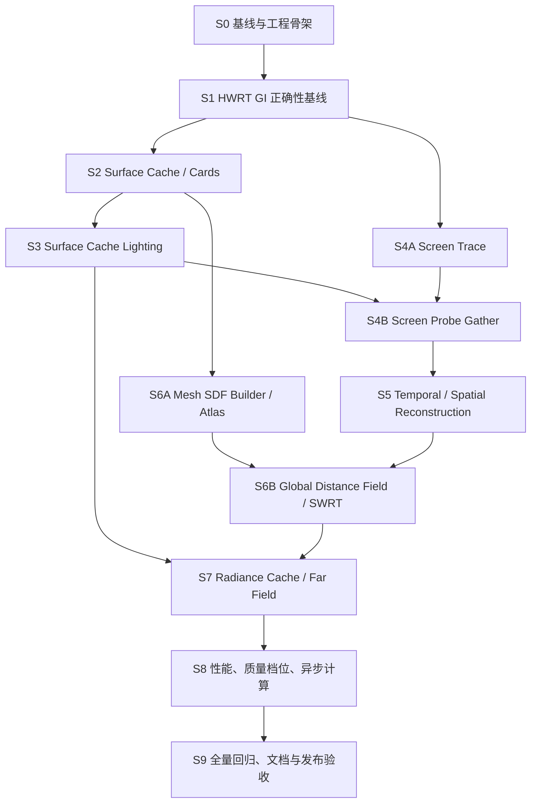

# LumenGI 全量实现执行计划

> 工作分支：`codex/lumen-gi`  
> 源码基线：NVIDIA Falcor `master@eb540f67`  
> 配套路线：`docs/LumenGI_Technical_Roadmap.md`  
> 状态：待执行  
> 执行原则：阶段内最大化并行，阶段间严格门禁；持续执行到全部 Definition of Done 满足

## 1. 最终目标与完成定义

在 NVIDIA Falcor 原始基线上完成一套独立实现的 Lumen 风格实时 GI，核心必须包含：

- Surface Cache 与 Cards；
- Surface Cache Lighting；
- Screen Trace + HWRT fallback；
- Screen Probe Gather；
- 时域重投影、空间滤波和半分辨率重建；
- Mesh Distance Field、Global Distance Field clipmap 和软件追踪 fallback；
- Radiance Cache / Far Field；
- 质量档位、性能统计、调试视图和自动回归。

仅完成路径追踪、NRD/SVGF 降噪或 IBL 预览不算完成。

### 全局 Definition of Done

- [ ] `Release` 与 `Debug` 均可从干净配置构建；
- [ ] `LumenGI` RenderGraph 可在 Mogwai 中加载、热重载、切换场景和调整分辨率；
- [ ] HWRT、Screen+HWRT、Screen+SDF 三条路径均可运行；
- [ ] 动态相机、动态光源、刚体实例、材质变化会正确更新或失效历史；
- [ ] 解析光、环境光和发光三角形均贡献间接光；
- [ ] Surface Cache、Screen Probe、GDF、Radiance Cache 都有独立调试视图；
- [ ] LumenGI 专项 CPU/GPU 单元测试全部通过；
- [ ] LumenGI 图像回归、动态轨迹回归、长稳和 GPU validation 全部通过；
- [ ] Falcor 全量 unit tests 无新增失败；
- [ ] 受影响的 GBuffer、PathTracer、RTXDI、NRD/SVGF、TAA 图像测试无新增失败；
- [ ] 固定场景性能达到冻结后的 MVP/目标预算，或所有未达项有经用户接受的记录；
- [ ] 文档、配置项、已知限制、性能数据和调试说明完整；
- [ ] `git diff --check` 通过，工作区不包含意外生成物。

## 2. 不可违反的工程约束

1. 不从 `feature/pbrt-offline-renderer` 合并 Filament/PBRT 预览代码。
2. 不复制 Unreal Engine 源码或 Shader；只依据公开资料独立实现。
3. 不把 DLSS 设为强制依赖；原生分辨率和半分辨率重建必须可用。
4. 第一条正确性路径必须复用 Falcor Material System、灯光采样和 Scene/TLAS。
5. 所有随机过程必须支持固定种子，方便重现图像和性能问题。
6. 所有持久缓存必须响应 `IScene::UpdateFlags`，不得仅靠手工 reset。
7. 每个新 GPU 资源必须有格式、尺寸、生命周期、显存预算和 debug 名称。
8. 每个新阶段必须先有 debug output，再进行画质调参。
9. 阶段门禁失败时不得继续堆叠后续功能。
10. Subagent 不得修改未分配文件、执行全仓格式化或自行合并共享入口文件。

### 2.1 已核实的 Falcor 接口约束

- 主 GI 图以 `GBufferRT` 为首选输入源，因为它能提供 `linearZ`、`mvecW`、`normWRoughnessMaterialID` 等 NRD、重投影和边界验证数据。
- `VBufferRT` 只提供 visibility/depth/mvec/viewW/time/mask 等输出，可作为可见性或精简路径输入，不能假定它直接输出完整 shading G-buffer。
- Surface Cache texel 不能直接共用面向屏幕分辨率创建的 RTXDI surface/reservoir ping-pong 状态。
- S3 初版优先使用 PathTracer 的 LightBVH/Emissive/EnvMap sampler；RTXDI Surface Cache 适配必须创建独立实例、自定义 SurfaceData writer、独立 frame dimensions 和 history。
- 所有共享 C++/Slang 数据结构都必须有尺寸、字段偏移和对齐测试。

## 3. Subagent 最大并行执行模型

当前并发上限按 4 个活跃 agent 设计：

- **Root / Integrator**：接口冻结、共享文件、合并、构建、门禁和最终决策；
- **Agent A / Host-Core**：C++ host、资源、场景更新、缓存管理；
- **Agent B / Shader-Algorithm**：Slang、采样、追踪、滤波与数值正确性；
- **Agent C / Test-Tooling**：FalcorTest、image tests、基准、调试视图和报告。

### 3.1 每个 Wave 的固定流程

1. Root 写明本 Wave 的输入/输出接口、资源格式、坐标空间和完成条件。
2. Root 为 A/B/C 分配互不重叠的文件集合；无法隔离时使用独立 Git worktree。
3. 同时启动 3 个 subagent；每个 agent 先跑最小基线测试再修改。
4. Subagent 完成后报告：改动文件、接口偏差、测试命令、结果和残余风险。
5. Root 依次集成 Host → Shader → Tests；中央 CMake/RenderGraph 文件只由 Root 修改。
6. Root 运行该 Wave 的 smoke gate；失败则进入并行故障归因，不进入下一 Wave。
7. 阶段所有 Wave 通过后运行完整 stage gate，并创建单一集成提交。

### 3.2 文件所有权规则

默认共享入口仅由 Root 修改：

- `Source/RenderPasses/CMakeLists.txt`
- `Source/RenderPasses/LumenGI/CMakeLists.txt`
- `scripts/LumenGI.py`
- `task.md`
- `docs/LumenGI_Technical_Roadmap.md`
- CI workflow 与测试环境配置

Subagent 只修改任务卡明确列出的 `.cpp/.h/.slang/.py`。若两个任务必须修改同一文件，拆成串行 Wave，禁止同时编辑。

### 3.3 并行故障归因

当 stage gate 失败时，同时启动：

- Agent A：复现 C++/资源生命周期/Scene update 问题；
- Agent B：复现 Shader 编译、GPU 崩溃、NaN/能量问题；
- Agent C：复现测试基准、图像差异、性能或环境问题；
- Root：缩小引入范围、比较阶段提交并决定修复或回滚。

只有根因、修复和回归证据齐全后才能解除阻塞。

## 4. 依赖 DAG 与阶段门禁



每个 `Sx` 都是强门禁。DAG 中没有依赖关系的节点可以并行，但共享文件仍遵守所有权规则。

## 5. S0：基线、接口冻结与工程骨架

### Wave S0.1（3 个 subagent 并行）

- [ ] **S0-A1 Host 骨架** — Agent A  
  新建 `LumenGI.h/.cpp`，实现 RenderPass 注册、Properties、reflect/compile/execute/setScene/onSceneUpdates 空流程；声明稳定的输入输出名；资源只做 passthrough/clear。
- [ ] **S0-B1 共享数据与调试 Shader** — Agent B  
  新建 `LumenGIData.slang`、`LumenDebug.cs.slang`；定义 frame constants、debug enum、坐标空间约定；输出 depth/normal/material/motion 的验证视图。
- [ ] **S0-C1 测试与参考框架** — Agent C  
  新建 LumenGI graph/test 骨架、固定随机种子、固定相机和曝光；准备 Cornell Box/Sponza/Bistro 测试清单；实现仅运行不比较的 smoke test。

### Root 集成

- [ ] **S0-R1** 添加 `Source/RenderPasses/LumenGI/CMakeLists.txt` 和顶层子目录注册；
- [ ] **S0-R2** 新建 `scripts/LumenGI.py`，主路径连接 `GBufferRT → LumenGI → ToneMapper`；保留可选 VBuffer 输入实验路径；
- [ ] **S0-R3** 冻结初始数据契约：格式、坐标空间、分辨率、可选输入、debug output；
- [ ] **S0-R4** 记录基准 GPU、驱动、分辨率、场景版本和构建配置。

### S0 门禁

- [ ] Release/Debug 编译 `LumenGI`、`Mogwai`、`FalcorTest`；
- [ ] RenderGraph 加载、热重载、resize、scene reload 无崩溃；
- [ ] G-buffer 调试视图与原始 GBuffer/VBuffer 测试一致；
- [ ] D3D12 debug layer smoke 无新增 validation error；
- [ ] 生成首份 Phase 0 GPU/显存基线报告。

## 6. S1：HWRT 单反弹 GI 正确性基线

### Wave S1.1（3 个 subagent 并行）

- [ ] **S1-A1 HWRT Host** — Agent A  
  建立 RT program、binding table、输出 radiance/hit distance/moments；处理 TLAS 与 `IScene::UpdateFlags`；实现 resize、camera cut 和 history reset。
- [ ] **S1-B1 单反弹 Shader** — Agent B  
  基于 Falcor Material System 实现 primary surface 到一次间接 bounce；复用 BSDF、环境光、解析光和 emissive sampling；加入 MIS、Russian roulette 接口和 NaN guard。
- [ ] **S1-C1 正确性测试** — Agent C  
  为 diffuse、metal、dielectric、emissive、environment 建立小场景；生成 256/1024 spp PathTracer 参考；增加固定种子与分量输出。

### Wave S1.2（3 个 subagent 并行）

- [ ] **S1-A2 降噪接口** — Agent A  
  输出 NRD 所需 diffuse radiance/hit distance、normal/roughness/material ID、viewZ、motion；NRD 不可用时提供 SVGF 接线。
- [ ] **S1-B2 数值与采样验证** — Agent B  
  实现 radiance clamp、firefly 统计、sample sequence；验证 PDF、单位和色彩空间；增加 direct-only/indirect-only debug mode。
- [ ] **S1-C2 动态回归** — Agent C  
  相机平移/旋转、camera cut、移动光源、移动刚体、材质变化测试；记录 ghost/flicker 和 history reset。

### S1 门禁

- [ ] Cornell Box 固定曝光下，间接光颜色传播方向与 PathTracer 一致；
- [ ] 解析光、环境光、emissive 分别关闭时分量正确消失；
- [ ] 运动时不保留无界历史，camera cut 后一帧内 reset；
- [ ] 输出无 NaN/Inf，能量不随静态帧数发散；
- [ ] 专项 unit/image/dynamic tests 全绿；
- [ ] 该阶段输出标注为 `HWRT GI Baseline`，尚不称为完整 LumenGI。

## 7. S2：Surface Cache 与 Cards

### Wave S2.1：接口与独立基础设施（3 个 subagent 并行）

- [ ] **S2-A1 Card Scene** — Agent A  
  新建 `LumenCardScene.*`；为静态 mesh 生成六轴 AABB Cards；维护 mesh/instance/card 映射、bounds、优先级与 dirty flags。
- [ ] **S2-B1 Atlas Allocator** — Agent B  
  新建 `LumenSurfaceCache.*`；实现固定 tile atlas、free-list、LRU、最小驻留帧、页表和显存统计；先写 CPU 单元测试再接 GPU。
- [ ] **S2-C1 Card 测试工具** — Agent C  
  增加 card placement/coverage/residency/eviction 测试与 debug overlays；构造 atlas 满、重复分配和 resize 用例。

### Wave S2.2：Capture 与更新（3 个 subagent 并行）

- [ ] **S2-A2 更新与失效** — Agent A  
  将 `IScene::UpdateFlags` 映射到 geometry/material/instance/card/page 失效；实现每帧 capture budget 和优先队列。
- [ ] **S2-B2 Card Capture** — Agent B  
  实现 `LumenCardCapture.3d.slang`，写入 base color、normal、roughness、emissive、opacity、depth；定义双面、alpha-test 和 unsupported material fallback。
- [ ] **S2-C2 Capture 对比** — Agent C  
  将 card material atlas 与直接材质求值对比；统计 coverage、误差、capture pages/frame 和 page churn。

### S2 门禁

- [ ] Cornell/Sponza/Bistro 的 card placement 可视化正确；
- [ ] 静态场景 coverage 达到冻结阈值，缺失区域有 fallback 标记；
- [ ] resize、scene reload、atlas pressure 不泄漏资源；
- [ ] 材质或实例变化只失效受影响页面；
- [ ] Atlas allocator CPU/GPU 测试、capture image tests、30 分钟 churn 测试通过。

## 8. S3：Surface Cache Lighting 与多反弹反馈

### Wave S3.1（3 个 subagent 并行）

- [ ] **S3-A1 Lighting Scheduler** — Agent A  
  新建 cache lighting page 队列；按可见性、dirty reason、距离和 age 排序；限制 pages/frame；跟踪 direct/indirect 独立版本。
- [ ] **S3-B1 Direct Cache Lighting** — Agent B  
  初版解析光使用 LightBVHSampler，emissive 使用 Emissive Light Sampler，环境光使用 EnvMapSampler；写 direct radiance atlas 与 visibility。RTXDI 作为后续子任务，必须使用独立 SurfaceData/reservoir 状态，不能复用屏幕 RTXDI 实例。
- [ ] **S3-C1 灯光分量测试** — Agent C  
  对 analytic/emissive/environment 分别做开关、移动和强度阶跃测试；检查更新延迟和能量。

### Wave S3.2（3 个 subagent 并行）

- [ ] **S3-A2 History 管理** — Agent A  
  维护 radiance page history、confidence、last-updated frame；光源/材质/几何变化时局部降权或失效。
- [ ] **S3-B2 多反弹反馈** — Agent B  
  使用上一帧 radiance atlas 做受控反馈；实现能量 clamp、曝光无关阈值和反馈次数/强度配置。
- [ ] **S3-C2 稳定与发散测试** — Agent C  
  运行黑房间、白炉、强 emissive 和灯光阶跃；检测持续增亮、振荡、负 radiance、NaN/Inf。

### S3 门禁

- [ ] Surface Cache direct lighting 与 hit-lighting reference 在容差内；
- [ ] 动态光在目标帧数内更新到间接缓存；
- [ ] emissive 能照亮邻近表面；
- [ ] 多反弹静态运行不发散，关闭反馈能回到单反弹结果；
- [ ] cache update budget 不产生不可接受的 P99 尖峰。

## 9. S4：Screen Trace 与 Screen Probe Gather

### Wave S4.1：Screen Trace（可与 S3 后半段并行）

- [ ] **S4-A1 HZB/资源 Host** — Agent A  
  建立线性深度 mip/HZB、trace command buffer、hit/miss 压缩列表；处理动态分辨率与 viewport。
- [ ] **S4-B1 Hierarchical Screen Trace** — Agent B  
  实现屏幕空间 ray march、厚度测试、步进 mip 选择、边缘退出和 behind-surface 判断；输出 hit UV/distance/confidence/miss reason。
- [ ] **S4-C1 Screen Trace 测试** — Agent C  
  构造可见命中、屏幕外命中、薄几何、深度不连续、相机边缘用例；与 HWRT hit distance 对比。

### Wave S4.2：Probe 放置与追踪（3 个 subagent 并行）

- [ ] **S4-A2 Probe Grid Host** — Agent A  
  新建 `LumenScreenProbe.*`；固定 `8x8` tile 起步；维护 probe metadata、radiance、direction mask、history 和 adaptive probe list。
- [ ] **S4-B2 Probe Direction Sampling** — Agent B  
  实现低差异/蓝噪声方向集、跨帧旋转、screen-first 追踪、HWRT fallback、统一 hit record。
- [ ] **S4-C2 Probe 分布测试** — Agent C  
  验证 probe 覆盖、随机序列重复性、ray budget、screen hit rate、fallback 分类。

### Wave S4.3：命中照明与积分（3 个 subagent 并行）

- [ ] **S4-A3 Surface Cache Lookup Host** — Agent A  
  绑定 card/page tables，统计 cache hit/miss；coverage 不足、动态网格和 unsupported material 走 hit lighting。
- [ ] **S4-B3 Probe Integrate/Interpolate** — Agent B  
  从 screen hit 或 Surface Cache radiance 获取入射辐射度；实现 probe 方向积分及 depth/normal/material aware 像素插值。
- [ ] **S4-C3 组合回归** — Agent C  
  比较 screen-only、HWRT-only、hybrid；检查屏幕外遮挡、接触反弹、边界泄漏和视角依赖。

### S4 门禁

- [ ] Screen Trace hit 与 HWRT reference 的命中距离在容差内；
- [ ] miss reason 统计总和与发射射线数一致；
- [ ] 屏幕外遮挡由 fallback 补齐；
- [ ] Probe 插值不跨明显深度、法线和材质边界；
- [ ] hybrid 输出比 per-pixel HWRT baseline 明显降低 ray count，且无新增严重伪影。

## 10. S5：时域稳定、空间滤波与重建

### Wave S5.1（3 个 subagent 并行）

- [ ] **S5-A1 History Host** — Agent A  
  管理 previous/current probe 与 pixel histories、moments、variance、history length；定义 camera cut、resize、scene change reset。
- [ ] **S5-B1 Temporal Filter** — Agent B  
  实现 motion-vector reprojection；用 depth/normal/material ID/hit distance/confidence 联合验证；对 disocclusion 快速响应。
- [ ] **S5-C1 Temporal 轨迹测试** — Agent C  
  固定 camera pan/orbit/cut、移动物体、移动光源和 emissive 阶跃；输出 history accept/reject 热图及 ghost 指标。

### Wave S5.2（3 个 subagent 并行）

- [ ] **S5-A2 Reconstruction Host** — Agent A  
  支持 full/half/quarter GI resolution，管理 upscale 资源和质量档位。
- [ ] **S5-B2 Spatial/Adaptive Filter** — Agent B  
  实现 variance-guided spatial filter、bilateral upsample、firefly clamp；保持几何和材质边界。
- [ ] **S5-C2 稳定性与细节测试** — Agent C  
  检查 flicker、ghost、薄结构、接触阴影、法线边界；与 NRD/SVGF baseline 比较。

### S5 门禁

- [ ] Camera cut 后历史立即失效，平滑运动时历史稳定复用；
- [ ] 动态物体不留下长期拖影；
- [ ] half-res 重建在冻结阈值内接近 full-res reference；
- [ ] 无 NaN/Inf、负方差、history length 溢出；
- [ ] 固定轨迹的帧间闪烁指标达到目标。

## 11. S6：Mesh SDF、Global Distance Field 与软件追踪

S6 工作量大，拆成两个强依赖子阶段。S6A 可在 S3/S4 开发期间由独立 worktree 提前并行，但不得在数据格式冻结前合入主线。

### Wave S6A.1：格式、构建器和 Atlas（3 个 subagent 并行）

- [ ] **S6-A1 Mesh SDF Builder** — Agent A  
  新建 `Source/Tools/MeshSDFBuilder/`；从静态三角网格生成有符号距离体；处理 watertight/sign、thin/open mesh 警告；支持 CPU reference。
- [ ] **S6-B1 Mesh SDF GPU/压缩** — Agent B  
  设计 volume layout、mip、量化和压缩；复用 Falcor SparseBrickSet/voxel Shader 思路；实现 sphere-trace sampling contract。
- [ ] **S6-C1 格式和构建测试** — Agent C  
  为 cube/sphere/open plane/thin wall/高模建立生成、序列化、版本、hash 和距离误差测试。

### Wave S6A.2：缓存与实例（3 个 subagent 并行）

- [ ] **S6-A2 磁盘缓存/版本** — Agent A  
  基于 mesh content hash、builder version、resolution/compression 建 cache key；支持损坏检测和重建。
- [ ] **S6-B2 Mesh SDF Atlas** — Agent B  
  实现 atlas/page table、mip residency、实例 transform 和 bounds；统计显存与采样 miss。
- [ ] **S6-C2 Atlas/实例回归** — Agent C  
  测试重复 mesh 多实例、非均匀缩放、atlas pressure、eviction/reload 和确定性。

### S6A 门禁

- [ ] 基础闭合网格 signed distance 与 CPU reference 在阈值内；
- [ ] 开放/薄网格被识别并进入明确 fallback；
- [ ] 缓存可复现、版本变更会失效、损坏会重建；
- [ ] atlas 多实例和缩放采样正确，无越界和泄漏。

### Wave S6B.1：Global Distance Field（3 个 subagent 并行）

- [ ] **S6-A3 Clipmap Host** — Agent A  
  实现相机中心多级 clipmap、世界到体素映射、滚动、静态/动态分层和 dirty region 列表。
- [ ] **S6-B3 GDF Compose Shader** — Agent B  
  将驻留 Mesh SDF 实例合成至 clipmap；处理 overlap、边界和级联；支持预算化局部更新。
- [ ] **S6-C3 GDF 测试/可视化** — Agent C  
  增加 slice、distance、dirty voxel、clipmap bounds 视图；测试相机滚动、实例移动和重叠实例。

### Wave S6B.2：软件追踪与混合路径（3 个 subagent 并行）

- [ ] **S6-A4 Trace 调度** — Agent A  
  将 screen miss 分类到 Detail SDF、Global SDF 或 HWRT；管理 trace distance、步数预算和 fallback。
- [ ] **S6-B4 Sphere Trace Shader** — Agent B  
  实现 Mesh/GDF sphere tracing、hit refinement、normal estimation、visibility；输出 step count/min distance/miss reason。
- [ ] **S6-C4 HWRT 对比回归** — Agent C  
  对 hit distance、occlusion、leak、thin geometry、overlap 和性能做 SWRT/HWRT 差异报告。

### S6 门禁

- [ ] GDF 随相机滚动仅更新新增/dirty 区域；
- [ ] 静态与动态层失效互不污染；
- [ ] Screen+SDF 路径完整运行，无 DXR 时具有可用输出；
- [ ] 软件追踪误差、漏光与性能达到冻结阈值；
- [ ] 不支持的 geometry/material 明确回退，不静默产生错误结果。

## 12. S7：Radiance Cache、Far Field 与大场景

### Wave S7.1（3 个 subagent 并行）

- [ ] **S7-A1 Radiance Cache Host** — Agent A  
  实现世界空间 probe clipmap、key/hash、页分配、刷新优先级、驻留和查询接口；限制更新和显存预算。
- [ ] **S7-B1 Radiance Cache Shader** — Agent B  
  实现 probe trace/integrate、可见性、方向表示、跨级联插值和泄漏抑制；Screen Probe miss 可查询该缓存。
- [ ] **S7-C1 Cache 测试** — Agent C  
  测试 clipmap 滚动、key 冲突、eviction、动态光响应、稳定场景收敛和显存平台期。

### Wave S7.2（3 个 subagent 并行）

- [ ] **S7-A2 Far Field Scene** — Agent A  
  实现远场实例选择、简化 representation/独立 TLAS 或 GDF 级联、更新与裁剪策略。
- [ ] **S7-B2 Far Field Trace** — Agent B  
  实现 near/far trace 切换、距离融合、Surface/Radiance Cache 查询和天空 miss。
- [ ] **S7-C2 大场景回归** — Agent C  
  在 Bistro/大实例场景执行相机长轨迹，检查切换断层、page churn、cache hit、P95/P99 和显存。

### S7 门禁

- [ ] Screen Probe miss 和远距离命中能稳定查询 Radiance Cache；
- [ ] 相机移动只刷新新增/dirty clipmap 区域；
- [ ] near/far 切换无明显能量跳变或黑带；
- [ ] Radiance Cache/Far Field 预算有硬上限且超限稳定降级；
- [ ] Bistro 2 小时 soak 无持续 page churn、显存增长或性能劣化。

## 13. S8：性能、异步计算与质量档位

优化必须一次只改变一个维度；每项优化都保留开关并做 on/off 图像等价与性能对比。

### Wave S8.1（3 个 subagent 并行）

- [ ] **S8-A1 Wave Compaction** — Agent A  
  对 screen miss、HWRT fallback、dirty pages、probe refinement 实现 prefix sum/compaction/indirect dispatch；处理空列表和满容量。
- [ ] **S8-B1 GPU 优化** — Agent B  
  优化 Shader occupancy、分支、采样、带宽和格式；评估 ray sorting、wave ops、atlas locality；禁止牺牲数值 invariant。
- [ ] **S8-C1 等价/性能测试** — Agent C  
  为每个优化提供图像等价、计数一致和三轮性能报告；任何 nondeterminism 单独归因。

### Wave S8.2（3 个 subagent 并行）

- [ ] **S8-A2 资源与 Barrier** — Agent A  
  缩短 transient lifetime、复用 scratch、审计 resource state/UAV barrier/descriptor；评估 async compute 数据依赖。
- [ ] **S8-B2 Async Compute** — Agent B  
  仅在 Falcor/D3D12 队列能力允许时实现；为 on/off 路径添加同步与 marker；无收益或不稳定则默认关闭。
- [ ] **S8-C2 质量档位** — Agent C  
  实现 `Low/Medium/High/Reference`：GI resolution、probe spacing、ray count、trace distance、atlas/cache budget、pages/frame；热切换时正确 reset。

### S8 门禁

- [ ] 四档质量均可运行并具有固定、可序列化配置；
- [ ] 所有 compaction/async on/off 测试输出等价；
- [ ] 每 Pass 输出 mean/P50/P95/P99/max、ray/cache/page/history 指标；
- [ ] RTX 4070 候选目标：720p MVP GI ≤12 ms，1080p 目标路径 GI ≤8 ms；
- [ ] 低档 RTX 参考机无崩溃、TDR 或不可控显存压力；
- [ ] 不达到性能目标时继续 profile/优化，不通过提高画质容差掩盖。

## 14. S9：全量回归、文档与 Release Gate

### Wave S9.1（3 个 subagent 并行，需不同 runner/GPU）

- [ ] **S9-A1 Build/Unit Matrix** — Agent A  
  Windows VS2022 Release/Debug；LumenGI 专项和 Falcor 全量 unit tests；共享布局与 Shader variants。
- [ ] **S9-B1 Image/Dynamic Matrix** — Agent B  
  全部 LumenGI golden、邻接 RenderPass 图像回归、固定动态序列、质量指标与人工 diff 包。
- [ ] **S9-C1 Perf/Validation/Soak** — Agent C  
  独占 GPU 执行性能、显存、D3D12/RT validation、2 小时 nightly 与最终 8 小时 soak。

### Root 最终验收

- [ ] 核对本文件所有任务及 Phase gate 证据；
- [ ] 更新路线、架构、配置、调试视图、限制和性能文档；
- [ ] 确认不依赖 DLSS、不包含预览分支代码、不包含意外资产/缓存；
- [ ] 运行 `git diff --check`、最终 clean build、最终 smoke；
- [ ] 输出最终实现摘要、测试报告、性能报告和未支持范围；
- [ ] 创建 release-candidate 集成提交；是否 push/PR 由用户单独授权。

### Release Gate

只有以下全部成立才允许把本计划标记为完成：

- [ ] S0–S8 全部门禁通过；
- [ ] Surface Cache、Cards、Cache Lighting 完成；
- [ ] Screen Trace、HWRT、Mesh SDF/GDF 混合追踪完成；
- [ ] Screen Probe Gather、时域、空间滤波和重建完成；
- [ ] Radiance Cache 与 Far Field 完成；
- [ ] HWRT 与无 DXR 的 SDF fallback 均可独立运行；
- [ ] 四档质量和所有 debug views 完成；
- [ ] 解析光、环境光、emissive 和多反弹完成；
- [ ] Debug/RT validation 零错误；
- [ ] 最终 8 小时 soak 通过；
- [ ] Falcor 原有回归无新增失败；
- [ ] 质量、性能、显存和动态响应指标均有可复现证据。

## 15. 测试与回归总方案

### 15.1 基准不可混用

1. **正确性参考**：Falcor PathTracer，固定 seed、锁定曝光；Cornell/小场景 1024 spp，Sponza/Bistro 256 spp。
2. **图像回归参考**：同 GPU/驱动/分辨率/质量档生成并人工审核的 LumenGI golden。
3. **性能参考**：固定 GPU、驱动、电源模式、场景、相机轨迹和 commit 的 CSV/JSON。

每次测试必须记录 commit、dirty 状态、GPU/驱动、D3D12 runtime、分辨率、质量档、scene/resource hash、seed、camera path、GPU timings、功能计数器、结果图、diff、日志和退出码。

### 15.2 CPU 单元测试

位置：`Source/Tools/FalcorTest/Tests/LumenGI/`。

覆盖：

- Card 放置、world/card 变换和 bounds；
- page address/free-list/LRU/generation ID/预算边界；
- mesh/instance/material/light 到 dirty page 的映射；
- camera/scene/resolution/quality 失效状态机；
- clipmap 坐标、负坐标、滚动区域和边界；
- quality preset 序列化；
- C++/Slang 共享布局；
- Radiance Cache key、过期和替换。

### 15.3 GPU/Shader 测试

- normal/octahedral、radiance、moments、hit distance 编解码；
- Card UV 与 atlas page 映射；
- probe direction、权重和半球积分；
- history validation、moments、variance、confidence；
- bilateral upsample 边界保持；
- compaction 空/满输入；
- analytic SDF、gradient、mip、sphere trace；
- UAV canary、NaN/Inf、负 radiance 和原子计数溢出；
- HWRT/cache/screen/NRD/SVGF/SDF/quality 的 Shader variants。

### 15.4 图像质量与动态序列

场景矩阵：Cornell、Sponza、Bistro、Emissive、Dynamic Light、Dynamic Object、Camera Cut、Thin Geometry、Black/No Light、White Furnace。

硬性 invariant：

- 输出无 NaN/Inf；
- radiance 非负；
- 黑场景不自发增亮；
- 静态反馈达到平台而非无界增长；
- golden 更新必须独立提交并人工审核，普通 CI 不得自动覆盖；
- relative RMSE、FLIP mean/P95、能量误差阈值在 S0 冻结，失败后不得直接放宽。

动态序列至少包括：静止 256 帧、pan/orbit/快速横移、disocclusion、移动物体、材质切换、移动/开关光源、camera cut、720p↔1080p、四档质量热切换、cache budget 热切换。

### 15.5 性能、显存、Validation 与 Soak

- 性能：Release、关闭 validation，预热 ≥120 帧，采样 ≥600 帧，三轮取中位数；报告 mean/P50/P95/P99/max。
- 性能和显存测试必须独占 GPU；单 GPU 不与 image/validation agent 并发。
- Surface Cache 实际分配不得超过配置预算加 5% metadata；atlas 满时必须 eviction/降级。
- 每 Phase 10 分钟 smoke soak；S2 起 30 分钟；nightly 2 小时；release candidate 8 小时。
- Debug build 串行执行 D3D12 debug layer 与 NVIDIA RT validation；error/corruption 为零，warning 只允许最小白名单。
- Aftermath 与 debug layer 分开运行。

## 16. 标准构建与测试命令

### 构建

```powershell
setup_vs2022.bat
tools\.packman\cmake\bin\cmake.exe --build build\windows-vs2022 `
  --config Release --target LumenGI Mogwai FalcorTest -- /m:1
tools\.packman\cmake\bin\cmake.exe --build build\windows-vs2022 `
  --config Debug --target LumenGI Mogwai FalcorTest -- /m:1
```

### 专项与全量单元测试

已核实的 FalcorTest 8.0 参数：CPU 测试用 `--test-suite`/`--test-case`（正则过滤），GPU 测试才附加 `--device-type d3d12`。CPU 测试不要附加 `--device-type`，否则会被 device filter 排除。

```powershell
# LumenGI CPU 专项（无 --device-type）
build\windows-vs2022\bin\Release\FalcorTest.exe `
  --test-suite "LumenGI" `
  --xml-report artifacts\lumengi\unit-release.xml

# LumenGI GPU 专项
build\windows-vs2022\bin\Release\FalcorTest.exe `
  --device-type d3d12 --test-suite "LumenGI" --enable-debug-layer `
  --xml-report artifacts\lumengi\unit-gpu-release.xml

# Falcor 全量
build\windows-vs2022\bin\Release\FalcorTest.exe `
  --xml-report artifacts\lumengi\unit-full-release.xml
```

### 图像测试

```powershell
tests\run_image_tests.bat `
  --config windows-vs2022-Release `
  --filter "LumenGI" --parallel 1 `
  --xml-report artifacts\lumengi\image.xml

tests\run_image_tests.bat `
  --config windows-vs2022-Release `
  --filter "(LumenGI|GBufferRT|VBufferRT|PathTracer|RTXDI|NRD|SVGF|TAA)" `
  --parallel 1 `
  --xml-report artifacts\lumengi\image-adjacent.xml
```

### D3D12 / RT Validation

```powershell
$env:NV_ALLOW_RAYTRACING_VALIDATION='1'
build\windows-vs2022\bin\Debug\Mogwai.exe `
  --device-type d3d12 --headless --precise `
  --enable-debug-layer --enable-raytracing-validation `
  --script tests\lumengi\run_validation.py `
  --logfile artifacts\lumengi\validation.log
```

具体 CLI 参数在首次实现时通过 `Mogwai.exe --help` 与 `FalcorTest.exe --help` 再校验，禁止在自动化中依赖未验证参数。

## 17. 统一自动化与产物规范

### 17.1 计划新增的测试入口

```text
scripts/LumenGI.py
scripts/LumenGIReference.py
scripts/LumenGIBenchmark.py
tests/lumengi/run_smoke.py
tests/lumengi/run_validation.py
tests/lumengi/run_dynamic.py
tests/image_tests/renderpasses/graphs/LumenGI.py
tests/image_tests/renderpasses/test_LumenGI.py
tests/image_tests/renderpasses/test_LumenGIDynamic.py
tests/image_tests/renderpasses/test_LumenGISDF.py
```

产品功能不依赖 Python；上述 Python 仅用于 Falcor 现有 Mogwai/图像测试自动化。

### 17.2 每次 Gate 必须保存的产物

```text
artifacts/lumengi/<phase>/<timestamp>/
├── manifest.json
├── build-release.log
├── build-debug.log
├── unit-results.xml
├── image-results.xml
├── runtime.log
├── validation.log
├── captures/
│   ├── output/
│   ├── reference/
│   ├── diff/
│   └── debug/
├── perf/
│   ├── raw.json
│   └── summary.json
└── memory/
    ├── vram.json
    └── soak.csv
```

`manifest.json` 至少记录：Git commit，工作树状态，构建配置，GPU/驱动，分辨率，场景，随机种子，质量档位，开关组合，参考图版本，门禁结果。

### 17.3 图像与动态回归原则

- 原始 trace/debug/cache buffer 使用固定种子和严格阈值。
- NRD/时域最终图允许单独、有书面依据的容差；不能用放宽阈值掩盖不稳定。
- 动态测试同时校验最终图、history reject mask、confidence 和无效化计数。
- 必测序列：相机平移/旋转/切换，分辨率切换，物体移动，材质/自发光变化，灯光移动/强度变化，环境图切换，atlas 超订阅。
- 必测异常值：NaN/Inf，负辐射度，越界 ID，未初始化像素，无穷 history weight。

## 18. 每阶段统一 Gate 模板

每个阶段严格按以下顺序执行，任一项失败即停止后续集成：

- [ ] 子任务产物和文件归属审查通过，无未约定的共享文件修改。
- [ ] Release 目标构建成功。
- [ ] Debug 目标构建成功。
- [ ] Mogwai headless 运行时 shader/Slang 编译和资源绑定冒烟通过。
- [ ] LumenGI 聚焦单元/GPU 测试通过。
- [ ] GBufferRT、PathTracer、RTXDI、NRD/SVGF/TAA 等邻接回归通过。
- [ ] Cornell Box 和 Arcade 固定相机、1/16/64 帧图像比较通过。
- [ ] 当前阶段的动态场景无效化测试通过。
- [ ] D3D12 Debug Layer 零 error，RT Validation 零 error。
- [ ] GPU 无 crash/hang/device removed，输出无 NaN/Inf。
- [ ] 性能和 VRAM 不超过当前阶段预算，并保存原始数据。
- [ ] Soak 通过：S0–S1 至少 10 分钟，S2 起至少 30 分钟。
- [ ] 该阶段的功能开关关闭时可回退到上一阶段路径。
- [ ] `task.md` 的任务、测试证据、实测性能和已知问题已更新。

性能采样规范：预热不少于 120 帧，正式采样不少于 600 帧，独立重复 3 次，报告 mean/P50/P95/P99/max。单块物理 GPU 上的 GPU 测试与性能测试串行；CPU 测试和离线图像 diff 可并行。

## 19. 持续执行、故障归因与恢复规则

### 19.1 不停止执行规则

- 从 S0 起严格沿 DAG 执行，只要仍有不依赖失败 Gate 的可并行任务，就继续开启最多 3 个子 agent。
- 根 agent 始终保留一个执行槽，负责共享接口、集成、实机 GPU 回归、冲突处理和证据归档。
- 子 agent 完成后立即回收执行槽，并从当前阶段 ready queue 中发布下一个无依赖任务。
- 不因单个子任务失败而闲置无关并行任务；但失败的 Gate 未修复前，不能启动其下游阶段。
- 仅在需要新的外部资产/权限、硬件不支持、或需要用户做会改变架构的决策时才中止并请求用户。
- 无论成功或失败，每次恢复时都从 `task.md` 和最新 `artifacts/lumengi/.../manifest.json` 继续，不重复已通过的阶段。

### 19.2 失败归因和修复闭环

1. 锁定第一个失败的 Gate，保留完整日志和复现参数。
2. 用 feature toggle 二分定位最小失败模块，不删除上一阶段参考路径。
3. 将修复交给原文件所有者；如涉及冻结接口，由根 agent 单独修改并通知所有活跃子 agent。
4. 先跑最小复现，再重跑当前阶段全部 Gate，最后重跑受影响的早期阶段回归。
5. 修复后在 `task.md` 记录根因、修改点、回归范围和产物路径。

### 19.3 回滚基线

- S1：逐像素 HWRT 单反弹。
- S2–S3：Surface Cache 失效时回退 hit lighting。
- S4：Screen Trace/Probe 失效时回退 S1。
- S5：时域失效时输出 raw 或走 RenderGraph 外部 NRD。
- S6：SDF miss、薄几何和变形网格回退 HWRT。
- S7：Radiance Cache miss 回退 Surface Cache/HWRT。
- S8：任一优化都必须能单独关闭。

## 20. 总进度看板

> 状态只能在对应阶段统一 Gate 全部通过后改为完成。

| 阶段 | 状态 | 前置 | 主要交付 | Gate 证据 |
|---|---|---|---|---|
| S0 基础骨架 | [ ] | 无 | 插件、契约、脚本、测试骨架 | 待生成 |
| S1 HWRT 基线 | [ ] | S0 | 一反弹 diffuse GI | 待生成 |
| S2 Cards/Surface Cache | [ ] | S1 | Card、atlas、驻留与 capture | 待生成 |
| S3 Surface Cache Lighting | [ ] | S2 | 直接/环境/自发光与 feedback | 待生成 |
| S4 Screen Probe Gather | [ ] | S3 | screen trace、probe、fallback | 待生成 |
| S5 时域/空域稳定 | [ ] | S4 | reprojection、滤波、upsample | 待生成 |
| S6 Mesh SDF/GDF | [ ] | S2；集成依赖 S5 | builder、atlas、clipmap、hybrid trace | 待生成 |
| S7 Radiance Cache/Far Field | [ ] | S5+S6 | 辐射度缓存与远场 | 待生成 |
| S8 优化/质量档 | [ ] | S7 | compaction、preset、GPU marker | 待生成 |
| S9 发布回归 | [ ] | S8 | 全量测试、性能报告、长稳定性 | 待生成 |

## 21. 最终完成条件

仅当以下条件同时满足，整个 LumenGI 实现才可标记为完成：

- [ ] S0–S9 全部标记完成。
- [ ] Low/Medium/High/Reference 四档在支持的硬件上均可运行。
- [ ] HardwareRT、MeshSDF 和 Hybrid 路径均有测试证据，且可按功能开关回退。
- [ ] Cornell Box 和 Arcade 的静态、动态、分辨率和更新场景回归全部通过。
- [ ] 受影响的 Falcor 单元、GPU 和图像测试全部通过。
- [ ] Debug Layer/RT Validation 零 error，无稳定复现的 crash/hang/device removed/NaN/Inf。
- [ ] nightly 2 小时和发布候选 8 小时 soak 通过，无持续 VRAM 增长或 cache 失控。
- [ ] 达成文档中的质量、性能和显存预算，或有用户明确接受的书面偏差。
- [ ] 最终产物、限制、已知问题、复现命令和性能报告已文档化。

不得因时间、实现难度或性能不达标而降低 Gate；未通过的项目必须保持未完成状态，并附带可复现证据。
